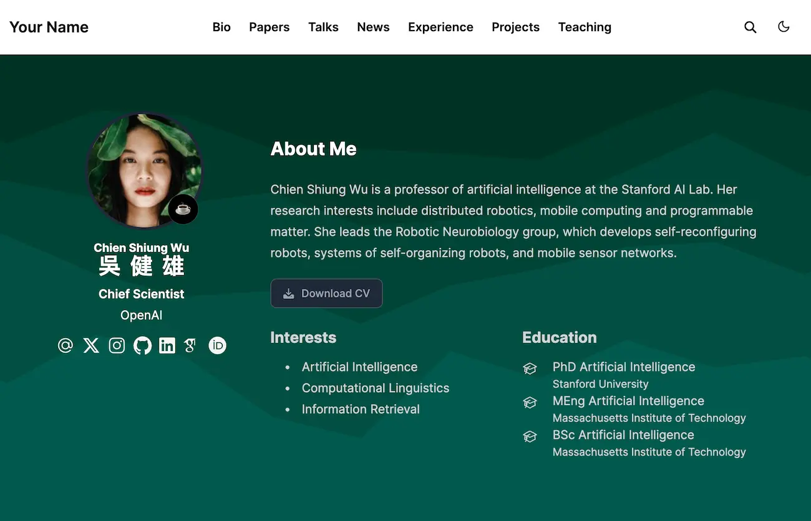

# Why learning/doing Hugo site
## Why using `go`?
* see [go.md] (go 1.19)
* See [The Go Programming Language](https://go.dev/)
    - An open-source programming language supported by Google
    - Easy to learn and great for teams
    - Built-in concurrency and a robust standard library
    - Large ecosystem of partners, communities, and tools
---

# Academic Icons for Writing
### 🔰 **Introduction**
- 🧭 `U+1F9ED` Compass – Setting direction
- 📌 `U+1F4CC` Pushpin – Anchoring context
- 🗺️ `U+1F5FA` World Map – Framing the landscape
- 📖 `U+1F4D6` Open Book – Background reading
- 🕰️ `U+231A` Watch – Temporal context

### 🎯 **Objectives**
- 🎯 `U+1F3AF` Direct Hit – Goals or aims
- ✅ `U+2705` Checkmark – Criteria or intent
- 🔍 `U+1F50D` Magnifying Glass – Investigative focus
- 🧠 `U+1F9E0` Brain – Cognitive purpose
- 🗝️ `U+1F5DD` Key – Central focus

### ⚙️ **Methods**
- ⚙️ `U+2699` Gear – Mechanism or procedure
- 🧪 `U+1F9EA` Test Tube – Experimental setup
- 🧰 `U+1F9F0` Toolbox – Tools used
- 📐 `U+1F4D0` Triangular Ruler – Design or framework
- 📊 `U+1F4CA` Bar Chart – Analytical strategy

### 📈 **Results**
- 📈 `U+1F4C8` Upward Trend – Positive findings
- 🧾 `U+1F9FE` Receipt – Recorded outcomes
- 📉 `U+1F4C9` Downward Trend – Negative/declining results
- 🧮 `U+1F9EE` Abacus – Quantitative data
- 📊 `U+1F4CA` Bar Chart – Summary statistics
    

### 💬 **Discussion**
- 💬 `U+1F4AC` Speech Bubble – Interpretation
- 🧩 `U+1F9E9` Puzzle Piece – Piecing insights together
- 🤔 `U+1F914` Thinking Face – Reflection
- 🧭 `U+1F9ED` Compass – Re-orienting understanding
- 🔄 `U+1F501` Arrows in Circle – Revisiting assumptions

### 🔚 **Conclusion**
- 🔚 `U+1F51A` END Arrow – Wrap-up
- 🧾 `U+1F9FE` Summary – Final statement
- 🎓 `U+1F393` Graduation Cap – Learning outcomes
- 📌 `U+1F4CC` Pushpin – Key takeaway
- 🏁 `U+1F3C1` Checkered Flag – Completion

### 🎁 **Contribution**
- 🎁 `U+1F381` Gift – What’s added
- 💡 `U+1F4A1` Lightbulb – Original insight
- 🛠️ `U+1F6E0` Hammer and Wrench – Practical impact
- 📘 `U+1F4D8` Blue Book – Knowledge contribution
- 🧬 `U+1F9EC` DNA – Novelty and originality

# [Hugo Academic CV Theme](https://github.com/HugoBlox/theme-academic-cv)

The Hugo **Academic CV Template** empowers you to easily create your job-winning online resumé, showcase your academic publications, and create online courses or knowledge bases to grow your audience.

  

️**Trusted by 250,000+ researchers, educators, and students.** Highly customizable via the integrated **no-code, Hugo Blox Builder**, making every site truly personalized ⭐⭐⭐⭐⭐

Easily write technical content with plain text Markdown, LaTeX math, diagrams, RMarkdown, or Jupyter, and import publications from BibTeX.

[Check out the latest demo](https://academic-demo.netlify.app/) of what you'll get in less than 10 minutes, or [get inspired by our academics and research groups](https://hugoblox.com/creators/).

The integrated [**Hugo Blox Builder**](https://hugoblox.com) and CMS makes it easy to create a beautiful website for free. Edit your site in the CMS (or your favorite editor), generate it with [Hugo](https://github.com/gohugoio/hugo), and deploy with GitHub or Netlify. Customize anything on your site with widgets, light/dark themes, and language packs.

- 👉 [**Get Started**](https://hugoblox.com/templates/)
- 📚 [View the **documentation**](https://docs.hugoblox.com/)
- 💬 [Chat with the **Hugo Blox Builder community**](https://discord.gg/z8wNYzb) or [**Hugo community**](https://discourse.gohugo.io)
- 🐦 Twitter: [@GetResearchDev](https://twitter.com/GetResearchDev) [@GeorgeCushen](https://twitter.com/GeorgeCushen) [#MadeWithHugoBlox](https://twitter.com/search?q=%23MadeWithHugoBlox&src=typed_query)
- ⬇️ **Automatically import your publications from BibTeX** with the [Hugo Academic CLI](https://github.com/GetRD/academic-file-converter)
- 💡 [Suggest an improvement](https://github.com/HugoBlox/hugo-blox-builder/issues)
- ⬆️ **Updating?** View the [Update Guide](https://docs.hugoblox.com/reference/update/) and [Release Notes](https://github.com/HugoBlox/hugo-blox-builder/releases)

## We ask you, humbly, to support this open source movement

Today we ask you to defend the open source independence of the Hugo Blox Builder and themes 🐧

We're an open source movement that depends on your support to stay online and thriving, but 99.9% of our creators don't give; they simply look the other way.

### [❤️ Click here to become a Sponsor, unlocking awesome perks such as _exclusive academic templates and blocks_](https://hugoblox.com/sponsor/)

<!--

-->

## Demo image credits

- [Unsplash](https://unsplash.com)

## Latest news

<!--START_SECTION:news-->
* [6 Compelling Reasons I Switched from WordPress to Hugo](https:&#x2F;&#x2F;hugoblox.com&#x2F;vs&#x2F;wordpress&#x2F;)
* [The 7 best landing page builders in 2024](https:&#x2F;&#x2F;hugoblox.com&#x2F;blog&#x2F;7-best-landing-page-builders&#x2F;)
* [Start a Blog and Make Money in 2024: Here&#39;s What You Need to Know](https:&#x2F;&#x2F;hugoblox.com&#x2F;blog&#x2F;start-a-blog-and-make-money&#x2F;)
* [Hugo vs Quarto: Which One is Better for 2024?](https:&#x2F;&#x2F;hugoblox.com&#x2F;vs&#x2F;quarto&#x2F;)
* [Easily make an academic CV website to get more cites and grow your audience 🚀](https:&#x2F;&#x2F;hugoblox.com&#x2F;blog&#x2F;easily-make-academic-website&#x2F;)
<!--END_SECTION:news-->

## Icons for Degrees

### 🎓 DPhil (Ph.D.) – Information, Communication, and the Social Sciences 🧭
Represents research, discourse, and societal systems:

🧠 (U+1F9E0) – cognitive insight

🗣️ (U+1F5E3) – speech and communication

🌐 (U+1F310) – global and digital perspectives

📊 (U+1F4CA) – data and societal analysis

🧭 (U+1F9ED) – navigating complexity and values

### 🖥️ M.Sc. – Computer Science and Information Engineering 🧑‍💻
Captures software, logic, and computational structure:

💻 (U+1F4BB) – computing and programming

🧮 (U+1F9EE) – algorithms and calculations

🧬 (U+1F9EC) – digital systems and AI modeling

📡 (U+1F4E1) – networks and transmissions

🧱 (U+1F9F1) – modular architecture (like your Hugo workflows!)

### 📰 M.S.S. – Journalism 🔍
Highlights media, narrative, and reporting:

📰 (U+1F4F0) – news and articles

📷 (U+1F4F7) – photojournalism

✍️ (U+270D) – writing and storytelling

🎙️ (U+1F399) – broadcasting and interviews

🔍 (U+1F50D) – investigation and inquiry

### 📚 B.A. – Foreign Languages and Literatures 🗺️
Symbolizes multilingual study and cultural expression:

📖 (U+1F4D6) – literature and interpretation

🈺 (U+1F23A) – East Asian scripts

🗺️ (U+1F5FA) – global linguistic geography

🎭 (U+1F3AD) – theatrical and literary arts

🗨️ (U+1F5E8) – dialogue and translation

### ⚡ B.Sc. – Electrical and Electronic Engineering 📶
Emphasizes circuitry, energy, and signal systems:

⚙️ (U+2699) – mechanisms and hardware

🔋 (U+1F50B) – energy and batteries

📶 (U+1F4F6) – signal strength

🔌 (U+1F50C) – connectors and flow

🛠️ (U+1F6E0) – tools and assembly