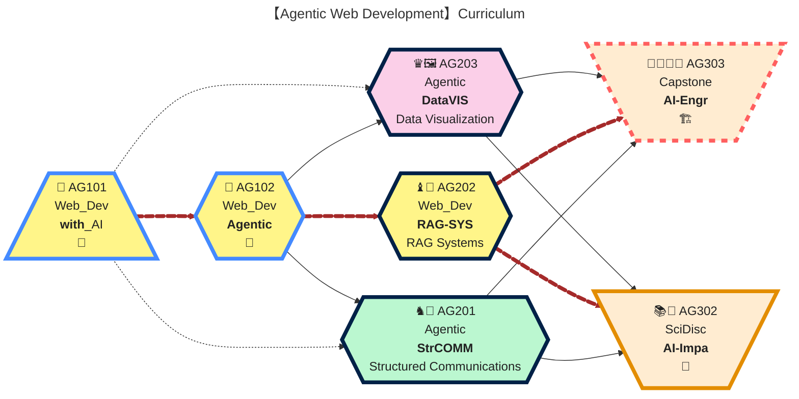

```mermaid
---
title: 【Agentic Web Development】Curriculum
---
flowchart LR
%% Agentic Web Development/智能體Web開發
%% params:
%%  emoji: 🪴
%%  id: Bare (5+2)
%%  curriculum: Agentic Web Development
%%  slug: AgenticWebDev
%%    (cf. 🪴Bare精簡版;🎍Core核心版;🎋Core+核心版;🎄Full完整版;🌲Base基礎版=====🪴🎍🎋🎄🌲)

AG101["🐙 AG101<br/>Web_Dev<br/><strong>with</strong>_AI<br/>🧭"] e1@--> AG102["🤗 AG102<br/>Web_Dev<br/><strong>Agentic</strong><br/>🤖"]

%% Links: AG102 → AG2XX
AG101 -.-> AG203
AG102 --> AG203["♛🖼️ AG203<br/>Agentic<br/><strong>DataVIS</strong><br/>Data Visualization"]
AG102 e2@--> AG202["♝🍞 AG202<br/>Web_Dev<br/><strong>RAG-SYS</strong><br/>RAG Systems"]
AG102 --> AG201["♞🧱 AG201<br/>Agentic<br/><strong>StrCOMM</strong><br/>Structured Communications"]
AG101 -.-> AG201

%% Links: AG2XX → AG3XX
AG203 --> AG303
AG202 e3@--> AG303
AG201 --> AG303["🧑‍🤝‍🧑🧬 AG303<br/>Capstone<br/><strong>AI-Engr</strong><br/>🏗"]
AG203 --> AG302
AG202 e4@--> AG302
AG201 --> AG302["📚🦠 AG302<br/>SciDisc<br/><strong>AI-Impa</strong><br/>🌈"]

linkStyle 0,3,7,10 stroke:brown, stroke-width:5px
e1@{ animate: true } 
e2@{ animate: true }
e3@{ animate: true }
e4@{ animate: true }

%% Shape declarations
AG101@{ shape: trap-b }
AG102@{ shape: hex }
AG201@{ shape: hex }
AG202@{ shape: hex }
AG203@{ shape: hex }
AG302@{ shape: trap-t }
AG303@{ shape: trap-t }

%% Styling 🪾 Bare Minimum (Core) Agentic learning 
style AG101 fill:#fff589,stroke:#448aff,stroke-width:5px,color:#222
style AG102 fill:#fff589,stroke:#448aff,stroke-width:5px,color:#222
style AG201 fill:#bbf7d0,stroke:#002147,stroke-width:5px,color:#222
style AG202 fill:#fff589,stroke:#002147,stroke-width:5px,color:#222
style AG203 fill:#fbcfe8,stroke:#002147,stroke-width:5px,color:#222
style AG302 fill:#ffecd1,stroke:#e38d00,stroke-width:5px,color:#222
%% 🌈 Rainbow-Style Border for Capstone
style AG303 fill:#ffecd1,stroke:#ff5f5f,stroke-width:5px,stroke-dasharray:8,color:#222
```
