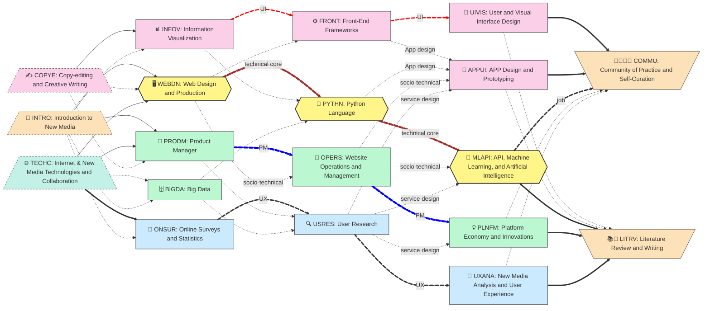

```mermaid
%%{ init: { 'flowchart': { 'curve': 'monotoneX' } } }%%
graph LR
%% Curriculum or Learning Roadmap:
%%  - 🌲Base New Media & Internet (cf. 🎍🎋🪴🎄)

    %% [Yellow] Technical Core (Declared First for Center Anchoring)   
    WEBDN["🖥️ WEBDN: Web Design and Production"] e1@==technical core==> PYTHN["🐍 PYTHN: Python Language"] e2@==technical core==> MLAPI["🤖 MLAPI: API, Machine Learning, and Artificial Intelligence"] 

    %% [Pink] UI/Design Core (Next for Top Placement)
    INFOV eUI1@==UI==> FRONT["⚙️ FRONT: Front-End Frameworks"]
    FRONT eUI2@==UI==> UIVIS["🎨 UIVIS: User and Visual Interface Design"] 

    %% [Green] PM/Socio-Technical Core (Middle Spread)
    PRODM["📌 PRODM: Product Manager"] ePM1@==PM==>  OPERS
    OPERS ePM2@==PM==> PLNFM["💡 PLNFM: Platform Economy and Innovations"]

    %% BEGIN Phase
    INTRO["📡 INTRO: Introduction to New Media"] --> PRODM
    INTRO --> WEBDN
    COPYE["✍️ COPYE: Copy-editing and Creative Writing"] --> INFOV["📊 INFOV: Information Visualization"]
    COPYE -.->  WEBDN
    TECHC["🌐 TECHC: Internet & New Media Technologies and Collaboration"] ==> ONSUR["🧮 ONSUR: Online Surveys and Statistics"]
    TECHC --> WEBDN & PRODM 

    %% Pink Design Others
    INFOV -.-> PYTHN 
    WEBDN -.-> FRONT 
    FRONT -.App design.-> APPUI
    PYTHN -.App design.-> APPUI["📱 APPUI: APP Design and Prototyping"] 

    %% [Blue] Social Science Core (Declared Later for Bottom Placement)
    USRES eUX2@==UX==> UXANA["🧠 UXANA: New Media Analysis and User Experience"]
    ONSUR eUX1@==UX==> USRES 

    %% Green -- Blue: Management informed by Research
    PRODM -.-> USRES["🔍 USRES: User Research"]     

    %% Blue Social Science Others: BIGDA
    WEBDN -.socio-technical.-> OPERS["🔧 OPERS: Website Operations and Management"] 
    BIGDA["🗄️ BIGDA: Big Data"] -.-> PYTHN 
    BIGDA-.->USRES
    TECHC-.->BIGDA
    INTRO-.->BIGDA

    %% transitions
    OPERS -.socio-technical.-> MLAPI
    OPERS -.socio-technical.-> APPUI
    USRES -.service design.-> APPUI
    USRES -.service design.-> MLAPI
    USRES -.service design.-> PLNFM


    %% Final Phase
    COMMU["🧑‍🤝‍🧑🧬 COMMU: Community of Practice and Self-Curation"]  ~~~ MLAPI
    MLAPI ~~~ LITRV["📚🦠 LITRV: Literature Review and Writing"]

    %% Final Phase: Pink
    UIVIS -.-> LITRV
    UIVIS ==> COMMU
    APPUI -.-> LITRV
    APPUI ==> COMMU

    %% Final Phase Core
    MLAPI e3@==job==> COMMU
    MLAPI ==> LITRV

    %% Final Phase: Green
    PLNFM -.-> COMMU
    PLNFM ==> LITRV

    %% Final Phase: Blue
    UXANA -.-> COMMU
    UXANA ==> LITRV

    %% Balancing
    COPYE -.-> PRODM
    INTRO -.-> INFOV
    INTRO -.-> ONSUR

    %% Hidden Links PYTHN ~~~ APPUI
    

click TECHC callback "Github"


%% Edge Tooltips
linkStyle 0,1 stroke:brown, stroke-width:5px
linkStyle 2,3 stroke:red, stroke-width:3px
linkStyle 4,5 stroke:blue, stroke-width:5px

e1@{ animate: true } 
e2@{ animate: true }
e3@{ animate: true }
eUI1@{ animate: true }
eUI2@{ animate: true }
eUX1@{ animate: true }
eUX2@{ animate: true }
ePM1@{ animate: true }
ePM2@{ animate: true }


%% Node Shapes
WEBDN@{ shape: hex}
PYTHN@{ shape: hex}
MLAPI@{ shape: hex}
COMMU@{ shape: trap-t}
LITRV@{ shape: trap-t}
TECHC@{ shape: trap-b}
INTRO@{ shape: trap-b}
COPYE@{ shape: trap-b}

%% Node Styles
%% Foundational Nodes
style TECHC fill:#C3F1E7,stroke:#333,stroke-width:1px,stroke-dasharray:4
style INTRO fill:#FDE2B9,stroke:#333,stroke-width:1px,stroke-dasharray:4
style COPYE fill:#fbcfe8,stroke:#333,stroke-width:1px,stroke-dasharray:4

%% Final Nodes
style COMMU fill:#FDE2B9,stroke:#333,stroke-width:1px
style LITRV fill:#FDE2B9,stroke:#333,stroke-width:1px

%% Green Socio-Technical/Business/Management
style BIGDA fill:#bbf7d0,stroke:#333,stroke-width:1px
style PRODM fill:#bbf7d0,stroke:#333,stroke-width:1px
style OPERS fill:#bbf7d0,stroke:#333,stroke-width:1px
style PLNFM fill:#bbf7d0,stroke:#333,stroke-width:1px

%% Blue Social Science/UX
style ONSUR fill:#cbeafe,stroke:#333,stroke-width:1px
style USRES fill:#cbeafe,stroke:#333,stroke-width:1px
style UXANA fill:#cbeafe,stroke:#333,stroke-width:1px

%% Pink Design Core
style INFOV fill:#fbcfe8,stroke:#333,stroke-width:1px
style FRONT fill:#fbcfe8,stroke:#333,stroke-width:1px
style UIVIS fill:#fbcfe8,stroke:#333,stroke-width:1px
style APPUI fill:#fbcfe8,stroke:#333,stroke-width:1px

%% Yellow Technical Core
style PYTHN fill:#fff589,stroke:#333,stroke-width:2px
style WEBDN fill:#fff589,stroke:#333,stroke-width:2px
style MLAPI fill:#fff589,stroke:#333,stroke-width:2px
```

