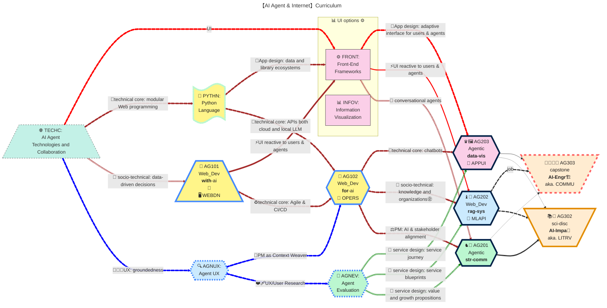

```mermaid
---
title: 【AI Agent & Internet】Curriculum
config:
  layout: dagre
  flowchart:
    curve: monotoneX
---
flowchart LR
%% AI Agent & Internet/智能體網際網路/智能体互联网
%% config:
%%   look: handDrawn%% params:
%%  emoji: 🎍
%%  id: Core (10+2)
%%  curriculum: AI Agent & Internet
%%  slug: AgenticInternet
%%    (cf. 🪴Bare精簡版;🎍Core核心版;🎋Core+核心版;🎄Full完整版;🌲Base基礎版=====🪴🎍🎋🎄🌲) 
  
    TECHC["🌐 TECHC: <br/>AI Agent <br/>Technologies and Collaboration"] eUI1@== UI ==> FRONT["⚙️ FRONT: <br/>Front-End <br/>Frameworks"]
    TECHC e1@== 🧩technical core: modular Web programming ==> PYTHN["🐍 PYTHN:<br/> Python <br/> Language"]
    TECHC -. "🛂 socio-technical: data-driven decisions" .-> WEBDN["🐙 AG101<br/>Web_Dev<br/><strong>with</strong>-ai<br/>🧭<br/>🖥️ WEBDN"]
    TECHC eUX2@== 🙈🙉🙊UX: groundedness ==> AGNUX["🔍 AGNUX: <br/>Agent UX"]
    PYTHN e2@-- 🐍App design: data and library ecosystems --> FRONT
    PYTHN e3@== 📡technical core: APIs both cloud and local LLM ==> OPERS["🤗 AG102<br/>Web_Dev<br/><strong>for</strong>-ai<br/>🔧 OPERS"]
    WEBDN -- ⚡UI reactive to users & agents --> FRONT
    WEBDN e4@== ♻️technical core: Agile & CI/CD ==> OPERS
    AGNUX ePM1@== 🧞PM as Context Weaver ==> OPERS
    AGNUX eUX1@== ❤‍🩹UX/User Research ==> AGNEV["🧠 AGNEV: <br/>Agent <br/>Evaluation"]
    FRONT eUI2@-. 🌉App design: adaptive interface for users & agents .-> APPUI["♛🖼️ AG203<br/>Agentic<br/><strong>data-vis</strong><br/>📱 APPUI"]
    OPERS e5@== 🤖technical core: chatbots ==> APPUI
    FRONT -- ⚡UI reactive to users & agents --> MLAPI["♝🍞 AG202<br/>Web_Dev<br/><strong>rag-sys</strong><br/>🤖 MLAPI"]
    OPERS ePM2@== "🏦 socio-technical: knowledge and organizations㊭" ==> MLAPI
    FRONT -. 💬 conversational agents .-> AG201["♞🧱 AG201<br/>Agentic<br/><strong>str-comm</strong>"]
    OPERS ePM3@-- ⚖PM: AI & stakeholder alignment --> AG201
    AGNEV -. 🛄 service design: service journey .-> APPUI
    AGNEV -. 🧭 service design: service blueprints .-> MLAPI
    AGNEV -. 🎯 service design: value and growth propositions .-> AG201
    APPUI ~~~ AG303["🧑‍🤝‍🧑🧬 AG303<br/>capstone<br/><strong>AI-Engr</strong>🏗<br/>aka. COMMU"]
    APPUI --> AG303
    MLAPI efin1@== job ==> AG303
    APPUI -.-> AG302["📚🦠 AG302<br/>sci-disc<br/><strong>AI-Impa</strong>🌈<br/>aka. LITRV"]
    MLAPI efin2@==> AG302
    AG201 -.-> AG303
    AG201 ==> AG302

  %% INFOV or FRONT options
  subgraph UI_options["📊 UI options ⚙️"]
    FRONT
    INFOV
  end
    INFOV["📊 INFOV: <br/>Information <br/>Visualization"] 

    TECHC@{ shape: trap-b}
    PYTHN@{ shape: flag}
    WEBDN@{ shape: trap-b}
    OPERS@{ shape: hex}
    APPUI@{ shape: hex}
    MLAPI@{ shape: hex}
    AG201@{ shape: hex}
    AG303@{ shape: trap-t}
    AG302@{ shape: trap-t}
    AGNUX@{ shape: hex}
    AGNEV@{ shape: hex}

    style TECHC fill:#C3F1E7,stroke:#333,stroke-width:1px,stroke-dasharray:4
    style FRONT fill:#fbcfe8,stroke:#333,stroke-width:1px
    style PYTHN fill:#fff589,stroke:#bbf7d0,stroke-width:5px,stroke-dasharray:4,color:#222
    style WEBDN fill:#fff589,stroke:#448aff,stroke-width:5px,color:#222
    style OPERS fill:#fff589,stroke:#448aff,stroke-width:5px,color:#222
    style AGNUX fill:#cbeafe,stroke:#448aff,stroke-width:5px,stroke-dasharray:4,color:#222
    style AGNEV fill:#bbf7d0,stroke:#448aff,stroke-width:5px,stroke-dasharray:4,color:#222
    style APPUI fill:#fbcfe8,stroke:#002147,stroke-width:5px,color:#222
    style MLAPI fill:#cbeafe,stroke:#002147,stroke-width:5px,color:#222
    style AG201 fill:#bbf7d0,stroke:#002147,stroke-width:5px,color:#222
    style AG303 fill:#ffecd1,stroke:#ff5f5f,stroke-width:5px,stroke-dasharray:8,color:#222
    style AG302 fill:#ffecd1,stroke:#e38d00,stroke-width:5px,color:#222
    style INFOV fill:#fbcfe8,stroke:#333,stroke-width:1px

    linkStyle 0 stroke:red, stroke-width:5px,fill:none
    linkStyle 1 stroke:brown, stroke-width:5px,fill:none
    linkStyle 2 stroke:brown, stroke-width:5px,fill:none
    linkStyle 3 stroke:blue, stroke-width:5px,fill:none
    linkStyle 4 stroke:brown, stroke-width:5px,fill:none
    linkStyle 5 stroke:brown, stroke-width:5px,fill:none
    linkStyle 6 stroke:brown, stroke-width:5px,fill:none
    linkStyle 7 stroke:brown, stroke-width:5px,fill:none
    linkStyle 8 stroke:blue, stroke-width:5px,fill:none
    linkStyle 9 stroke:blue, stroke-width:5px,fill:none
    linkStyle 10 stroke:red, stroke-width:5px,fill:none
    linkStyle 11 stroke:brown, stroke-width:5px,fill:none
    linkStyle 12 stroke:red, stroke-width:3px,fill:none
    linkStyle 13 stroke:brown, stroke-width:5px,fill:none
    linkStyle 14 stroke:brown, stroke-width:5px,fill:none
    linkStyle 15 stroke:brown, stroke-width:5px,fill:none
    linkStyle 16 stroke:green, stroke-width:5px,fill:none
    linkStyle 17 stroke:green, stroke-width:5px,fill:none
    linkStyle 18 stroke:green, stroke-width:5px,fill:none

    eUI1@{ animate: true } 
    e1@{ animate: true } 
    eUX2@{ animate: true } 
    e2@{ animate: true } 
    e3@{ animate: true } 
    e4@{ animate: true } 
    ePM1@{ animate: true } 
    eUX1@{ animate: true } 
    eUI2@{ animate: true } 
    e5@{ animate: true } 
    ePM2@{ animate: true } 
    ePM3@{ animate: true } 
    efin1@{ animate: true } 
    efin2@{ animate: true }

```

