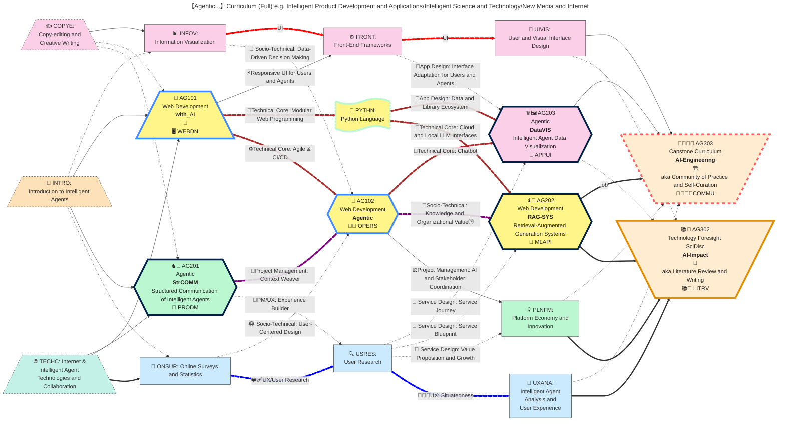

```mermaid
---
title: 【Agentic...】Curriculum (Full) e.g. Intelligent Product Development and Applications/Intelligent Science and Technology/New Media and Internet
---
    flowchart LR
%%{ init: { 'flowchart': { 'curve': 'monotoneX' } } }%%
%% Agentic New Media & Internet/智能體時代下的網路與新媒體／智能體時代下的網路與新媒體
%%   look: handDrawn
%% params: 
%%  emoji: 🎄
%%  id: Full (16+2)
%%  curriculum: Agentic New Media & Internet
%%  slug: AgenticNMInternet
%%  (cf. 🪴Bare精簡版;🎍Core核心版;🎋Core+核心版;🎄Full完整版;🌲Base基礎版=====🪴🎍🎋🎄🌲) 

INFOV eUI1@==UI==> FRONT["⚙️ FRONT: <br/>Front-End Frameworks"]
FRONT eUI2@==UI==> UIVIS["🎨 UIVIS: <br/>User and Visual Interface Design"]

COPYE["✍️ COPYE: <br/>Copy-editing and<br/>Creative Writing"] --> INFOV
INTRO -.-> INFOV["📊 INFOV: <br/>Information Visualization"]
COPYE -.-> WEBDN
INTRO --> WEBDN
TECHC["🌐 TECHC: Internet &<br/>Intelligent Agent Technologies and Collaboration"] --> WEBDN
INTRO["📡 INTRO: <br/>Introduction to Intelligent Agents"] --> PRODM
COPYE -.-> PRODM
TECHC --> PRODM
TECHC ==> ONSUR["🧮 ONSUR: Online Surveys and Statistics"]
INTRO -.-> ONSUR

WEBDN["🐙 AG101<br/>Web Development<br/><strong>with</strong>_AI<br/>🧭<br/>🖥️ WEBDN"] --⚡Responsive UI for Users and Agents--> FRONT 
INFOV -."🛂 Socio-Technical: Data-Driven Decision Making".-> OPERS 

WEBDN e1@=="🧩Technical Core: Modular Web Programming"==> PYTHN["🐍 PYTHN:<br/>Python Language"] 
WEBDN e2@=="♻️Technical Core: Agile & CI/CD"==> OPERS["🤗 AG102<br/>Web Development<br/><strong>Agentic</strong><br/>🤖🔧 OPERS"]

PRODM["♞🧱 AG201<br/>Agentic<br/><strong>StrCOMM</strong><br/>Structured Communication of Intelligent Agents<br/>📌 PRODM"] ePM1@==🧞Project Management: Context Weaver==> OPERS
PRODM -.💞PM/UX: Experience Builder.-> USRES["🔍 USRES: <br/>User Research"]     
ONSUR -.😭 Socio-Technical: User-Centered Design.-> OPERS 
ONSUR eUX1@==❤‍🩹UX/User Research==> USRES 

FRONT -.🌉App Design: Interface Adaptation for Users and Agents.-> APPUI
PYTHN e3@--🐍App Design: Data and Library Ecosystem--> APPUI["♛🖼️ AG203<br/>Agentic<br/><strong>DataVIS</strong><br/>Intelligent Agent Data Visualization<br/>📱 APPUI"] 
OPERS e4@==🤖Technical Core: Chatbot==> APPUI

OPERS ePM2@==🏦Socio-Technical: Knowledge and Organizational Value㊭==> MLAPI
PYTHN e5@==📡Technical Core: Cloud and Local LLM Interfaces==> MLAPI["♝🍞 AG202<br/>Web Development<br/><strong>RAG-SYS</strong><br/>Retrieval-Augmented Generation Systems<br/>🤖 MLAPI"]

OPERS --⚖Project Management: AI and Stakeholder Coordination--> PLNFM["💡 PLNFM: <br/>Platform Economy and<br/>Innovation"]
USRES -.🛄 Service Design: Service Journey.-> APPUI
USRES -.🧭 Service Design: Service Blueprint.-> MLAPI
USRES -.🎯 Service Design: Value Proposition and Growth.-> PLNFM
USRES eUX2@==🙈🙉🙊UX: Situatedness==> UXANA["🧠 UXANA: <br/>Intelligent Agent<br/>Analysis and<br/>User Experience"]
%% Final Phase Core
UIVIS --> COMMU     
UIVIS -.-> LITRV
APPUI --> COMMU
APPUI -.-> LITRV
MLAPI e3@==job==> COMMU["🧑‍🤝‍🧑🧬 AG303<br/>Capstone Curriculum<br/><strong>AI-Engineering</strong><br/>🏗<br/>aka Community of Practice and Self-Curation<br/>🧑‍🤝‍🧑🧬COMMU"]  
MLAPI ==> LITRV["📚🦠 AG302<br/>Technology Foresight SciDisc<br/><strong>AI-Impact</strong><br/>🌈<br/>aka Literature Review and Writing<br/>📚🦠 LITRV"]

    %% Final Phase: Green
    PLNFM -.-> COMMU
    PLNFM ==> LITRV

    %% Final Phase: Blue
    UXANA -.-> COMMU
    UXANA ==> LITRV

click TECHC callback "Github"


%% Edge Tooltips
%% eUI1 eUI2
linkStyle 0,1 stroke:red, stroke-width:5px
%% eUX1 eUX2
linkStyle 19,29 stroke:blue, stroke-width:5px

linkStyle 14,15,21,22,24 stroke:brown, stroke-width:5px
linkStyle 16,23 stroke:purple, stroke-width:5px


eUI1@{ animate: true }
eUI2@{ animate: true }
eUX1@{ animate: true }
eUX2@{ animate: true }
e1@{ animate: true } 
e2@{ animate: true }
e3@{ animate: true }
e4@{ animate: true }
e5@{ animate: true }
ePM1@{ animate: true }
ePM2@{ animate: true }


%% Node Shapes
PYTHN@{ shape: flag}
COMMU@{ shape: trap-t}
LITRV@{ shape: trap-t}
TECHC@{ shape: trap-b}
INTRO@{ shape: trap-b}
COPYE@{ shape: trap-b}

%% Node Styles
%% Shape declarations
%% Styling 🪾 Bare Minimum (Core) Agentic learning 
WEBDN@{ shape: trap-b}
OPERS@{ shape: hex}
APPUI@{ shape: hex}
MLAPI@{ shape: hex}  
PRODM@{ shape: hex} 
%% MLAPI cbeafe (blue) or fff589 (yellow)
%% style AG101 ... WEBDN
%% style AG102 ... OPERS
%% style AG201 ... PRODM
style MLAPI fill:#fff589,stroke:#002147,stroke-width:5px,color:#222
style WEBDN fill:#fff589,stroke:#448aff,stroke-width:5px,color:#222
style OPERS fill:#fff589,stroke:#448aff,stroke-width:5px,color:#222
style APPUI fill:#fbcfe8,stroke:#002147,stroke-width:5px,color:#222
style PRODM fill:#bbf7d0,stroke:#002147,stroke-width:5px,color:#222

%% Foundational Nodes
style TECHC fill:#C3F1E7,stroke:#333,stroke-width:1px,stroke-dasharray:4
style INTRO fill:#FDE2B9,stroke:#333,stroke-width:1px,stroke-dasharray:4
style COPYE fill:#fbcfe8,stroke:#333,stroke-width:1px,stroke-dasharray:4

%% Final Nodes
style COMMU fill:#ffecd1,stroke:#ff5f5f,stroke-width:5px,stroke-dasharray:8,color:#222
style LITRV fill:#ffecd1,stroke:#e38d00,stroke-width:5px,color:#222

%% Green Socio-Technical/Business/Management
%% style PRODM fill:#bbf7d0,stroke:#333,stroke-width:1px
%% style OPERS fill:#bbf7d0,stroke:#333,stroke-width:1px
style PLNFM fill:#bbf7d0,stroke:#333,stroke-width:1px

%% Blue Social Science/UX
style ONSUR fill:#cbeafe,stroke:#333,stroke-width:1px
style USRES fill:#cbeafe,stroke:#333,stroke-width:1px
style UXANA fill:#cbeafe,stroke:#333,stroke-width:1px

%% Pink Design Core
style INFOV fill:#fbcfe8,stroke:#333,stroke-width:1px
style FRONT fill:#fbcfe8,stroke:#333,stroke-width:1px
style UIVIS fill:#fbcfe8,stroke:#333,stroke-width:1px
%% style APPUI fill:#fbcfe8,stroke:#333,stroke-width:1px

%% Yellow Technical Core
style PYTHN fill:#fff589,stroke:#bbf7d0,stroke-width:5px,stroke-dasharray:4,color:#222
%% style WEBDN fill:#fff589,stroke:#333,stroke-width:2px
%% style MLAPI fill:#fff589,stroke:#333,stroke-width:2px

```

