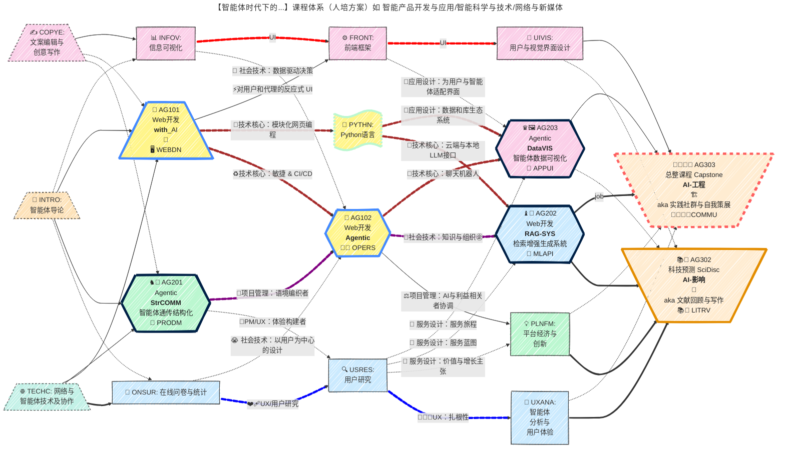

```mermaid
---
title: 【智能体时代下的...】课程体系（人培方案）如 智能产品开发与应用/智能科学与技术/网络与新媒体
subtitle: 
config:
  layout: dagre
  look: handDrawn
---
flowchart LR
%%{ init: { 'flowchart': { 'curve': 'monotoneX' } } }%%
%% Agentic New Media & Internet/智能体时代下的网路与新媒体／智能體時代下的網路與新媒體
%% params:
%%  emoji: 🎄
%%  id: Core (16+2)
%%  curriculum: Agentic New Media & Internet
%%  slug: AgenticNMInternet
%%  (cf. 🪴Bare精簡版;🎍Core核心版;🎋Core+核心版;🎄Full完整版;🌲Base基礎版=====🪴🎍🎋🎄🌲) 

    INFOV eUI1@==UI==> FRONT["⚙️ FRONT: <br/>前端框架"]
    FRONT eUI2@==UI==> UIVIS["🎨 UIVIS: <br/>用户与视觉界面设计"]

    COPYE["✍️ COPYE: <br/>文案编辑与<br/>创意写作"] --> INFOV
    INTRO -.-> INFOV["📊 INFOV: <br/>信息可视化"]
    COPYE -.-> WEBDN
    INTRO --> WEBDN
    TECHC["🌐 TECHC: 网络与<br/>智能体技术及协作"] --> WEBDN
    INTRO["📡 INTRO: <br/>智能体导论"] --> PRODM
    COPYE -.-> PRODM
    TECHC --> PRODM
    TECHC ==> ONSUR["🧮 ONSUR: 在线问卷与统计"]
    INTRO -.-> ONSUR

    WEBDN["🐙 AG101<br/>Web开发<br/><strong>with</strong>_AI<br/>🧭<br/>🖥️ WEBDN"] --⚡对用户和代理的反应式 UI--> FRONT 
    INFOV -."🛂 社会技术：数据驱动决策".-> OPERS 
 
    WEBDN e1@=="🧩技术核心：模块化网页编程"==> PYTHN["🐍 PYTHN:<br/> Python语言"] 
    WEBDN e2@=="♻️技术核心：敏捷 & CI/CD"==> OPERS["🤗 AG102<br/>Web开发<br/><strong>Agentic</strong><br/>🤖🔧 OPERS"]

    PRODM["♞🧱 AG201<br/>Agentic<br/><strong>StrCOMM</strong><br/>智能体通传结构化<br/>📌 PRODM"] ePM1@==🧞项目管理：语境编织者==>  OPERS
    PRODM -.💞PM/UX：体验构建者.-> USRES["🔍 USRES: <br/>用户研究"]     
    ONSUR -.😭 社会技术：以用户为中心的设计.-> OPERS 
    ONSUR eUX1@==❤‍🩹UX/用户研究==> USRES 

    FRONT -.🌉应用设计：为用户与智能体适配界面.-> APPUI
    PYTHN e3@--🐍应用设计：数据和库生态系统--> APPUI["♛🖼️ AG203<br/>Agentic<br/><strong>DataVIS</strong><br/>智能体数据可视化<br/>📱 APPUI"] 
    OPERS e4@==🤖技术核心：聊天机器人==> APPUI
    
    OPERS ePM2@==🏦社会技术：知识与组织㊭==> MLAPI
    PYTHN e5@==📡技术核心：云端与本地LLM接口==> MLAPI["♝🍞 AG202<br/>Web开发<br/><strong>RAG-SYS</strong><br/>检索增强生成系統<br/>🤖 MLAPI"]

    OPERS --⚖项目管理：AI与利益相关者协调--> PLNFM["💡 PLNFM: <br/>平台经济与<br/>创新"]
    USRES -.🛄 服务设计：服务旅程.-> APPUI
    USRES -.🧭 服务设计：服务蓝图.-> MLAPI
    USRES -.🎯 服务设计：价值与增长主张.-> PLNFM
    USRES eUX2@==🙈🙉🙊UX：扎根性 ==> UXANA["🧠 UXANA: <br/>智能体<br/>分析与<br/>用户体验"]

    %% Final Phase
    %%     COMMU["🧑‍🤝‍🧑🧬 COMMU: Community of Practice and Self-Curation"]  ~~~ MLAPI
    %%     MLAPI ~~~ LITRV["📚🦠 LITRV: Literature Review and Writing"]


    %% Final Phase Core
    UIVIS --> COMMU     
    UIVIS -.-> LITRV
    APPUI --> COMMU
    APPUI -.-> LITRV
    MLAPI e3@==job==> COMMU["🧑‍🤝‍🧑🧬 AG303<br/>总整课程 Capstone<br/><strong>AI-工程</strong><br/>🏗<br/>aka 实践社群与自我策展<br/>🧑‍🤝‍🧑🧬COMMU"]  
    MLAPI ==> LITRV["📚🦠 AG302<br/>科技预测 SciDisc<br/><strong>AI-影响</strong><br/>🌈<br/>aka 文献回顾与写作<br/>📚🦠 LITRV"]


    %% Final Phase: Green
    PLNFM -.-> COMMU
    PLNFM ==> LITRV

    %% Final Phase: Blue
    UXANA -.-> COMMU
    UXANA ==> LITRV

    %% Balancing
    %% Hidden Links 
    %% COPYE ~~~ WEBDN
    %% COPYE ~~~ WEBDN
    %% TECHC ~~~ PRODM
    %% TECHC ~~~ PRODM

click TECHC callback "Github"


%% Edge Tooltips
%% eUI1 eUI2
linkStyle 0,1 stroke:red, stroke-width:5px
%% eUX1 eUX2
linkStyle 19,29 stroke:blue, stroke-width:5px

linkStyle 14,15,21,22,24 stroke:brown, stroke-width:5px
linkStyle 16,23 stroke:purple, stroke-width:5px


eUI1@{ animate: true }
eUI2@{ animate: true }
eUX1@{ animate: true }
eUX2@{ animate: true }
e1@{ animate: true } 
e2@{ animate: true }
e3@{ animate: true }
e4@{ animate: true }
e5@{ animate: true }
ePM1@{ animate: true }
ePM2@{ animate: true }


%% Node Shapes
PYTHN@{ shape: flag}
COMMU@{ shape: trap-t}
LITRV@{ shape: trap-t}
TECHC@{ shape: trap-b}
INTRO@{ shape: trap-b}
COPYE@{ shape: trap-b}

%% Node Styles

%% Styling 🪾 Bare Minimum (Core) Agentic learning 
%% Shape declarations
%% AG101@{ shape: hex }
%% AG102@{ shape: hex }
%% style AG101 fill:#fff589,stroke:#448aff,stroke-width:2px,color:#222
%% style AG102 fill:#fff589,stroke:#448aff,stroke-width:2px,color:#222
WEBDN@{ shape: trap-b}
OPERS@{ shape: hex }
style WEBDN fill:#fff589,stroke:#448aff,stroke-width:5px,color:#222
style OPERS fill:#fff589,stroke:#448aff,stroke-width:5px,color:#222
%% AG203 ... OPERS
APPUI@{ shape: hex}
%% AG202 ... MLAPI
MLAPI@{ shape: hex}  
style APPUI fill:#fbcfe8,stroke:#002147,stroke-width:5px,color:#222
style MLAPI fill:#cbeafe,stroke:#002147,stroke-width:5px,color:#222
%% AG201 ... PRODM
PRODM@{ shape: hex} 
style PRODM fill:#bbf7d0,stroke:#002147,stroke-width:5px,color:#222


%% Foundational Nodes
style TECHC fill:#C3F1E7,stroke:#333,stroke-width:1px,stroke-dasharray:4
style INTRO fill:#FDE2B9,stroke:#333,stroke-width:1px,stroke-dasharray:4
style COPYE fill:#fbcfe8,stroke:#333,stroke-width:1px,stroke-dasharray:4

%% Final Nodes
style COMMU fill:#ffecd1,stroke:#ff5f5f,stroke-width:5px,stroke-dasharray:8,color:#222
style LITRV fill:#ffecd1,stroke:#e38d00,stroke-width:5px,color:#222

%% Green Socio-Technical/Business/Management
%% style PRODM fill:#bbf7d0,stroke:#333,stroke-width:1px
%% style OPERS fill:#bbf7d0,stroke:#333,stroke-width:1px
style PLNFM fill:#bbf7d0,stroke:#333,stroke-width:1px

%% Blue Social Science/UX
style ONSUR fill:#cbeafe,stroke:#333,stroke-width:1px
style USRES fill:#cbeafe,stroke:#333,stroke-width:1px
style UXANA fill:#cbeafe,stroke:#333,stroke-width:1px

%% Pink Design Core
style INFOV fill:#fbcfe8,stroke:#333,stroke-width:1px
style FRONT fill:#fbcfe8,stroke:#333,stroke-width:1px
style UIVIS fill:#fbcfe8,stroke:#333,stroke-width:1px
%% style APPUI fill:#fbcfe8,stroke:#333,stroke-width:1px

%% Yellow Technical Core
style PYTHN fill:#fff589,stroke:#bbf7d0,stroke-width:5px,stroke-dasharray:4,color:#222
%% style WEBDN fill:#fff589,stroke:#333,stroke-width:2px
%% style MLAPI fill:#fff589,stroke:#333,stroke-width:2px
```

