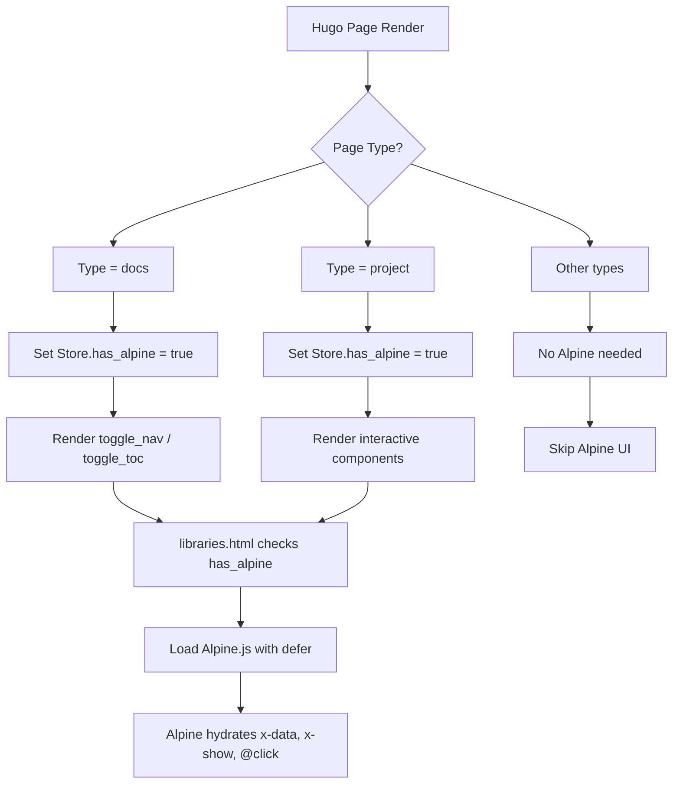

## type=docs
* toggle-nav (left) sidebar
* toggle-toc (right)

## Alpine.js hydration
Once Alpine.js is properly loaded through your `libraries.html` partial using a `<script defer>` tag, your toggle components like `toggle_nav` and `toggle_toc` will function as expected without requiring any extra initiation logic.

## Mechanism of Alpine.js hydration across page types

Based on the Hugo logic here (e.g., `.Page.Store.Set "has_alpine"` and conditional loading via `libraries.html`), here’s a simple **Mermaid flowchart** that visualizes Alpine.js hydration across page types:



## Everything connects automatically

### 🧩 Example Flow Recap

1. You add:
    
    go
    
    ```
    {{- .Page.Store.Set "has_alpine" true -}}
    ```
    
    in the layout or partial _before_ `libraries.html` is invoked.
    
2. `libraries.html` detects it and injects:
    
    html
    
    ```
    <script src="{{ $alpine_js.RelPermalink }}" integrity="{{ $alpine_js.Data.Integrity }}" defer></script>
    ```
    
3. Alpine sees your toggle component:
    
    html
    
    ```
    <aside x-show="navVisible" x-data="{ navVisible: false }">...</aside>
    ```
    

🟢 Everything connects automatically: no need to call `Alpine.start()` or script anything manually.


### ✅ Why This Works

- `defer` **loading** ensures Alpine is initialized after HTML is parsed, so it sees and processes directives like `x-data`, `x-show`, `@click`, etc.
    
- As long as you’ve set `.Page.Store.Set "has_alpine"` _before_ `libraries.html` runs — which you're doing in your Hugo page or layout — Alpine is **injected at the right time**, keeping the toggle partials lean and declarative.