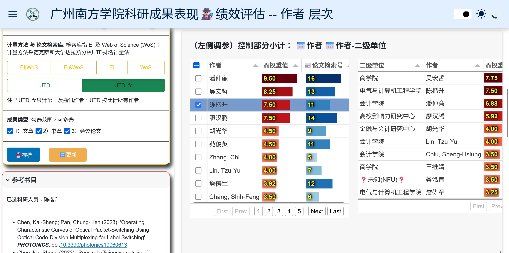

利用并扩展[**UTD**全球商学院科研排名的计量方法](https://jsom.utdallas.edu/the-utd-top-100-business-school-research-rankings/index.php#methodology)，这里展示NetBib项目案例🗄--'广州南方学院 (NFU.edu.cn)' 的科研表现。根据案例实证，点出数据不一致、二级单位识别难或乱等等问题及改进建议。

<!--more-->

此项目展示产出的可视化产品原型，可以用来改进作者、学院、及大学各层次的数据***可见度***及影响力。



### 案例特性

广州南方学院因改制有改名，因此本案例对于机构成长消亡改名等的追踪评价特别有意义。


### 🗄广州南方学院 (NFU.edu.cn)

就以广州南方学院（一家中国私立民办大学）为例，本可视化的过程及成果发现：


```markmap
- 广州南方学院
  - NetBib
    - [科研成果表现趋势](https://oxfordroadmap.github.io/vis/NetBib/NFU.edu.cn/zh/App00/App00.html)
    - [二级单位层次](https://oxfordroadmap.github.io/vis/NetBib/NFU.edu.cn/zh/App01/App01.html)
    - [作者层次](https://oxfordroadmap.github.io/vis/NetBib/NFU.edu.cn/zh/App02/App02.html)
    - 桑基图概览
    - 影响力评估 -- 谷歌学术样本
  - 数据与决策问题
    -  1. 数据不一致
    -  2. 作者贡献计量膨胀
    -  3. 撤稿及重覆投稿
    -  4. 二级单位识别难或乱
    -  5. 决策难或无基准无实证
```


#### 🔭洞察 

##### 1. 数据不一致

      - 使用研究机构标识符 （ROR）
      - 使用研究员和贡献者标识符 （ORCID）

机构（如大学）及二级单位（如学院系所科研中心）不止需要统一科研发表的英文名称及常见缩写，更要利用[研究机构标识符 （ROR） ](https://ror.org/search?query=Nanfang+Coll+Guangzhou)及[开放研究员和贡献者标识符 （ORCID）](https://info.orcid.org/zh-CN/%E7%A0%94%E7%A9%B6%E4%BA%BA%E5%91%98/)来验证 ***机构*** 及 ***人员***　的数据的一致性，才能确保在大学及机构排名时能集中成效。

##### 3. 撤稿及重覆投稿
      - 中长期 ***科学诚信*** 检查
有不少多作者及多单位的成果发表，因此[**UTD**计量方法](https://jsom.utdallas.edu/the-utd-top-100-business-school-research-rankings/index.php#methodology)更能确保一篇论文不因多作者及多单位 ***（作者贡献计量）通货膨胀*** 的问题。本项目还进一步清洗数据并提供只计第一作者及通讯作者的 UTD_fc （first and correspondence authors）的方法，供使用者选择。

##### 2. 数据不一致

有少许论文撤稿及重覆投稿的现象，因此NetBib项目开发出 ***能区别论文状态及文章类型***的数据清理及可视化模块，从而提供机构及人员[科学诚信](https://www.nsfc.gov.cn/Portals/0/fj/fj20231221_01.pdf)问题的实证基础，为人员及机构评价的中长期深耕，避免短线只为职称发表的风险。

#####  3. 二级单位识别难，乱
      - 使用 NetBib 辅助
      - 提供 ***规范权威*** 机构中英文名

3. 由于广州南方学院的大学及二级单位（学院及科研中心）近年来有改名且在 WoS 及 EI 的机构登录名实践不一不完备，致使在各自论文的检索平台难以进行二级单位成果绩效的横向比较。因此NetBib项目开发出 ***能识别并汇整二级单位*** 的数据流程方法，从而提供基本的数量及贡献比的计量比较。

#####   5. 决策难或无基准无实证
      - 使用 NetBib 应用 UTD 计量法
      - 科学比较***投入-产出***

4. 未来NetBib项目将对 [UTD 方法的人均计算](https://jsom.utdallas.edu/the-utd-top-100-business-school-research-rankings/search#perCapitaAnalysis)　功能进行实践，以利决策者、新进科研人员、等，对进一步按各机构的人员数、科研经费投入、科研设备及空间投入等等作为分母进行科学比较。

### UTD 方法

### 机构标识符及人员标识符
数据缺失
[使用 ROR 添加研究机构标识符！ —— ORCID](https://info.orcid.org/zh-CN/%E6%B7%BB%E5%8A%A0%E5%B8%A6%E6%9C%89-ror-%E7%9A%84%E7%A0%94%E7%A9%B6%E6%9C%BA%E6%9E%84%E6%A0%87%E8%AF%86%E7%AC%A6/)


-----

## 关于NetBib项目

* [NFU.edu.cn NetBib 仪表盘 App](/NetBib/NFU.edu.cn/zh/App02/App02.html)
* [NFU.edu.cn 成果详细说明](/project/NetBib_NFU.edu.cn)
* [NetBib项目缘起说明](/project/pybibx)
 
