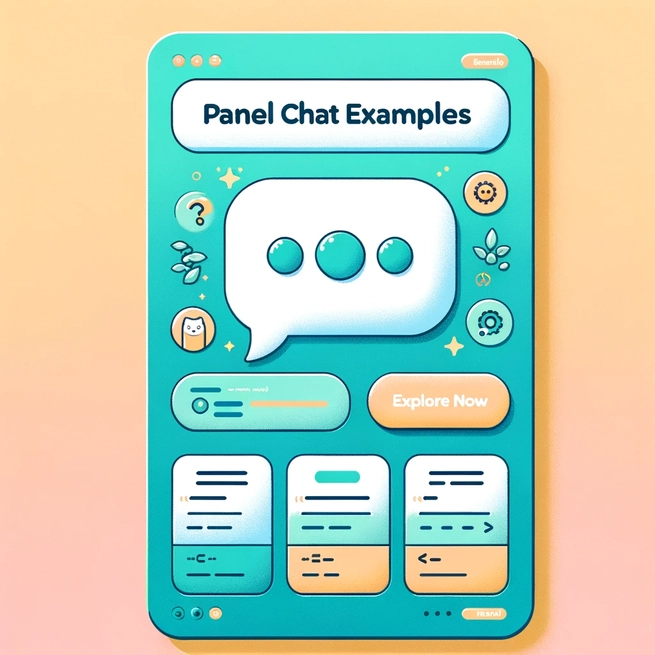

[`Panel Chat Examples`](https://holoviz-topics.github.io/panel-chat-examples/) feature [Panel](https://panel.holoviz.org/) and its  _multi modal_ chat components that support [LangChain](https://python.langchain.com/docs/get_started/introduction), [OpenAI](https://openai.com/blog/chatgpt), [Mistral](https://docs.mistral.ai/), [Llama](https://ai.meta.com/llama/), etc.  The useful extensions lead to doing and learning 🎛️🤖 Dashboard AI Agents for interactive, continuously improving insights.

<!--more-->

## Note: Panel Chat Examples

While there are [several Python Frameworks to build UIs for AI Apps](https://getstream.io/blog/ai-chat-ui-tools/#3-chainlit-build-uis-for-conversational-ai), Panel (Holoviz) features a few chatbot UIs within its browser-based data visualization ecosystems.  

Thus, although more general tools such as [`Gradio Python Client`](https://www.gradio.app/docs/python-client/introduction), [Streamlit LLM chatbots](https://docs.streamlit.io/develop/tutorials/chat-and-llm-apps/build-conversational-apps), and [`ai-chatbot by Vercel`](https://github.com/vercel/ai-chatbot) exist to build AI Apps with chatbots, it is still useful to learn and do "smart" interactive data-visualization using Panel (Holoviz).

For a more detailed technical and educational discussion on the alternatives in building LLM chatbots, please refer to [🤓 Learning Paths 🛤️:  Dashboard AI Agents 🎛️🤖] ()

{}
Alternatives to `Panel Chat Examples`: Gradio, 
{}

## Outcomes: 🎛️🤖 Dashboard AI Agents

`Panel Chat Examples`, by integrating powerful capabilities of data visualization, UI widgets, python libraries, and LLM AI capabilities through chatbot UIs:
* ***prototype*** working 🎛️🤖 Dashboard AI Agents,
* ***interconnect*** _interactive data visualization_ and _LLM-based chatbots_, and thus
* ***orchestrate*** data pipelines and interactions

{}
`Panel Chat Examples` can ***prototype*** working 🎛️🤖 Dashboard AI Agents, ***interconnect*** _interactive data visualization_ and _LLM-based chatbots_, and thus ***orchestrate*** data pipelines and interactions.
{}

## Tasks

[Han-Teng Liao](/experience) seeks the useful extensions of `Panel Chat Examples` for doing and learning AI-powered interactive data visualization for insights:

For 2025:

* A reading AI agent: learning [AI Engineering Book]()
* A writing AI agent: writing undergraduate-level papers using [pybibx](), [Bibliometrix]()
* Several visualization AI agents: visualizing data as part of the intelligent responses, such as [🍃💵visNetZero]({}),  [🍃🏭visCEADs]({}), [🧰NetBib]({}), and [⚖️🪙 Global Civic Service Performance --🏛️Oxford University bipa2024]({})

{}
Applying Panel Chat Examples to:
* reading [AI Engineering Book](
* writing papers using [pybibx](), [Bibliometrix]()
* visualizing data as part of intelligent responses
  * [🍃💵visNetZero]({}),
  * [🍃🏭visCEADs]({}), 
  * [🧰NetBib]({}), and 
  * [⚖️🪙 Global Civic Service Performance bipa2024]({})
{}

## External Links
{id="external_link"}
* https://holoviz-topics.github.io/panel-chat-examples/