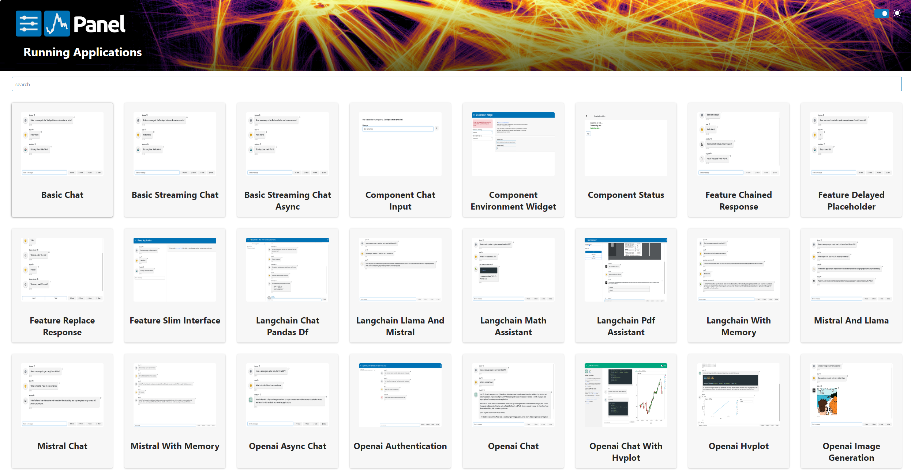
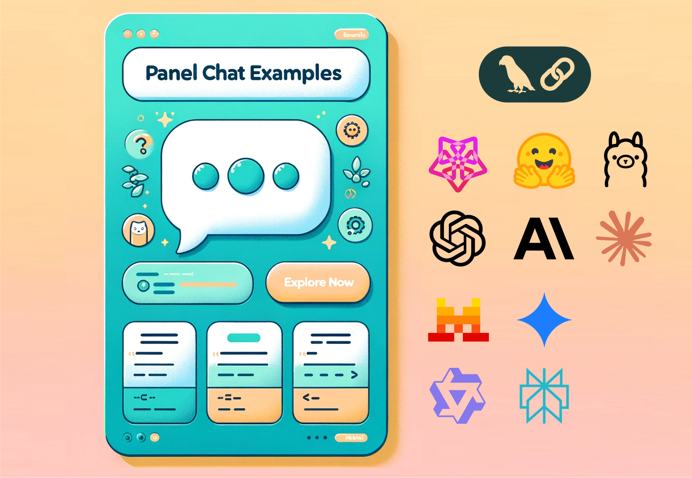

`Panel Chat Examples` feature *multi-modal* chat components that support various LLM and RAG tools.  The useful extensions lead to doing and learning 🎛️🤖 Dashboard AI Agents for interactive, continuously improving insights.

<!--more-->

## Note: Panel Chat Examples

While there are [several Python Frameworks to build UIs for AI Apps](https://getstream.io/blog/ai-chat-ui-tools/#3-chainlit-build-uis-for-conversational-ai), [Panel (Holoviz)](https://panel.holoviz.org/) provides a few Chatbot Examples in the collection of [`Panel Chat Examples`](https://holoviz-topics.github.io/panel-chat-examples/).

### LLM support
They demonstrate the support of various LLM and RAG tools: [LangChain](https://python.langchain.com/docs/get_started/introduction), [OpenAI](https://openai.com/blog/chatgpt), [Mistral](https://docs.mistral.ai/), [Llama](https://ai.meta.com/llama/), etc. 

### Alternatives
Thus, although more general tools, such as [Gradio Python Client](https://www.gradio.app/docs/python-client/introduction), [Streamlit LLM chatbots](https://docs.streamlit.io/develop/tutorials/chat-and-llm-apps/build-conversational-apps), and [Vercel AI chatbots](https://github.com/vercel/ai-chatbot) exist to build AI Apps with chatbots, it is still useful to learn and do "smart" interactive data-visualization using Panel (Holoviz).

For a more detailed technical and educational discussion on the alternatives in building LLM chatbots, please refer to [🤓 Learning Paths 🛤️:  Dashboard AI Agents 🎛️🤖]({})

{}
Some alternatives to `Panel Chat Examples`:
* [Gradio Python Client](https://www.gradio.app/docs/python-client/introduction)
* [Streamlit LLM chatbots](https://docs.streamlit.io/develop/tutorials/chat-and-llm-apps/build-conversational-apps), and 
* [Vercel AI chatbots](https://github.com/vercel/ai-chatbot)
{}



## Outcomes: 🎛️🤖 Dashboard AI Agents

`Panel Chat Examples`, integrate powerful capabilities of data visualization, UI widgets, python libraries, and LLM AI capabilities.  

Do Panel Chat Examples can:
* ***prototype*** working 🎛️🤖 Dashboard AI Agents,
* ***interconnect*** _interactive data visualization_ and _LLM-based chatbots_, and thus
* ***orchestrate*** data pipelines and interactions

A list of the available examples:
- Basic Chat, including Basic Streaming Chat, Basic Streaming Chat Async
- Component: Component Chat Input, Component Environment Widget, Component Status
- Features: Feature Chained Response, Feature Replace Response, Feature Slim Interface
- Langchain: Chat Pandas DF, Llama And Mistral, Math Assistant, Pdf Assistant, Langchain With Memory
- LLMs: Mistral And Llama, Mistral Chat, Mistral With Memory, Openai Async Chat, Openai Authentication, Openai Chat, Openai Chat With Hvplot, Openai Hvplot, Openai Image Generation

{}
`Panel Chat Examples` can 
* ****prototype*** working 🎛️🤖 Dashboard AI Agents, 
* ***interconnect*** _interactive data visualization_ and _LLM-based chatbots_, and thus 
* ***orchestrate*** data pipelines and interactions.
{}


## Tasks

[Han-Teng Liao](/experience) seeks the useful extensions of `Panel Chat Examples` for doing and learning AI-powered interactive data visualization for insights:

For 2025:

* A reading AI agent: learning [AI Engineering Book]({})
* A writing AI agent: writing undergraduate-level papers using [pybibx]({}), [Bibliometrix]({})
* Several visualization AI agents: visualizing data as part of the intelligent responses, such as [🍃💵visNetZero]({}),  [🍃🏭visCEADs]({}), [🧰NetBib]({}), and [⚖️🪙 Global Civic Service Performance --🏛️Oxford University bipa2024]({})

{}
Applying Panel Chat Examples to:
* reading [AI Engineering]({})
* writing papers using [pybibx]({}), [Bibliometrix]({})
* visualizing data as part of intelligent responses
  * [🍃💵visNetZero]({}),
  * [🍃🏭visCEADs]({}), 
  * [🧰NetBib]({}), and 
  * [⚖️🪙 Global Civic Service Performance bipa2024]({})
{}

## External Links
{id="external_link"}
* https://holoviz-topics.github.io/panel-chat-examples/