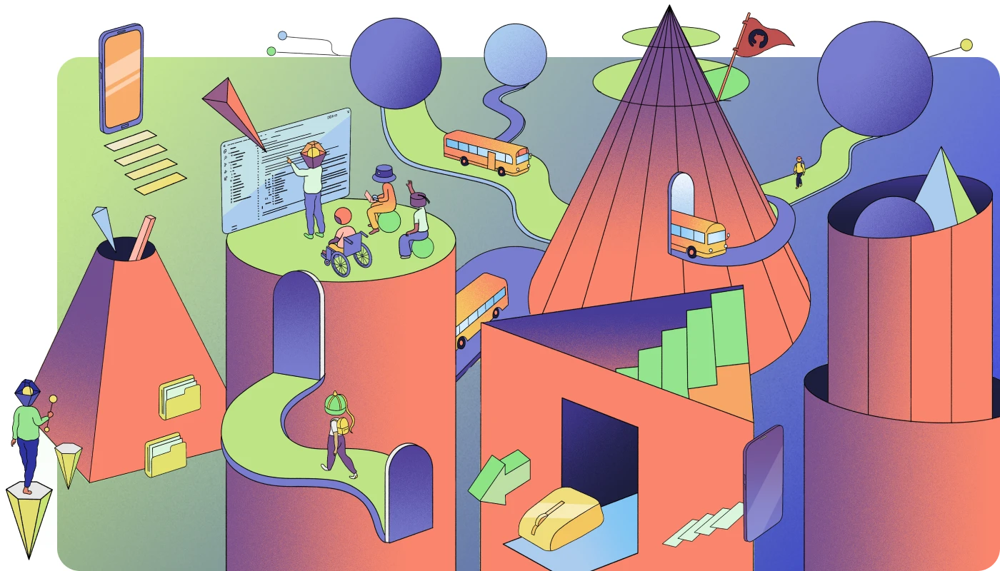

💓 Motivate students to do! Learn by doing AI agents 🤖! Curate their own portfolios of prototypes and PRDs📋. 

Based on my teaching and curriculum-developing experiences in China that features modern web development using <i class="fab fa-github" aria-hidden="true"></i>[GitHub](https://github.com/) and [🤗Hugging Face Hub ](https://huggingface.co/docs/hub/index), I have carefully designed a full foundational course of "Web Development for LLM-Powered Apps" that features building intelligent Apps using LLM, and producing AI agents within 24 weeks.

It aims to replace or complement CS 101 courses for all disciplines, including management and humanities background.  

<!--more-->



## Course Info and Features

Aimed at entry-level undergraduate students from diverse disciplinary backgrounds, the course series 🤖📲 *Web Development for LLM-Powered Apps* (hereafter  _this series_) provides a comprehensive foundation in both conceptual and practical aspects of modern web development in the context of **Large Language Models (LLMs)**.

> See how  _this series_ covers diverse disciplinary backgrounds including `engineering`, `management`, `marketing`, `psychology`, `design` and `new media` based on emerging job markets of AI capabilities: [🚢Learning Roadmap for intelligent API, ML, and AI 🗿](#LearningRoadmap)


### Course Series Structure
Spanning **two semesters** (12–18 weeks each, depending on institutional scheduling), the course is structured as follows:

* Web Development — 💪
  * 1️⃣ Foundations and CI/CD using Github
  * 2️⃣ Foundations for LLM-Powered Apps

This course emphasizes applied practice, technical fluency, and ethical awareness through the integration of LLMs into accessible, user-centric web platforms.

### ✨ Course Features 

_This course series_ emphasizes the following **action-oriented** learning outcomes, each grounded in Blooms' Taxonomy’s higher-order verbs and mapped to real-world development practices:

- 🏗️ **Construct** a capstone **project** 🎓 — integrating AI capabilities, multilingual interfaces, LLM APIs, and interactive data visualizations.
    
- 🌍 **Design** inclusive, multilingual **experiences** 💱 — incorporating WCAG accessibility, sustainable design principles, and internationalization/localization (i18n/L10n).
    
- 📢 **Communicate** technical **decisions** 🗄 — through structured documentation (MRDs, PRDs), interactive prototypes, deployed apps, and rubric-based peer evaluations.
    
- ⛏ **Clarify** foundational **concepts** 🧠 — including HTTP protocols, web standards, responsive layouts, Hugo modularity, Tailwind workflows, and prompt design for LLMs.
    
- 🧩 **Compose** responsive **user interfaces** 🗗 and interactive **visualizations** 📊 — using Hugo page bundles, TailwindCSS, and Apache ECharts to build tables, network graphs, geographical maps, and more.
    
- 📎 **Manage** multimodal and structured **assets** 🗂️ — such as images (vector vs. raster), video content, structured datasets (.json, .yaml, .csv, .xml), and production-ready HTML/CSS/JS.
    
- ⏿ **Orchestrate** reproducible **deployments** 🛫 — through Git-based version control, automated bundling, CI/CD workflows, and open-source configuration strategies.
    
- 🔌 **Integrate** LLM-powered **APIs** 📲 — to generate adaptive content, support real-time interactions, and implement prompt-to-page web flows.
    
- 🧭 **Evaluate** ethical and human-centered **implications** 🕵 — addressing algorithmic bias, privacy, transparency, and Responsible AI principles

Together, these features illustrate how students, through a **project-based learning journey**, can continuously expand, revise, and reflect on, their growth. 

Culminating in a capstone **project** 🎓, each learner’s contributions, peer-review, peer-learning and feedback cycles are tracked and recorded on GitHub to foster transparency and real-world readiness.

{}
##### In short
**Intelligent** Web Development requires continuous learning skillsets that leverage modern platforms such as Github for professional project-based traceable professional practices. 
{}

Two course syllabus are provided as follows:
* First, learners build a modern responsive website using Github, learning the fundamental components, Web knowledge, design practices, and basic deployment operations.
* Second, learners build several LLM-powered Apps (and other projects) that feature intelligent value-adds to their well-curated portfolio of documents, projects, interactive data dashboards, etc.

After finishing the _this course series_, each learner will align their interests and practices, growing with the world-leading projects and contributors on platforms such as <i class="fab fa-github" aria-hidden="true"></i>[GitHub](https://github.com/) and [🤗Hugging Face Hub ](https://huggingface.co/docs/hub/index), both of which provide extra education resources:

* <i class="fab fa-github" aria-hidden="true">Github</i>[GitHub Education](https://github.com/education)
* [🤗Hugging Face for Education ](https://huggingface.co/blog/education)

```markmap
* Web Development — 💪
  * 1️⃣ Foundations and CI/CD using Github
  * 2️⃣ Foundations for LLM-Powered Apps
```


## 💪1️⃣ Foundations and CI/CD using Github

_The first course_, called ***"Web Development—  Foundations and CI/CD using Github*** integrates essential `Web Design`, `Web Development`, and relevant `software & AI engineering` knowledge, with strong focus on practical applications using modern coding and deployment platforms such as Github.  

Learners are also expected to **observe, learn, and practice** critical software engineering skills in **Continuous Integration** and **Continuous Delivery/Deployment** (CI/CD),  aiming at automating and streamlining software/Web development lifecycles.  

{}
##### 1️⃣. Web Development Foundations
_The first course_ 
* integrates essential `Web Design`, `Web Development`, and relevant `software & AI engineering` knowledge
* prepares learners to **observe, learn, and practice** on Github
* trains learners to orchestrate their skillsets in the overall **Continuous Integration** and **Continuous Delivery/Deployment** (CI/CD) development processes
* requires learners to compose a Product Requirements Document (PRD)
{}

### 🎯 **Learning Objectives**

By the end of this course, students will be able to:

- 🎨 **Design** an intelligent, interactive site with multilingual content, search functionality, and diagrammatic UI elements
- 🧪 **Evaluate** personal and peer projects using structured rubrics tied to UX clarity, sustainability, and accessibility
- 🖌️ **Construct** accessible and responsive interfaces using TailwindCSS, semantic HTML, and animated SVGs
- 📑 **Compose** entry-level Product Requirements Documents (PRDs) aligned with professional standards including W3C accessibility and sustainable web design principles
- 🔍 **Identify** the foundational Web components (.html, .css, .js), webpage structure, core modules of a Hugo-based portfolio site and organize content logically
- 🧰 **Apply** structured web documentation and data file construction practices using markdown, YAML/JSON, and Hugo layouts
 
### 🌐 **Technology & Online Tools**

Learners must use and deploy **Github** platform resources. Learners are expected to star, curate, document, and apply software, UI and data projects that interest them.

Focusing on improving and polishing both the Web site and PRD, learners must gather, curate, revise, and reflect on all useful resources that lead them to valuable communities and leaders in the related professional fields.  However, these records and documentations must be recorded through Github commits. 

### 📅 **Weekly Breakdown** 🗂

The table below describes, for each week, the topics, tools, concepts and capabilities, all of which details the progression of the learning paths.



|Week📅|Topics 🧩|Tools🔧 & Concepts🧠|Specific Capabilities💪|
|---|---|---|---|
|1|Course Intro + GitHub 🗃️|Hugo, Git basics, site archetypes|🔍 **Identify** site structure and workflow components|
|2|Markdown & Hugo Basics 📄|Content pages, frontmatter|✍️ **Apply** markdown standards to author posts|
|3|Markmap & Mermaid 🧠|Mindmaps, flowcharts, Hugo diagram blocks|🎯 **Visualize** project logic or personal narratives|
|4|YAML & JSON 📦|Hugo `data/`, multilingual config, DevTools|🗂️ **Structure** reusable, localized content sources|
|5|HTML & Semantics 🧩|`<section>`, ARIA, semantic hierarchy|🧩 **Recognize** accessible layouts using semantic tags|
|6|Typography, Color Harmony & Font Accents 🖍️|Tailwind typography, 🎨 contrast, palettes|🌈 **Integrate** harmonious visual styles and fonts|
|7|TailwindCSS Animation + UI Motion ✨|Hover, pulse, icon transitions|⚙️ **Construct** intuitive interactions with animations|
|8|Responsive Design + Code Assistants 📱|Gemini CLI, grid, flexbox|🧰 **Adapt** layouts for mobile and diverse viewports|
|9|Hugo Shortcodes & Embeds 🎬|Modular blocks, YouTube, diagrams|🔧 **Embed** reusable shortcodes and media elements|
|10|SVG, Iconography & Theming 🎨|Inline SVG, dark/light mode, hover FX|🖼️ **Customize** visual branding and dynamic theming|
|11|Taxonomies + PRD Writing 🔖|Tags, categories, ✍️ PRD basics|📑 **Outline** UI and content behavior using verbs + nouns|
|12|Showcase & Peer Review 🎓|Deployment, rubric, walkthrough|🧪 **Evaluate** self + peer portfolios using clarity + UX metrics|


  
### ⛳ Final Project Assignment Brief 

(Based on Web PRD + W3C Accessibility & Sustainability)



#### 🏷️ Title
- 🧱 **Design** a Sustainable and Accessible Web Portfolio 💼🧾
   
#### 🎯 Goal
- 🛠️ **Build** and 📄 **Document** a static portfolio site using **Hugo**, representing your learning journey and showcasing professional communication via a companion **Product Requirements Document (PRD)**.    
- The project functions as a self-curation artifact for your professional identity in a **Community of Practice (CoP)**.

#### 📦 Deliverables
* 1. **🧭 Deploy** a GitHub-hosted **portfolio site** 🛫 featuring:
  - 📲 **Implement** clear semantic structure and accessible navigation with semantic HTML and WAI-ARIA landmarks ♼
  - 👀 **Support** search functionality, keyboard navigation and screen reader accessibility 📎
  - ⛏ **Style** responsive layouts using TailwindCSS 🧩and sustainable design principles (e.g. optimized assets, low-carbon fonts, dark mode)
  - 🌱 **Apply** sustainable design strategies (e.g. optimized assets, dark mode, green fonts) 💡
  - 📊 **Visualize** data with **Markmap、Mermaid、Apache ECharts or other interactive graphs**, demonstrating data literacy 🌀
  - 🛠️ **Construct** a retrieval **pipeline** or scripted automation flow 📎
  - ⚙️ **Automate** CI/CD  integration using **GitHub Actions** 🛫 
* 2. **📝Write** a PRD **Document** (2–3 pages) 🗄 outlining:
  - 🔖 **Define** Purpose, audience, content scope, and user experience goals (including personas)🎯 
  - 🧭 **Commit** to accessibility 🌍and sustainability standards ♿ 
  - 🧱 **Scope** all featured Hugo and Web components (e.g. pages, shortcodes, UI widgets, animation logic, SVG, and icon packs) 🧰    
  - 🛠️ **Specify** other technical expectations: performance,  browser compatibility, language toggles 💱
* 3. **⚖️ Reflect** n a series of personal **blog posts** (1 page) 📎
  - 🔍 **Explain** design trade-offs related to accessibility and environmental impact ♼
  - 🧑‍🤝‍🧑 **Incorporate** peer feedback and highlight key self-revisions 👀
  - ⏿  **Publish** your reflections (blog post or README) with citations/links to valuable resources 📚



### 🧭 Project Evaluation & Reflection

Final assessment emphasizes evidence-based iteration and individual growth over time. Students are expected to:

- 🧑‍🤝‍🧑 **Evaluate** Web **design** and **development processes**📎 —  by articulating accessibility, sustainability, and technical trade-offs 🛠️  
- 👁 **Analyze** feedback from **peer reviewers** 📎 — by identifying actionable suggestions, implementing changes, and reflecting on improvement loops.
- 📊 **Present** personal measurable **progress** over time🧮 — including tracked version control (Git commits, pull requests), deployment iterations, and visual evidence of CI/CD practices 🧷    
- 🤝 **Acknowledge** and **attribute** borrowed **assets or ideas**  — with thoughtful attribution and reward for value-added context-specific reuse, preferably within your own creative vision
- 💬 **Communicate** their personal **learning journey** 🗄 — by highlighting key skills gained, resources used, challenges overcome, and moments of insight or iteration.
- 📝 **Document** accessibility and sustainability **outcomes** ♼ — including any audits performed, performance benchmarks, or tooling used for optimization.

### 🧮 **Grading Criteria**
Grading Criteria focuses on the grasp of AI capabilities and professional expertise.

|Component|Description|Weight|
|---|---|---|
|🎯 **Web Quality & Site Structure**|Github usage, and working deployments|30%|
|🛠️ **Engineering Workflow**|GitHub commits, CI/CD integration, reproducibility, file structure, and deployment documentation|30%|
|🗣️ **PRD Clarity & Verb/Noun Precision**|Self and Peer Review Quality, revision cycles, self-reflection blogs/docs, and thoughtful citations|20%|
|🎨 **UX & Accessibility**|Responsive UI, multilingual support, accessibility compliance (WCAG), and sustainability design considerations|15%|





## 🏋2️⃣  Foundations for LLM-Powered Apps

_The second course_, called ***"Web Development—  LLM-Powered Apps"*** integrates essential  `API services`, `LLM`, and relevant `software & AI engineering` knowledge, with strong focus on practical applications using modern coding and deployment platforms such as Github and [🤗Hugging Face Hub ](https://huggingface.co/docs/hub/index).  

Learners are also expected to **observe, learn, and practice** critical **Continuous Integration** and **Continuous Deployment** (CI/CD) software/AI engineering skills,  aiming at automating and streamlining AI agent development lifecycles.  

{}
##### 2️⃣ LLM-Powered App Foundations
_The second course_ 
* integrates essential `API services`, `LLM`, and relevant `software & AI engineering` knowledge
* prepares learners to **observe, learn, and practice** on Github and [🤗Hugging Face Hub ](https://huggingface.co/docs/hub/index) platforms
* train learners to orchestrate their skillsets in the overall **Continuous Integration** and **Continuous Delivery/Deployment** (CI/CD) development processes for AI-agent development and deployment
* requires learners to compose a Product Requirements Document (PRD), following a [Proven AI PRD Template by Miqdad Jaffer (Product Lead @ OpenAI)](https://www.productcompass.pm/p/ai-prd-template)
{}


### 🎯 **Learning Objectives**

By the end of this course, students will be able to:

- ⛏ **Build** a set of intelligent, interactive applications with AI capabilities, while leveraging low-code and code-assistant intelligent tools and platforms (e.g. Gemini CLI)
- 🧪 **Evaluate** generated codes, content and agent behaviors using evaluation metrics and peer-tested rubrics
- 💬 **Construct** chatbot experiences integrated within Hugo using prompt logic and diagrammatic thinking
- 📝 **Author** technical AI Product Requirement Documents (PRDs) based on Miqdad Jaffer’s framework to articulate use cases, value, and measurement plans for LLM-based features
- 🔍 **Explain** and **integrate** foundational LLM APIs (e.g., OpenAI, Gemini) and UI components and how chat-based agents and retrieval methods (e.g. 📚RAG) serve specific interaction goals
- 🔁 **Automate** site, resource, code and content updates and deployments using dynamic web workflows (e.g. n8n) and GitHub CI/CD pipelines, with scaling cost and performance in mind

### 🌐 **Technology & Online Tools**

Learners must use and deploy **Github** and **[🤗Hugging Face Hub ](https://huggingface.co/docs/hub/index)** platform resources.  Exceptions can be made for advanced students seeking local LLM or WebLLM implementations. 

### 📅 **Weekly Breakdown** 🗂

The table below describes, for each week, the topics, tools, concepts and capabilities, all of which details the progression of the learning paths.



|Week📅|Topics 🧩|Tools🔧 & Concepts🧠|Specific Capabilities💪|
|---|---|---|---|
|1|PRD Writing for Chat UX 🧾|Lobe Icons, interface verbs/nouns|📝 **Author** a PRD to define chatbot roles and expected flows|
|2|Markmap & Mermaid for System Logic 📊|Diagrams, Markdown pipelines|💡 **Map** LLM workflows visually via sequence maps|
|3|YouTube ➜ Markdown Pipelines 📹|Transcript → summary → Hugo|🔄 **Convert** video input into structured markdown posts|
|4|APIs + n8n Sync Automation 🔧|POST to GitHub, REST hooks|🔁 **Automate** AI content deployment workflows|
|5|Prompt Engineering ✏️|Prompt formats, templates, JSON inputs|🎯 **Design** input-output flows with structured prompts|
|6|Local LLM + Docker 🐳|Ollama, API ports, docker-compose|🐳 **Implement** local LLM models via container infra|
|7|Retrieval-Augmented Generation 🔗|Embedding, grounding, context docs|📦 **Define** retrieval contexts for response precision|
|8|Chat UI + Hugo Integration 🧠|Chat widgets, Hugo rendering, fetch()|🧰 **Construct** reactive chat experiences in Hugo|
|9|Evaluating Chat Groundedness 🧪|Truth scoring, hallucination checks|🎯 **Evaluate** AI replies based on relevance + PRD adherence|
|10|Touchpoints + UX Resilience 🌐|Service mapping, feedback logs|💬 **Analyze** chat-agent lifecycle through UX blueprints|
|11|CI/CD for AI Apps ⚙️|Auto build, GitHub Actions|🔁 **Implement** auto-deploy and rebuild flows|
|12|Live Demo + Peer Reflection 🎓|Rubric, screen capture, presentation|🧠 **Evaluate** peer apps using PRD and UX performance metrics|

  
  
### ⛳ **Final Capstone Project**

The project features a [Proven AI PRD Template by Miqdad Jaffer (Product Lead @ OpenAI)](https://www.productcompass.pm/p/ai-prd-template) and provides students with an applied format for integrating documentation and deployment best practices.



#### 🏷️ Title
- 🧱 **Design** an AI-Powered Hugo **App & PRD** 🤖🧾
   
#### 🎯 Goal
- 🛠️ **Build** and 📄 **Document** a conversational agent or AI-powered integration that delivers clear value through a structured PRD—adapting Miqdad Jaffer’s example.

#### 📦 Deliverables
**💬 AI-Enabled Apps** should:
- 📲 **Implement** an API-powered or local LLM **chatbot interface** 👀
- ⛏ **Construct** a retrieval **pipeline** or scripted automation flow 📎
- 📊 **Visualize** data pipelines using **Markmap,  Mermaid, ECharts, or other diagrams/graphs** 🌀
- ⚙️ **Automate** CI/CD **integration** via GitHub Actions 🛫

**📄 AI PRD Document** (3–4 pages) should:
- 🗺️ **Frame** the **Strategic Context** 🧭 — including an executive summary and its (AI and AI capabilities) alignment to organizational strategy 
- 💡 **Define** **Product & Technical Excellence** 🧰 — identifying customer needs, value proposition, and agent logic blueprints    
- 💱 **Outline** the **Rollout Plan / Go-To-Market Strategy** 📢 — use cases, evaluation metrics (e.g. CSAT, grounding accuracy), and non-functional concerns like latency or hallucination mitigation
    

### 🧭 Project Evaluation & Reflection

Final assessment emphasizes evidence-based iteration and individual growth over time. Students are expected to:

- 🧑‍🤝‍🧑 **Review** peer **applications** and **documentations**📎 — and 🔁 **Revise** their own project based on rubric-based feedback 🛠️    
- 👁 **Identify** groundedness issues and **log failure cases** ♼ — as evidence of applied CI/CD practices and iterative deployment    
- 📝 **Compose** personal **reflections** 🗄 — including GitHub commit histories, blog posts, or technical documentation 🧷    
- 🧾 **Credit** referenced **code and sources** 📚 — with thoughtful attribution and reward for value-added context-specific reuse

### 🧮 **Grading Criteria**

Grading Criteria focuses on the grasp of AI capabilities and professional expertise.

|Component|Description|Weight|
|---|---|---|
|🎯 **App Functionality & Integration**|AI features, LLM API usage, chatbot logic, data flow execution, and working deployments|30%|
|📄 **PRD Structure & Clarity**|Alignment with Miqdad Jaffer’s AI PRD template, strategic framing, technical depth, and visuals|30%|
|🗣️ **Communication & Reflection**|Peer reviews, revision cycles, self-reflection blogs/docs, and thoughtful citations|20%|
|🧭 **Evaluation Awareness**|Recognition of bias, responsible AI concerns, and evaluation metrics with mitigation strategies|20%|





## 🧑‍🏫 An Education Technical Note on Syllabus Components📓

Using and extending [Syllabus Components by Harvard](https://bokcenter.harvard.edu/syllabus-design), this post focuses on the following in the university learning context:
- 🎯 **Course Goals / Learning Objectives**
- 📅 **Weekly Breakdown / Course Schedule**
- ⛳ **Final Project / Capstone (if applicable)**
- 🧮 **Grading Criteria / Assessment**
- 🌐 **Technology & Online Tools**

The following details are beyond the scope of this post:
- 📚 **Course Materials / Texts**
- 🧠 **Course Requirements / Assignments**
- 📌 **Course Policies**
- 🧑‍🏫 **Instructor Information**
- 🧭 **Office Hours & Communication**
- 🛠 **Support Resources**
- 📖 **Academic Integrity**



## 🚢Learning Roadmap for API, ML, and AI 🗿  

This section first contextualize AI capabilities in the emerging job markets, covering academic disciplines, including `engineering`, `management`, `marketing`, `psychology`, `design` and `new media`, and then summarize as one overall learning roadmap.
{id="LearningRoadmap"}

### Roadmap

```markmap {height="240px"}
* ⚙️
  * General
	* 💡 AI Product Manager
* 🛄 leaning 
  * *Engineering*🏗️ 
	 * ⛑ AI Engineer
	 * 🧪 AI Research Scientist
  * *Management*, *Accounting* and *Audit*🎯 
 	 * 🎛 AI Data Context Architect
 	 * ⚖️ AI Integrity Analyst
  * *Marketing*, *Psychology* and *Design*💓 
	 * 🤝 AI Behavior Architect
	 * 💃🏻 AI Audience Strategist Track
  * *New Media*, *Content* and *HCI*📳 
	 * 🤣 Multimodal AI Designer
* 🧑‍🚀 
  * Senior Position
	 * 🚀 AI Agent Orchestration Lead
```

### Details

* ⚙️ general track with basic *AI engineering* understanding
	 * 💡 AI Product Manager
* 🛄 leaning 
  * 🏗️*Engineering* 
	 * ⛑ AI Engineer
	 * 🧪 AI Research Scientist
  * 🎯*Management*, *Accounting* and *Audit* 
	 * 🎛 AI Data Context Architect (operations and management context)
	 * ⚖️ AI Integrity Analyst (QA, risk management, and compliance)
  * 💓*Marketing*, *Psychology* and *Design* 
	* 🤝 AI Behavior Architect (UX design focusing on user adoption)
	* 💃🏻 AI Audience Strategist Track (story marketing)
  * 📳*New Media*, *Content* and *HCI* 
	* 🤣 Multimodal AI Designer (UX design focusing on interfaces across voice, gesture, text, image, and touch)
* 🧑‍🚀 enterprise senior position
	 * 🚀 AI Agent Orchestration Lead
