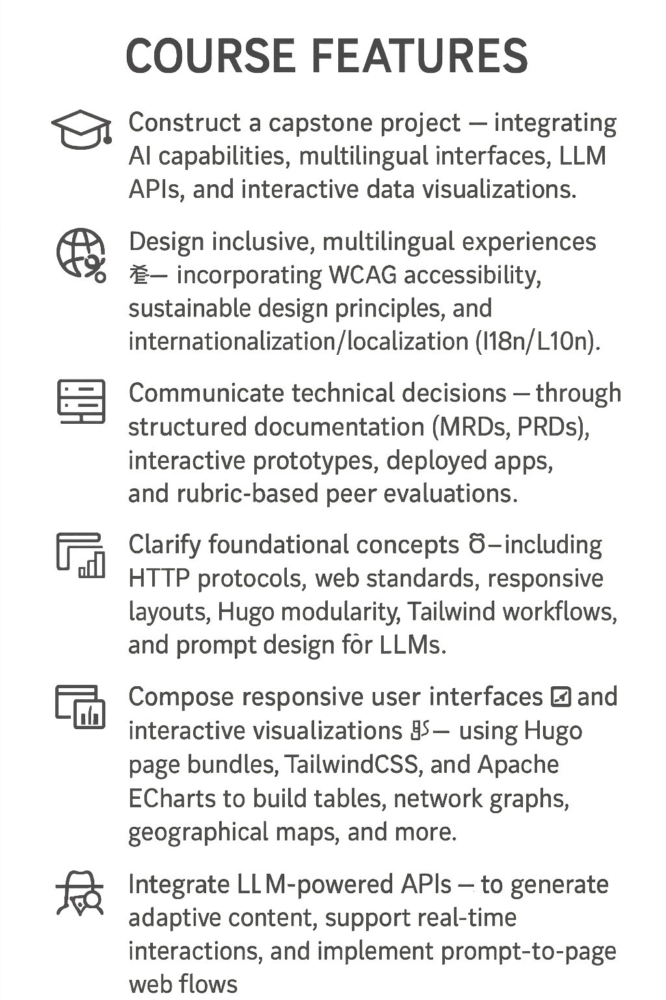

💓 激勵學生通過制作自己的 PRD📋 組合、原型和 AI 代理🤖 來實踐學習！

基於我在中國教授和開發課程的經驗，該課程以使用 <i class="fab fa-github" aria-hidden="true"></i>[GitHub](https://github.com/) 和 [🤗Hugging Face Hub](https://huggingface.co/docs/hub/index) 的現代網頁開發為特色，我精心設計了一門名為“面向 LLM 驅動應用的網頁開發”的完整基礎課程，其特點是利用 LLM 構建智能應用， 在共 24 周的課程後，開始入門 `AI 工程` 並產出 LLM 應用**AI 代理🤖** 項目。

本課程旨在取代或補充所有學科（包括管理和人文學科背景）的 CS 101 課程。

<!-- more -->



## 系列課程信息與特點

本系列課程 🤖📲 _面向 LLM 驅動應用的網頁開發_ （以下簡稱 _本系列_）面向具有不同學科背景的入門級本科生，在 **大型語言模型 (LLM)** 的背景下，為現代網頁開發的理論和實踐方面提供全面的基礎。

> 要了解 _本系列_ 如何根據 AI 能力的新興就業市場，涵蓋包括 `工程`、`管理`、`營銷`、`心理學`、`設計` 和 `新媒體` 等在內的多學科背景，請見：[🚢智能 API、ML 和 AI 學習路線圖 🗿](#LearningRoadmap)


### _系列課程結構_

_本系列_課程為期 **兩個學期** （每學期 12-18 周，具體取決於院校安排），結構如下：

* 網站應用開發 —💪
  * 1️⃣ 使用 Github 進行 CI/CD 基礎
  * 2️⃣ 大語言模型驅動應用基礎

本課程通過將 LLM 集成到易於訪問、以用戶為中心的網站應用，強調應用實踐、技術熟練度和倫理意識，先後產出1️⃣**個人作品集** 與 2️⃣**AI 代理🤖** 項目。

### ✨ 課程特色

_本系列課程_ 強調以下 **以行動為導向** 的學習成果，每個成果都以布魯姆分類學的高階動詞為基礎，並與實際開發實踐相對應：

- 🏗️ **構建** 一個結業 **項目** 🎓 — 集成 AI 能力、多語言界面、LLM API 和交互式數據可視化。    
- 🌍 **設計** 包容性、多語言 **體驗** 💱 — 融入 WCAG 無障礙標准、可持續設計原則和國際化/本地化 (i18n/L10n)。    
- 📢 **溝通** 技術 **決策** 🗄 — 通過結構化文檔（MRD、PRD）、交互式原型、已部署的應用和基於評分標准的同行評審。 
- ⛏ **釐清** 基礎 **概念** 🧠 — 包括 HTTP 協議、Web 標准、響應式布局、Hugo 模塊化、Tailwind 工作流和 LLM 的提示詞設計。    
- 🧩 **組合** 響應式 **用戶界面** 🗗 和交互式 **可視化** 📊 — 使用 Hugo 頁面包、TailwindCSS 和 Apache ECharts 構建表格、網絡圖、地理地圖等。    
- 📎 **管理** 多模態和結構化 **資產** 🗂️ — 例如圖像（矢量與柵格）、視頻內容、結構化數據集（.json、.yaml、.csv、.xml）以及生產就緒的 HTML/CSS/JS。    
- ⏿ **編排** 可復現的 **部署** 🛫 — 通過基於 Git 的版本控制、自動化打包、CI/CD 工作流和開源配置策略。    
- 🔌 **集成** LLM 驅動的 **API** 📲 — 生成自適應內容、支持實時交互並實現從提示詞到頁面的 Web 流。    
- 🧭 **評估** 倫理和以人為本的 **影響** 🕵 — 解決算法偏差、隱私、透明度和負責任的 AI 原則。

所有這些特點共同展示了學生如何通過 **項目式學習之旅** 不斷擴展、修改和反思自己的成長。

最終的結業 **項目** 🎓 中，每位學習者的貢獻、同行評審、同伴學習和反饋周期都會在 GitHub 上進行跟蹤和記錄，以促進透明度和實際工作的准備。

{}
##### 簡而言之
**智能** 網頁開發需要持續學習的技能，並利用 GitHub 等現代平台進行基於項目的、可追溯的專業實踐。
{}

兩門課程大綱提供如下：

* 首先，學習者使用 GitHub 構建一個***現代響應式網站***，學習基本組件、Web 知識、設計實踐和基本部署操作。
    
* 其次，學習者構建多個***由 LLM 驅動的應用程序***（及其他項目），為其精心策劃的文檔、項目、交互式數據儀表板等作品集增添智能價值。


完成 _本系列課程_ 後，每位學習者將根據自己的興趣和實踐調整方向，與  <i class="fab fa-github" aria-hidden="true"></i>GitHub 和 🤗Hugging Face Hub 等平台上的世界領先項目和貢獻者共同成長，這兩個平台都提供額外的教育資源：

* <i class="fab fa-github" aria-hidden="true">Github</i>[GitHub Education](https://github.com/education)
* [🤗Hugging Face for Education ](https://huggingface.co/blog/education)



<hr class="w-48 h-1 mx-auto my-4 bg-gray-100 border-0 rounded-sm md:my-10 dark:bg-gray-700">

## 💪1️⃣ 基礎知識與使用 GitHub 進行 CI/CD

_第一門課程_，名為“**_網頁開發 — 基礎知識與使用 GitHub 進行 CI/CD_**”，融合了必要的 `網頁設計`、`網頁開發` 和相關的 `軟件與 AI 工程` 知識，並重點關注使用 GitHub 等現代編碼和部署平台的實際應用。

學習者還將**觀察、學習和實踐**關鍵軟件工程技能，包括**持續集成**和**持續交付/部署** (CI/CD) ，旨在自動化和（加工）流水化開發生命周期，改進軟件/網頁。


{}
##### 1️⃣. 網頁開發基礎
_第一門課程_
* 融合了必要的 `網頁設計`、`網站開發` 和相關的 `軟件與 AI 工程` 知識
* 培養學習者在 GitHub 上進行**觀察、學習和實踐**
* 訓練學習者在整體的**持續集成**和**持續交付/部署** (CI/CD) 開發過程中協調其技能
* 要求學習者撰寫產品需求文檔 (PRD)
{}

### 🎯 **學習目標**

學完本課程後，學生將能夠：

- 🎨 **設計** 一個智能、交互式網站，包含多語言內容、搜索功能和圖表式 UI 元素    
- 🧪 **評估** 個人和同行項目，使用與用戶體驗清晰度、可持續性和可訪問性相關的結構化評分標准    
- 🖌️ **構建** 可訪問和響應式界面，使用 TailwindCSS、語義化 HTML 和動畫 SVG    
- 📑 **撰寫** 符合專業標准（包括 W3C 可訪問性和可持續網頁設計原則）的入門級產品需求文檔 (PRD)    
- 🔍 **識別** 基礎的 Web 組件（.html, .css, .js）、網頁結構、基於 Hugo 的作品集網站的核心模塊並進行邏輯組織    
- 🧰 **應用** 結構化的 Web 文檔和數據文件構建實踐，使用 Markdown、YAML/JSON 和 Hugo 布局
 
### 🌐 **技術與在線工具**

學習者必須使用和部署 **Github** 平台資源。學習者需要點贊、整理、記錄和應用他們感興趣的軟件、UI 和數據項目。

為了改進和完善網站和 PRD，學習者必須收集、整理、修訂和反思所有有用的資源，這些資源將引導他們進入相關專業領域的寶貴社區和領導者。然而，這些記錄和文檔必須通過 Github 提交進行記錄。

### 📅 **每周安排** 🗂

下表描述了每周的主題、工具、概念和能力，所有這些都詳細說明了學習路徑的進展。



|周📅|主題 🧩|工具🔧 & 概念🧠|具體能力💪|
|---|---|---|---|
|1|課程介紹 + GitHub 🗃️|Hugo, Git 基礎知識, 網站原型|🔍 **識別** 網站結構和工作流組件|
|2|Markdown 和 Hugo 基礎 📄|內容頁面, frontmatter|✍️ **應用** Markdown 標准撰寫文章|
|3|Markmap 和 Mermaid 🧠|思維導圖, 流程圖, Hugo 圖表塊|🎯 **可視化** 項目邏輯或個人敘述|
|4|YAML 和 JSON 📦|Hugo `data/`, 多語言配置, DevTools|🗂️ **構建** 可復用的本地化內容源|
|5|HTML 和語義化 🧩|`<section>`, ARIA, 語義層級|🧩 **識別** 使用語義標簽的可訪問布局|
|6|排版, 色彩協調與字體強調 🖍️|Tailwind 排版, 🎨 對比度, 調色板|🌈 **整合** 協調的視覺風格和字體|
|7|TailwindCSS 動畫 + UI 動效 ✨|懸停, 脈衝, 圖標過渡|⚙️ **構建** 帶有動畫的直觀交互|
|8|響應式設計 + 代碼助手 📱|Gemini CLI, 網格, flexbox|🧰 **適應** 移動設備和不同視窗的布局|
|9|Hugo Shortcodes 和嵌入 🎬|模塊化塊, YouTube, 圖表|🔧 **嵌入** 可復用的 shortcode 和媒體元素|
|10|SVG, 圖標和主題 🎨|內聯 SVG, 深色/淺色模式, 懸停效果|🖼️ **自定義** 視覺品牌和動態主題|
|11|分類法 + PRD 撰寫 🔖|標簽, 分類, ✍️ PRD 基礎|📑 **概述** 使用動詞 + 名詞表示 UI 和內容行為|
|12|展示與同行評審 🎓|部署, 評分標准, 演示|🧪 **評估** 個人 + 同行作品集，使用清晰度和用戶體驗指標|

  
### 🧩 期末項目作業說明

（基於 Web PRD + W3C 可訪問性與可持續性）

>  🧩 項目模板
{class="inline-block"}

  

#### 🏷️ 標題

- 🧱 **設計** 一個可持續且可訪問的 Web 作品集 🧩

#### 🎯 目標
- 🛠️ **構建** 並 📄 **文檔化** 一個使用 **Hugo** 的靜態作品集網站，展示您的學習歷程，並通過配套的 **產品需求文檔 (PRD)** 展示專業溝通能力。
- 該項目作為您在 **實踐社區 (CoP)** 中專業身份的自我策展成果。
- 
#### 📦 交付作品
* 1. **🧭 部署** 一個 GitHub 托管的 **作品集網站** 🛫，具備以下特點：
  - 📲 **實現** 清晰的語義結構和可訪問的導航，使用語義化 HTML 和 WAI-ARIA 地標 ♼    
  - 👀 **支持** 搜索功能、鍵盤導航和屏幕閱讀器可訪問性 📎    
  - ⛏ **使用** TailwindCSS 🧩和可持續設計原則（例如優化資產、低碳字體、深色模式）**設計** 響應式布局    
  - 🌱 **應用** 可持續設計策略（例如優化資產、深色模式、綠色字體）💡    
  - 📊 **可視化** 數據作品，運用 **Markmap、Mermaid、Apache ECharts 或其他圖表** 來展示數據素養 🌀
  - 🛠️ **構建** 一個檢索 **管道** 或腳本自動化流程 📎    
  - ⚙️ **自動化**  CI/CD  集成，利用 **GitHub Actions** 🛫 
* 2. **📘 撰寫** 一份 PRD **文檔**（2-3 頁）🗄 概述： 
  - 🔖 **定義** 目的、受眾、內容範圍和用戶體驗目標（包括用戶畫像）🎯    
  - 🧭 **遵守** 可訪問性和可持續性標准 ♿ 🌍    
  - 🧱 **範圍界定** 所有特色 Hugo 和 Web 組件（例如頁面、shortcode、UI 小部件、動畫邏輯、SVG 和圖標包）🧰    
  - 🛠️ **明定** 其他技術預期：性能、瀏覽器兼容性、語言切換💱
* 3. ** ⏿  反思** 一系列個人 **博客文章**（1 頁）📎
  - 🔍 **解釋** 與可訪問性和環境影響相關的設計權衡 ♼
  - 🧑‍🤝‍🧑 **采納** 同行反饋並突出關鍵的自我修訂 👀
  - 📖 **發布** 您的反思（博客文章或 README），並引用/鏈接有價值的資源 📚 
 

 
### 🧭 項目評估與反思

最終評估強調基於證據的迭代和隨時間推移的個人成長。學生應：

- 🧑‍🤝‍🧑 **評估** Web **設計** 和 **開發過程** 📎 — 通過闡明可訪問性、可持續性和技術權衡 🛠️    
- 👁 **分析** 來自 **同行評審者** 的反饋 📎 — 通過識別可操作的建議、實施更改並反思改進循環。    
- 📊 **展示** 隨時間推移的個人可衡量 **進展** 🧮 — 包括跟蹤的版本控制（Git 提交、拉取請求）、部署迭代以及 CI/CD 實踐的視覺證據 🧷    
- 🤝 **志謝** 並 **注明** 借用的 **資源或想法** — 使用他人資源必署名原作者，並經過深思熟慮，去獎勵有價值的、特定於上下文的再次利用，最好是在自己的創意願景中定位借用他人的部份  
- 💬 **溝通** 他們的個人 **學習旅程** 🗄 — 突出獲得的關鍵技能、使用的資源、克服的挑戰以及洞察或迭代的時刻。    
- 📝 **記錄** 可訪問性和可持續性 **成果** ♼ — 包括執行的任何審計、性能基准或用於優化的工具。

### 🧮 **評分標准**
評分標准聚焦在 AI 能力 的掌握 與 產業專業能力。

|分項內容|描述|比重|
|---|---|---|
|🎯 **網站質量與結構**|Github 使用情況和正常運行的部署|30%|
|🛠️ **工程工作流程**|GitHub 提交、CI/CD 集成、可復現性、文件結構和部署文檔|30%|
|🗣️ **PRD 清晰度與動詞/名詞精確性**|自我與同行評審質量、修訂周期、自我反思博客/文檔以及深思熟慮的引用|20%|
|🎨 **用戶體驗與可訪問性**|響應式 UI、多語言支持、可訪問性合規性 (WCAG) 和可持續性設計考慮|15%|
|✨ **創新與價值創造**|獨特的功能、創造性的解決方案、對新興趨勢的整合以及對作品集的整體價值貢獻|5%|




<hr class="w-48 h-1 mx-auto my-4 bg-gray-100 border-0 rounded-sm md:my-10 dark:bg-gray-700">


## 🏋2️⃣ LLM 驅動應用基礎

_第二門課程_，名為“**_網頁開發 — LLM 驅動應用_**”，整合了必要的 `API 服務`、`LLM` 以及相關的 `軟件與 AI 工程` 知識，並著重於使用 GitHub 和 [🤗Hugging Face Hub](https://huggingface.co/docs/hub/index) 等現代編碼和部署平台進行實際應用。

學習者預期能習得**觀察、學習和實踐**關鍵的**持續集成**和**持續部署** (CI/CD) 的 `軟件與 AI 工程` 技能，旨在自動化和簡化 AI 代理開發生命周期。

{}
##### 2️⃣ LLM 驅動應用基礎
_第二門課程_
- 整合了必要的 `API 服務`、`LLM` 以及相關的 `軟件與 AI 工程` 知識    
- 培養學習者在 GitHub 和 [🤗Hugging Face Hub](https://huggingface.co/docs/hub/index) 平台上**觀察、學習和實踐**    
- 訓練學習者在 AI 代理開發和部署的整體**持續集成**和**持續交付/部署** (CI/CD) 開發流程中協調其技能    
- 要求學習者按照 [Miqdad Jaffer (OpenAI 產品負責人) 的經驗證的 AI PRD 模板](https://www.productcompass.pm/p/ai-prd-template) 撰寫產品需求文檔 (PRD) {}

### 🎯 **學習目標**

學完本課程後，學生將能夠：

- ⛏ **構建** 一系列具有 AI 能力的智能交互式應用程序，同時利用低代碼和代碼助手智能工具及平台（例如 Gemini CLI）    
- 🧪 **評估** 生成的代碼、內容和代理行為，使用評估指標和經過同行測試的評分標准    
- 💬 **構建** 集成在 Hugo 中的聊天機器人體驗，運用提示詞邏輯和圖表思維    
- 📝 **撰寫** 基於 Miqdad Jaffer 框架的技術性 AI 產品需求文檔 (PRD)，闡明基於 LLM 功能的使用案例、價值和衡量計劃    
- 🔍 **解釋** 並 **集成** 基礎的 LLM API（例如 OpenAI、Gemini）和 UI 組件，以及基於聊天的代理和檢索方法（例如 📚RAG）如何服務於特定的交互目標    
- 🔁 **自動化** 網站、資源、代碼和內容更新與部署，使用動態網頁工作流（例如 n8n）和 GitHub CI/CD 管道，同時考慮擴展成本和性能    

### 🌐 **技術與在線工具**

學習者必須使用並部署 **Github** 和 **[🤗Hugging Face Hub](https://huggingface.co/docs/hub/index)** 平台資源。對於尋求本地 LLM 或 WebLLM 實現的進階學生可以破例。

### 📅 **每周安排** 🗂

下表描述了每周的主題、工具、概念和能力，所有這些都詳細說明了學習路徑的進展。



|周📅|主題 🧩|工具🔧 & 概念🧠|具體能力💪|
|---|---|---|---|
|1|聊天用戶體驗的 PRD 撰寫 🧾|Lobe Icons, 界面動詞/名詞|📝 **撰寫** PRD 以定義聊天機器人角色和預期流程|
|2|Markmap 和 Mermaid 用於系統邏輯 📊|圖表, Markdown 管道|💡 **通過** 序列圖可視化 LLM 工作流|
|3|YouTube ➜ Markdown 管道 📹|轉錄 → 摘要 → Hugo|🔄 **將** 視頻輸入轉換為結構化 Markdown 文章|
|4|API + n8n 同步自動化 🔧|POST 到 GitHub, REST hooks|🔁 **自動化** AI 內容部署工作流|
|5|提示工程 ✏️|提示詞格式, 模板, JSON 輸入|🎯 **設計** 帶有結構化提示詞的輸入-輸出流程|
|6|本地 LLM + Docker 🐳|Ollama, API 端口, docker-compose|🐳 **通過** 容器基礎設施實現本地 LLM 模型|
|7|檢索增強生成 (RAG) 🔗|嵌入, 接地, 上下文文檔|📦 **定義** 用於響應精度的檢索上下文|
|8|聊天 UI + Hugo 集成 🧠|聊天小部件, Hugo 渲染, fetch()|🧰 **在** Hugo 中構建響應式聊天體驗|
|9|評估聊天接地性 🧪|真值評分, 幻覺檢查|🎯 **根據** 相關性 + PRD 符合度評估 AI 回復|
|10|觸點 + 用戶體驗彈性 🌐|服務映射, 反饋日志|💬 **通過** 用戶體驗藍圖分析聊天代理生命周期|
|11|AI 應用的 CI/CD ⚙️|自動構建, GitHub Actions|🔁 **實施** 自動部署和重建流程|
|12|現場演示 + 同行反思 🎓|評分標准, 屏幕截圖, 演示|🧠 **使用** PRD 和用戶體驗性能指標評估同行應用|


### 🧩 **期末頂點項目**說明

本項目特色為使用 [Miqdad Jaffer (OpenAI 產品負責人) 的 AI PRD 模板](https://www.productcompass.pm/p/ai-prd-template) ，此模板經企業市場實戰驗證。

>  🧩 項目模板
{class="inline-block"}

 
#### 🏷️ 標題
- 🧱 **設計** 一個由 AI 驅動的 Hugo **應用與 PRD** 🧩

#### 🎯 目標
- 🛠️ **構建** 並 📄 **文檔化** 一個會話代理或 AI 驅動的集成，通過結構化的 PRD 傳遞清晰的價值 — 借鑒 Miqdad Jaffer 的示例。    

#### 📦 交付作品
**💬 啟用 AI 的應用** 應：
- 📲 **實現** 一個由 API 驅動或本地 LLM 驅動的 **聊天機器人界面** 👀    
- ⛏ **構建** 一個檢索 **管道** 或腳本自動化流程 📎    
- 📊 **可視化** 數據管道，使用 **Markmap、Mermaid、ECharts 或其他圖表** 🌀    
- ⚙️  **自動化** GitHub Actions CI/CD 的**集成** 🛫    

**📄 AI PRD 文檔** (3–4 頁) 應：
- 🗺️ **框架** **戰略背景** 🧭 — 包括執行摘要及其（AI 和 AI 能力）與組織戰略的一致性    
- 💡 **定義** **產品和技術卓越性** 🧰 — 識別客戶需求、價值主張和代理邏輯藍圖    
- 💱 **概述** **推廣計劃 / 上市策略** 📢 — 用例、評估指標（例如 CSAT、接地性准確性）和非功能性關注點，如延遲或人工智能幻覺緩解 


### 🧭 項目評估與反思
最終評估強調基於證據的迭代和隨時間推移的個人成長。學生應：

- 🧑‍🤝‍🧑 **評審** 同行**應用**和**文檔** 📎 — 並 🔁 **修訂** 自己的項目，基於評分標准反饋 🛠️    
- 👁 **識別** 接地性問題並 **記錄故障案例** ♼ — 作為應用 CI/CD 實踐和迭代部署的證據    
- 📝 **撰寫** 個人**反思** 🗄 — 包括 GitHub 提交歷史、博客文章或技術文檔 🧷    
- 🧾 **注明** 參考的**代碼和來源** 📚 — 經過深思熟慮的歸屬，並獎勵有價值的、特定於上下文的重用    

### 🧮 **評分標准**
評分標准聚焦在 AI 能力 的掌握 與 產業專業能力。

|分項內容|描述|比重|
|---|---|---|
|🎯 **應用功能與集成**|AI 功能、LLM API 使用、聊天機器人邏輯、數據流執行和正常運行的部署|30%|
|📄 **PRD 結構與清晰度**|與 Miqdad Jaffer 的 AI PRD 模板的一致性、戰略框架、技術深度和視覺效果|30%|
|🗣️ **溝通與反思**|同行評審、修訂周期、自我反思博客/文檔以及深思熟慮的引用|20%|
|🧭 **評估意識**|對偏差、負責任的 AI 擔憂和評估指標（包括緩解策略）的認識|20%|


<hr class="w-48 h-1 mx-auto my-4 bg-gray-100 border-0 rounded-sm md:my-10 dark:bg-gray-700">

## 🧑‍🏫 說明：教學大綱組成部分📓
本文借鑒並擴展了 [哈佛大學的教學大綱組成部分 (Syllabus Components by Harvard)](https://bokcenter.harvard.edu/syllabus-design)，重點關注大學學習環境中的以下方面：
- 🎯 **課程目標 / 學習目標**    
- 📅 **每周安排 / 課程表**    
- 🧩 **期末項目 / 畢業設計（如適用）**    
- 🧮 **評分標准 / 評估**    
- 🌐 **技術與在線工具**

以下詳細內容超出本文範圍（但可以補充自用）：
- 📚 **課程材料 / 教材**
- 🧠 **課程要求 / 作業**
- 📌 **課程政策**
- 🧑‍🏫 **教師信息**
- 🧭 **辦公時間與溝通**
- 🛠 **支持資源**
- 📖 **學術誠信**

<hr class="w-48 h-1 mx-auto my-4 bg-gray-100 border-0 rounded-sm md:my-10 dark:bg-gray-700">

## 🚢 API、機器學習和人工智能學習路線圖 🗿 

本節將首先在新興就業市場中情境化人工智能能力，涵蓋包括 `工程`、`管理`、`市場營銷`、`心理學`、`設計` 和 `新媒體` 等在內的學術學科，然後總結為一個總體學習路線圖。
{id="LearningRoadmap"}

### 路線圖

```markmap {height="240px"}
* ⚙️
  * 通用
	* 💡 AI 產品經理
* 🛄 偏向
  * 工程🏗️ 
	 * ⛑ AI 工程師
	 * 🧪 AI 科學家
  * 管理、會計 和 審計🎯 
 	 * 🎛 AI 數據脈絡/語境架構師
 	 * ⚖️ AI 合規性分析師
  * 市場營銷、心理學 和 設計💓 
	 * 🤝 AI 行為設計師
	 * 💃🏻 AI 受眾策略師
  * 新媒體、內容 和 人機交互 (HCI)📳 
	 * 🤣 多模態 AI 體驗設計師
* 🧑‍🚀 
  * 企業高級職位
	 * 🚀 AI 智能體編排負責人
```

### 大綱

* ⚙️ 通用路徑，具備基本 `AI 工程` 理解
	 * 💡 **AI 產品經理 (AI Product Manager)** （技術產品和項目管理）
* 🛄 偏向
  * 🏗️ *工程* 
	 * ⛑ AI 工程師
	 * 🧪 AI 科學家
  * 🎯 *管理*、*會計* 和 *審計* 
	 * 📈 **AI 數據語境架構師 (AI Data Context Architect)** （運營和管理語境）
	 * ⚖️ **AI 合規性分析師 (AI Integrity Analyst)** （質量保證、風險管理和合規）
  * 💓 *市場營銷*、*心理學* 和 *設計*
    * 🤝 **AI 行為設計師 (AI Behavior Designer)** （專注於用戶采納的用戶體驗設計）
    * 💃🏻 **AI 受眾策略師 (AI Audience Strategist)** 路徑（故事營銷）
  * 📳 *新媒體*、*內容* 和 *人機交互 (HCI)*
	* 🤣 **多模態 AI 體驗設計師 (Multimodal AI Experience Designer)** （專注於語音、手勢、文本、圖像和觸摸界面的用戶體驗設計）
* 🧑‍🚀企業高級職位
	 * 🚀 **AI 智能體編排負責人 (AI Agent Orchestration Lead)**
