_**“API Dialogue AI”**_ is a course designed to guide learners in building intelligent product prototypes featuring **Retrieval-Augmented Generation (RAG)**. It covers theoretical and architectural workflows involving **Large Language Models (LLMs)**—from interface to evaluation—and emphasizes hands-on coding, documentation, and idea generation through applied **LLM applications**.

<!--more-->

This page outlines and showcases the knowledge and practical components of the course.

## MCP: The Model Context Protocol Emerging from APIs

How do we practically integrate smart applications? Whether cloud-based or local Q&A, intelligent APIs can act like building blocks for constructing useful, tangible smart apps.

As in storytelling, it’s sometimes best to start in medias res. Let’s dive straight into the **Model Context Protocol (MCP)**.

### Core Concepts: Grasping the Ideas

While watching the video below, note down unfamiliar nouns on one side and the verbs you understand on the other.



Based on this video: How does MCP enhance AI? How does it simplify the LLM workflow? What role do APIs play?

### Foundational Practice: Understanding Code Blocks

Watch the next video focusing solely on identifying nouns and verbs related to each code section. Skip the detailed implementation.



## Reinforcement Learning Through Self-Assessment

Learning is personal—it’s about improving your ability to solve problems, not proving yourself to a teacher.

This course includes interactive prompts to strengthen understanding and retention.

 While API-based LLM Q&A workflows existed, the lack of streamlined context delivery and standardization led to the proposal of the open **Model Context Protocol (MCP)**. 🎉 

 LLM applications (especially AI agents) rely heavily on **content** (e.g. databases, knowledge bases) and **tools** (e.g. search, visualization, generation). MCP standardizes how these are packaged—tools, resources, and prompt templates—into machine-discoverable registries, offering more structured alternatives to single API calls. 🎉 

## Evaluation: Evaluating LLM Apps

To improve an app, it must first be evaluable. For RAG-based applications, platforms like [🦜️🛠️ LangSmith (LangChain)](https://docs.smith.langchain.com/evaluation/tutorials/rag) and[LlamaIndex](https://docs.llamaindex.ai/en/stable/module_guides/evaluating/)

provide evaluation guidance.

{} The **Evaluation** phase informs both **Observability** and **Deployment**, making it a crucial area for study and practice. {}

### Basic Evaluation Metrics

Common machine learning and document-retrieval metrics include **Recall** and **Precision**:

**Recall** – the proportion of actual positives correctly identified (True Positive Rate):

 $$ Recall = \frac{ TP }{TP + FN}= \frac{Correctly Labeled Actual Positives}{All Actual Positive} $$ 

**Precision** – the proportion of predicted positives that are actually correct:

 $$ Precision = \frac{ TP }{TP + FP}= \frac{Correctly Labeled Actual Positives }{All Labeled As Positive} $$ 

### RAG-Specific Evaluation Metrics

Evaluating LLM-powered RAG applications may include:

- **Relevance (Question)**
    
- **Relevance (Context)**
    
- **Groundedness**
    
- **LLM-as-a-Judge**
    

## Skills: Code-Based Practice

To develop and refine LLM app development skills, this course uses  Python in two areas: **LLM pipelines** and **Sequential UI**.

{} Building an **LLM pipeline** locally (especially with GPU) presents challenges but offers critical insight into deployment differences. While more advanced, **Sequential UI** is essential for workflow-oriented apps. {}

### LLM: Building a Prompt-to-Model Pipeline

LLM app development starts with constructing a data pipeline from input to LLM invocation.

Here’s a simplified example using Hugging Face models locally via 🦜️🔗 LangChain:

```python
### 模型加载
from langchain_huggingface.llms import HuggingFacePipeline  
  
hf = HuggingFacePipeline.from_model_id(  
model_id="gpt2",  
task="text-generation",  
pipeline_kwargs={"max_new_tokens": 10},  
)

### 创建语言链，使用提问句模板（提示工程）
from langchain_core.prompts import PromptTemplate
template = """Question: {question}Answer: Let's think step by step."""
prompt = PromptTemplate.from_template(template)
chain = prompt | hf
question = "What is electroencephalography?"
print(chain.invoke({"question": question}))
```

This example demonstrates model loading, prompting, and chaining logic using LangChain.

### UI: Connecting LLM to the User

LLM app user interfaces require structured, sequential interaction channels. This course uses Python’s Panel library to build a starter chatbot app: [Panel Chat Bot](https://github.com/holoviz-topics/panel-chat-examples)：


##  🗺 Learning Map

```mermaid
graph LR
    WebLLM_Panel[WebLLM Panel Demo] -. Panel Technology .-> PanelChatBot( Panel Chatbot )
    WebLLM_Panel -- LLM Tech --> LangChain( 🦜🔗 LangChain )
    WebLLM_Panel -- LLM Tech --> LlamaIndex( 🦙 LlamaIndex )
    WebLLM_Panel -- Innovation Mgmt --> API((API))--> MCP((MCP))
    WebLLM_Panel -- Innovation Mgmt --> AI_Wrappers>AI Wrappers Biz Models]
    LangChain -- LLM --> RAG{{RAG App}}
    LlamaIndex -- LLM --> RAG{{RAG App}}
    PanelChatBot -. UI .-> RAG{{RAG App}}
    RAG -. Ecosystem .-> API_based_AI_ecosystems([API-Based AI Ecosystems])
    MCP -. Ecosystem .-> API_based_AI_ecosystems([API-Based AI Ecosystems])
    AI_Wrappers -. Ecosystem .-> API_based_AI_ecosystems([API-Based AI Ecosystems])
```




## Project-Based Learning

Learners are encouraged to demonstrate **transferable skills** through custom projects based on the course:

1. A refined or extended **LLM application** (e.g. adding bilingual prompts, upgrading evaluation, adding visual outputs)
    
2. A concise and informative **LLM technical documentation**—using scaffolding to help both experts and newcomers
    
3. A 150-character **project summary** for community sharing (GitHub, LinkedIn, forums), linking to the app and docs。

Example project summary:

> Thanks to the [Panel Chat Examples](https://holoviz-topics.github.io/panel-chat-examples/), I’ve built a bilingual Chinese-English RAG-enabled chatbot for _The Art of War_. See [App Demo](#AppDemo) and [Technical Docs](#TechnicalDocs). Any tips to improve its documentation to highlight Panel + LangChain integration?

