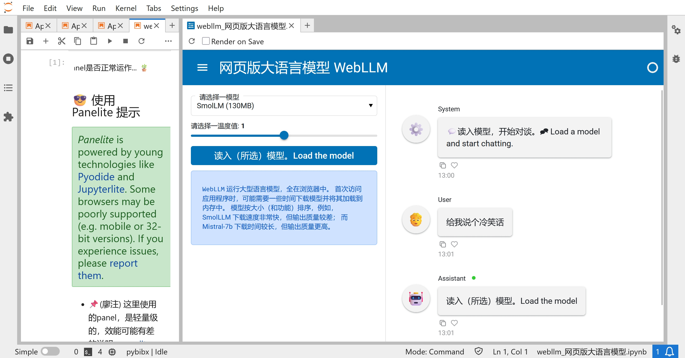
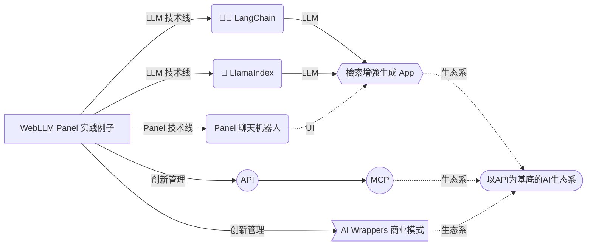

***《API对话AI》*** 课程旨在带领学习者，完成具`检索增强生成（RAG）`功能的智能产品原型，一方面掌握从界面到评测各环节的 `LLM 大语言模型` 流程架构及理论知识，另一方面透过代码及文档实践并记录已有成果及引发想法的 `LLM应用` 实践课程。
<!--more-->

本页具体说明及展示本课程的知识及实践内容。

## API 演化出的 MCP

智能应用的整合要如何实做？云端或本地的一问一答、有来有往的智能API如何能像一块块的砖，构建出有用且具体的智能App？

看剧（或编剧）不怕从中间开始的拦腰法（In medias res）。要回答上面的问题，不妨直接浸入（大语言）`模型上下文协定 Model Context Protocol (MCP) `。

### 基本概念：概念的掌握

以下影片看的方式是，把所有陌生的名词记下来放一边，把听懂的动词放另一边，笔记下来。



按上述影片内容，MCP 如何强化 智能 AI？ MCP 如何简化 LLM 工作流程？ 其中 API 扮演什么角色？

### 基础实践：代码块的掌握

以下影片看的方式是，把所有相关代码的说明按一块块笔记下来其相关的动词及名词即可，具体的操作及代码请务必略过。



## 自我测试的强化学习

学习是自己的，不用证明给老师看，只要能提升自我解决问题的能力就是好的成长。

本课程的基础内容，会以如下的交互内容，对学习者提问，强化学习成果。

 业界虽已有使用 API 调用 LLM 大语言模型的问答方式 (i.e. 发问－取答的一往一来) ，但是在更高效提供问答的上下文 (Context) 的流程化及及标准化共同难点方面，则并没有好的标准及解方，所以才有了开放标准 Model Context Protocol (MCP)　的提案。🎉 

 LLM 应用 （常特指 AI 代理人）的两大实践要点是**内容（content）**及**工具（tools）**。🎉 内容指的像是文件集数据库、或知识库，工具指的像是搜索、可视化、内容生成等功能，MCP 开放标准则可以将内容及工具整套有共识标准的方式把`工具`、`资源`、及`问答模板`分别打包成机器可查找的清单目录，进行提供比单一API调用更具体系的使用方式。

## 评测 Evaluating LLM apps 

要改进App，必需先有好的有用的评测。特别是RAG的应用，像[[🦜️🛠️ LangSmith (LangChain)](https://docs.smith.langchain.com/evaluation/tutorials/rag)] 及[LlamaIndex](https://docs.llamaindex.ai/en/stable/module_guides/evaluating/)都有相关的评测实践文档。

{}
在`评测（Evaluation）`这环节，对接下来的`观察（Observability）`、及`部署（Deployment）`具有指导及指引性的影响，因此是学习及操练的重点。
{}

###  基础评测指标

在通用的机器学习及以文件检索方面，常见的基础评测指标包括`召回率（Recall）`、`精确率（Precision）`等等:

`召回率（Recall）`，所有实际正例被正确标志为正例的占比，或称`真正例率(TPR)`：


$$
Recall = \frac{ TP }{TP + FN}= \frac{Correctly Labeled Actual Positives}{All Actual Positive}
$$



`精确率（Precision）`，所有被标志为正例中实际为正例的占比：



$$
Precision = \frac{ TP }{TP + FP}= \frac{Correctly Labeled Actual Positives }{All Labeled As Positive}
$$



###  LLM RAG 应用评测指标

利用LLM完成具`检索增强生成（RAG）`功能的评测常涉及以下评测指标：`回答相关性Relevance (Question)`、 `上下文相关性 Relevance (Context)`、`接地气程度 (Groundedness)`、`LLM作为裁判（LLM-as-a-judge）` 等等。


## 技能：代码实践 Code

要获取LLM App开发及改良的核心编程能力，本课程的  Python 代码实践着两方面技能：（1）LLM 管道及（2）循序 UI。

{}
`LLM 管道（LLM pipeline）`是本地实践 LLM 难点之一，不过若能克服则能够实践体会云端至本地含 GPU 的实践考量差异。`循序 UI （Sequential UI）`虽是较进阶的用户使用界面，但正是带有流程性质应用之必备技能。
{}

### LLM：打通LLM至提示工程的数据管道

LLM App开发的`数据处理`基础类型是打通 LLM 调用的管道。`LLM 管道（LLM pipeline）`的建构与实践可以包括从云端至本地含 GPU 各类用法。

以下代码展示，部分关于[🦜️🔗 LangChain 语言链代码实践Hugging Face 平台所提供的模型（开源和公开可用的）的本地管道]((https://python.langchain.com/docs/integrations/llms/huggingface_pipelines/#gpu-inference))包装器使用方式：

```python
### 模型加载
from langchain_huggingface.llms import HuggingFacePipeline  
  
hf = HuggingFacePipeline.from_model_id(  
model_id="gpt2",  
task="text-generation",  
pipeline_kwargs={"max_new_tokens": 10},  
)

### 创建语言链，使用提问句模板（提示工程）
from langchain_core.prompts import PromptTemplate
template = """Question: {question}Answer: Let's think step by step."""
prompt = PromptTemplate.from_template(template)
chain = prompt | hf
question = "What is electroencephalography?"
print(chain.invoke({"question": question}))
```

以上代码案例具体展示从LLM模型加载，到提问句模板（提示工程 Prompt Engineering的阶段）创建语言链的代码实践。

### UI：打通LLM至用户的交互管道

LLM App开发的`用户界面（UI）`基础类型是打通 LLM 至用户的交互管道。`循序 UI （Sequential UI）`的建构与实践可以包括从云端至本地含 GPU 各类用法。下图展示本课程采用的 Python Panel 程序库来实践 的入手聊天机器人案例 [Panel Chat Bot](https://github.com/holoviz-topics/panel-chat-examples)：



##  🗺 学习地图




## 项目式学习（project-based learning ）

本课程学习成果之一是学习者的***举一反三***的项目展示：根据本课程实践的项目，学习者按自身展示需要，产出以下作品：

1. 有引伸/改进/扩张的 ′LLM 应用′（如增加另一种语言的文本及提问模板、改迸一管道的评测水平、扩张文本以外的可视化应用、等）  
2. 简要详实的 ′LLM 应用技术文档′，主要利用 学习鹰架（scaffolding）概念，能引领专家及新手理解此 LLM 应用 的再应用、学习、或问题解决价值。
3. '150 字项目简介'，主要利用自己对实践社群、自我、及项目的当下理解，针对某一实践社群平台（如Github, LinkedIn, 或项目讨论区）去介绍带连结的′LLM 应用′及 ′LLM 应用技术文档′，对目标群众展示具体价值。

150 字项目简介示例如下：


> 感谢您们有提供[Panel Chat Examples](https://holoviz-topics.github.io/panel-chat-examples/)学习教案，让我能进一步打造出具检索增强生成（RAG）功能的《孙子兵法》的中英文双语智能对话系统，见[App展示](#App展示)及[技术文档](#技术文档)。请问要如何改进此项目文档，以利展示Panel整合LangChain的潜力及价值？
