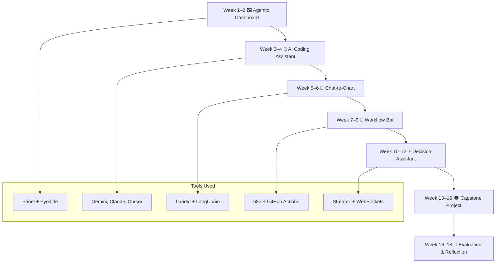
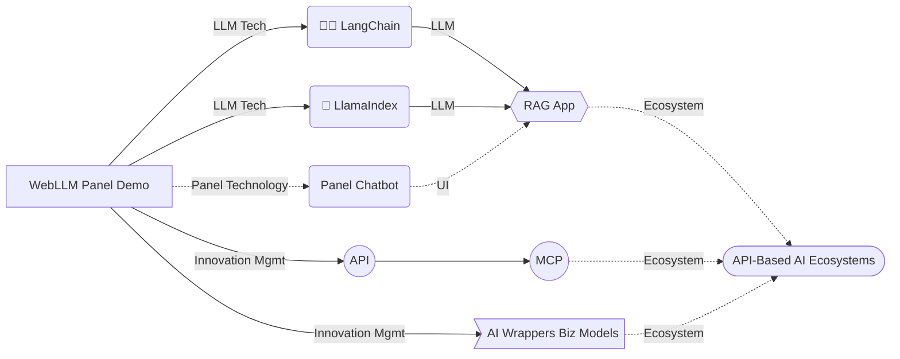

AG203 introduces learners to intelligent systems that combine interactive visualization with AI agents. Students will build modular dashboards, conversational interfaces, and automated workflows using minimal infrastructure.

summary: "Project-Based Learning with Modular AI Agents and Interactive Dashboards"

## 📚 Explore Course Materials

- [📘 Syllabus](syllabus/)
- [📅 Weekly Breakdown](weekly-breakdown/)
- [🎓 Capstone Projects](capstone-projects/)
- [🧮 Grading Criteria](grading/)
- [🧭 Curriculum Map](curriculum-map/)
Welcome to `♛🖼️ AG203`, a project-based course designed to help learners build intelligent, modular systems that combine interactive data visualization with AI agent capabilities.

This course emphasizes low-barrier tooling, modular thinking, and real-world decision support through hands-on projects.

This course introduces learners to intelligent, modular systems that combine interactive data visualization with AI agent capabilities. It emphasizes low-barrier tooling, modular thinking, and real-world decision support through hands-on projects.

Learners will build systems that:
- Visualize and interpret structured data (CSV, YAML, JSON)
- Interact with data through conversational agents
- Automate workflows using cloud-native orchestration tools
- Deploy interactive dashboards using browser-based technologies

Explore the syllabus, weekly breakdown, capstone projects, and grading criteria using the links below.

## 🎯 Course Overview

AG203 introduces learners to intelligent systems that combine interactive visualization with AI agents. Students will build modular dashboards, conversational interfaces, and automated workflows using minimal infrastructure.

## ✨ Course Features

- 🧩 Compose modular visualizations
- 🔄 Orchestrate agentic workflows
- 💬 Design conversational interfaces
- ⚡ Evaluate adaptive decision-making
- ☁️ Deploy reproducible systems
- 📢 Communicate design decisions

## 🧭 Learning Objectives

- Build interactive dashboards using Panel + Pyodide
- Implement AI agents that interpret and act on data
- Integrate visualization components into workflows
- Evaluate system behavior and decision logic
- Document and reflect using GitHub

## 🌐 Technology Stack

- Panel, Pyodide, GitHub Pages
- n8n.io, GitHub Actions
- LangChain, Gradio, Streamz
- ECharts, Vega-Lite, Plotly, Folium

##  🗺 Learning Map

## Project-Based Learning

Learners are encouraged to demonstrate **transferable skills** through custom projects based on the course:

1. A refined or extended **LLM application** (e.g. adding bilingual prompts, upgrading evaluation, adding visual outputs)
    
2. A concise and informative **LLM technical documentation**—using scaffolding to help both experts and newcomers
    
3. A 150-character **project summary** for community sharing (GitHub, LinkedIn, forums), linking to the app and docs。

Example project summary:

> Thanks to the [Panel Chat Examples](https://holoviz-topics.github.io/panel-chat-examples/), I’ve built a bilingual Chinese-English RAG-enabled chatbot for _The Art of War_. See [App Demo](#AppDemo) and [Technical Docs](#TechnicalDocs). Any tips to improve its documentation to highlight Panel + LangChain integration?

