The document summarizes a comprehensive 19-course `New Media & Internet` undergraduate curriculum designed to cultivate future **Product Managers**, **UI/UX Designers**, and **Front-End Developers** who can _**integrate cloud-based APIs and resources**_. I personally developed and implemented this curriculum in China.

It features the application of Education as a Minimum Viable Product (MVP) and includes award-winning, first-class modules such as `API, Machine Learning, and API`.

<!--more-->

- 🎄 Develop integrated skills in Web development, content strategy, and product management—preparing learners for careers as Web Developers, Product Managers, UI/UX Specialists, and UX Researchers
    
- 🧪 Refine personal portfolios through hands-on projects involving complete website operations, mobile app prototyping, and responsive interface design
    
- 🚀 No prior programming experience required—only the ambition to build impactful Web and mobile applications
    
- 🧠 Master user experience strategies and ideation workflows—from user-driven problem scoping to interactive whiteboards—accurately defining problem contexts, user journeys, and service blueprints to address real-world challenges
    

<!--more-->

## 📚 Curriculum Overview

- Name: `{}{}`
    
- Slug: `{}`
    
- Stages: `{}`
    
- Target Specialization: AI agent-oriented talent development for students pursuing careers in Web development, product design, UI/UX research, and digital product management. Designed for the **New Media and Internet（网络与新媒体）** program in the mainland Chinese context.
    

## ⚡ TLDR

The `{}{}` curriculum empowers learners to navigate job roles in Web and mobile development: Web Developers, Product Managers, UI Specialists, and UX Researchers. Through hands-on modules and impact-focused projects, students gain not only the technical ability to build applications, but also the design thinking and collaborative skills to shape ethical, participatory, and data-informed digital experiences within platform-based ecosystems.

📚 Delivered in **5 progressive stages**, the curriculum spans **17➕2 modules**, adaptable for both semester-based and self-paced formats.

## XX to replace/del
- 🧭 **Stage 1: Conceptual Foundation** — _🌐 TECHC, 📡 INTRO, ✍️ COPYE_: Students build critical digital literacy through open-source exploration, version-controlled writing, and sociotechnical reflection—laying the groundwork for structured communication and networked authorship using 🐙 GitHub.
    
- 🦾 **Stage 2: Practical Foundation** — _🐙 AG101, ♞🧱 AG201, 📊 INFOV, 🧮 ONSUR_: Students apply modular web design, prompt engineering, visual storytelling, and data analysis to build agentic systems. Portfolios evolve through agile workflows, multilingual interfaces, and contextual surveys—all hosted in or linked from 🐙 GitHub.
    
- 🔁 **Stage 3: Front-end Production** — _🤗 AG102, ⚙️ FRONT, 🐍 PYTHN, 🔍 USRES_:  Stage 3 empowers learners to build reactive applications and interface logic using modular front-end design, lightweight Python scripting, and UX-driven research. Students debug frameworks, scaffold agentic features, and interpret data with foundational dashboards—bridging user context with LLM-enhanced outputs via platforms such as 🤗 Hugging Face.
    
- ⛓️ **Stage 4: Data-heavy Production** — _♝🍞 AG202, ♛🖼️ AG203, 🎨 UIVIS, 💡 PLNFM, 🧠 UXANA_: Learners advance into data-intensive agentic systems, integrating Retrieval-Augmented Generation (RAG) pipelines, visual dashboards, and platform-aware design. They construct multilingual interfaces, interpret user behavior, and align agentic outputs with stakeholder needs—bridging structured knowledge with adaptive media through platforms such as 🤗 Hugging Face and 🐙 GitHub.
    
- 🚀 **Stage 5: Capstone Impact** — _AG302 & AG303_: Students synthesize their work into public-facing portfolios, conduct science mapping, and articulate AI impact using forecasting and responsible innovation tools.

### ✨ Highlights

- 🔧 **Build** API-integrated web and mobile apps using 🐙 GitHub for real-world functionality, preparing for roles in Web Development, Product Management, UI Design, and UX Research through collaborative project teams
    
- 📦 **Deliver and deploy** multilingual content, structured datasets, MRDs, BRDs, PRDs, and interactive prototypes across responsive platforms
    
- 🔗 **Synthesize and forecast** datasets, decisions, and digital narratives into ethical, adaptive dashboards for public engagement—including code sharing, API visualizations, and science mapping
    

### 🎯 Learning Outcomes

By the end of this curriculum, students will be able to:

- 🖌️ **Construct** structured web and mobile applications and interactive AI-enhanced systems using modern frameworks and cloud-based APIs
    
- 📑 **Compose** API-based product requirements documents (PRDs) optimized for integration and code-generation, aligned with W3C accessibility and sustainable web design standards
    
- 🧰 **Communicate** project decisions and value propositions across relevant ecosystems and Communities of Practice (CoPs)
    
- 🎨 **Design** data visualizations and user interfaces that reflect ethical design principles and contextual responsiveness powered by intelligent API-based services
    
- 🧪 **Evaluate** innovation scenarios and impact through applied API metrics, responsible AI design patterns, and forward-looking methodologies such as science mapping and futures thinking

## 🔖 Curriculum Details
(TBF)

## Learning Outcomes: A personal portfolio 
The core of the undergraduate curriculum is learners' personal portfolio as both an MVP of individual learning outcomes, and an learning outcomes of the PBL process. 

* Learners deliver their final portfolio as the a curated collection of MVPs
* Learners demonstrate clear understanding of the industrial roles of Project Management (PM), Frontend and User Interface (UI) development, and User Experience (UX) design and/or research positions, through the corresponding examples and expressions of MVPs.
* Learners collaborate across roles and MVPs, with specific examples such as required documents (MRD, BRD, and PRD), interactive data dashboards, prototypes, Apps, UI libraries, user research reports, market research papers, technical documentations, and thesis papers, etc. 
* 
## 📐 Curriculum Structure

As demonstrated in the graph below, the final learning outcomes (see the final phase of the two courses) will be ultimately presented as a portfolio.  

### Four  interconnected threads

The `New Media & Internet` curriculum unfolds through **four interconnected threads**, each emphasizing distinct yet complementary skill sets. (See the graph above for their color-coded placement.)

1. 🧱 Core technical pillars (yellow hexagon nodes): Web development and API integration **focus** on building functional systems through scripting, data logic, and automated services.
2. 🎨 UI (pink): Frontend and User Interface development emphasizes visual composition, layout strategies, prototyping, and responsiveness.
3. 🎁 PM (green): Project Management: Socio-technical expertise highlights team coordination, production workflow skills, covering agile development, strategic planning, cross-functional collaboration, and applied design workshops.
4. 💓 UX (blue): User Experience: Human-centered observational and analytical skills focus on research-driven usability, platform economics, and evidence-based insights.

### Capstone projects: From Hero to Actions
 The curriculum converges into two capstone projects at the end (see the graph's right end) and begins with three foundational courses (see the left end).

- A. 🚀 **Capstone Projects** –  The product and writing portfolio culminate the program by guiding learners to synthesize full-stack solutions that integrate ***design, data, and decision-making***. 🧪 🤖 
- B. 🌐 **Foundational Internet Literacy** – Personal digital notebooks anchor the learning journey with fluency in online documentations, social media, technical vocabulary, and creative communication.

---

## 1. 🧱Core Technical Pillars (Yellow Hexagon )

The backbone of the Internet-empowered curriculum features three technical courses that equip students with full-stack integration capabilities, from front-end to machine-driven intelligence, connected via brown graph links.

### 🧩 Core Modules
These core technical pillars, shown in the graph as yellow‐filled hexagons, highlight the centrality of the learning-by-doing in the overall curriculum.  

- 🖥️ `WEBDN`: **Web Design and Production** • Establishes core skills in implementing responsive interfaces and structured multi-media multi-modal content using reusable modular components, following usability and sustainability guidelines. • Delivers an individual portfolio with a professional sense of product ownership.
- 🐍 `PYTHN`: **Python Language** • Develops and practices fundamental skills in building interactive data-processing applications. • Delivers troubleshooting documentations, with further product required documents (PRDs) for future task-automation projects.  
-  🤖 `MLAPI`:  **API, Machine Learning, and Artificial Intelligence**  • Identifies and curates core AI capabilities through the use and experiments of APIs for interactive applications.  • Delivers self- and peer-reviewed PRDs and prototypes that specify the value position and relevant cost-benefit analysis for the use of a set of APIs in an identified use context. 

### 💛Why This Cluster Matters 🧱
These hexagon nodes represent a **sequential skill arc** in app development towards full-stack capabilities 🧱:
- 🧰 **Core Workflow**: Learners start by crafting engaging web front ends (`🖥️ WEBDN`), then gain fluency in Python scripting and data-driven interaction (`🐍 PYTHN`), and finally learn to prototype intelligent applications that embed AI capabilities into services (`🤖 MLAPI`). This path aligns with best practices in Continuous Integration and Continuous Delivery/Deployment (CI/CD).
- 🧪 **Learning Process**: Through hands-on labs, peer-review loops, code debugging, and CI/CD workflows, learners build competency to **design, build, and deploy** intelligent web applications that reflect both human values and organizational goals.
- 📱 **Integrated Capability Pillars**: The cluster combines **visual**, **informational** (data manipulation), and **interactive** (prototyping & web logic) dimensions — all foundational to adjacent curriculum threads and real-world digital ecosystems.

---

## 2. 🎨UI (Pink)

The UI thread (pink nodes) features the integrated design thinking across **visual** and **interactive** dimensions.  Positioned at the top of the graph, these nodes often correspond to industry roles such as frontend developers and UI designers.

### 🧩 UI Modules
This thread comprises interactive visualization courses that lead into app prototyping and development.

- 📊 `INFOV`: **Information Visualization** 
- ⚙️ `FRONT`: **Front-End Frameworks** 
- 🎨 `UIVIS`: **User and Visual Interface Design** 
- 📱 `APPUI`: **App Design and Prototyping** 

### 💛 Why This UI Thread Matters 😍🎨
Core teaching strengths and learning objectives:
- 🎨 Foster design thinking through rapid prototyping.
- ⚙️ Leverage modular components for scalable UI (c.f. consistent and positive UX).  
- 📱 Apply web frameworks—including components, libraries, and design patterns—within Continuous Integration and Continuous Delivery/Deployment (CI/CD) pipelines.

## 3. 🎁PM (Green)
The Project Management (PM) thread, represented by **green nodes**, anchors the curriculum’s **socio-technical fluency**—combining planning, coordination, and strategic execution. These nodes reflect real-world roles such as product managers, creative producers, and innovation leads.

### 🧩 PM Modules
This thread equips learners to lead projects from ideation to deployment, enabling them to act as thoughtful stewards of collaborative production, align technology capabilities with value-driven innovations.

- 📌 `PRODM`: **Product Manager** Trains learners in feature planning, team coordination and professional writing. Emphasizes agile principles and roadmapping strategies across real-world use cases. • Integrates **market research** practices to align technical decisions with user expectations and business models — fostering critical thinking around reliability, cost-efficiency, and stakeholder value.
- 🗄️ `BIGDA`: **Big Data** • Explains the processes and features of the data revolution and examines its implications for platform strategies and AI-driven innovations.
- 🔧 `OPERS`: **Website Operations and Management** • Equips learners to optimize digital infrastructure through modern cloud platforms, web hosting, and deployment pipelines. • Applies **cost-benefit frameworks**, **conversion funnel analysis**, and **web analytics tools**  to evaluate projects, prioritize requirements, and  fine-tune user journeys and retention strategies. 
- 💡 `PLNFM`: **Platform Economy and Innovations** • Prepares learners to examines how digital infrastructures orchestrate interaction between producers and consumers via a modular API ecosystem, fostering rapid system innovations. • Encourage learners to investigate regulator and market dynamics alongside growth and scale models driven by positive feedback loops, requiring a system-thinking approach to balance expansion with resilience.  • Engage learners to formulate evidence-based business models and strategies that sustain scalable growth.
    

### 💚 Why This PM Thread Matters 🎁💵

Key strengths and competencies developed through this cluster:
- 🎯 **Full-Lifecycle Mastery**: Guides learners to plan, execute, and deploy projects end-to-end—from initial concept through live delivery.
- 🤝 **Collaborative Stewardship**: Cultivates cross-functional teamwork and community-of-practice engagement to solve complex challenges together.
- 🔍 **Strategic Alignment**: Maps technology choices to stakeholder needs and business outcomes, ensuring every feature delivers clear value.
- 🚀 **Innovation Leadership**: Empowers data-driven experimentation and continuous improvement, embedding positive feedback loops into the project funnel.

## 4. 💓UX (Blue)

The UX thread, represented by **blue nodes**, anchors the curriculum’s **human-centered design capabilities**—integrating rigorous research methods, statistical analysis, and experiential insights. These nodes reflect real-world roles such as UX researchers, content and experience strategists who bridge the gap between user needs and product solutions.

### 🧩 UX Modules
This thread equips learners to empathize with users through surveys and qualitative studies, translate data into actionable UX insights, and iterate designs that enhance usability, satisfaction, and long-term engagement. 

- 🧮 **ONSUR: Online Surveys and Statistics** • Guides hands-on survey design, sampling methods, and statistical inference.    
- 🔍 **USRES: User Research** • Conducts ethnographic interviews, contextual inquiries, and usability tests to uncover user behaviors and needs.
- 🧠 **UXANA: New Media Analysis and User Experience** • Transitions from data collection to UX insights using RAG methods, sentiment analysis, and human-centered design.

### 😽 Why This UX Thread Matters 🎁💓
- 🔎 **Empathy-first Research**: Builds deep understanding of user motivations and challenges through qualitative and quantitative methods.    
- 🛠️ **Iterative Optimization**: Leverages insights from surveys and usability tests to continuously refine interfaces and interactions.    
- 📊 **Data-informed Decisions**: Integrates statistical analysis and user feedback to drive evidence-based design improvements.    
- 🤝 **User Advocacy**: Empowers learners to champion user perspectives, ensuring products resonate with real-world contexts.    
- 🔄 **Sustainable Feedback Loops**: Embeds ongoing evaluation cycles that adapt to evolving user needs and technology shifts.

## 5. 🚀 Capstone Project (Final Year)

The final phase features the curriculum’s **Outcomes-Based Assessment** by the **Community of Practice** (`CoP`), guiding learners to face real-world scrutiny through structured self- and peer-reviews, professional presentations, and expert feedback loops. It challenges participants to reflect on their entire learning journey, defend their technical and design choices, and communicate their project’s value proposition to industry stakeholders.

### 🧩 Capstone Modules
This phase requires learners to synthesize cumulative experiences, apply rigorous evaluation frameworks, exercise healthy judgment, and chart personalized career pathways based on evidence and feedback.

- 🧑‍🤝‍🧑 `COMMU`: **Community of Practice and Self-Curation** • Facilitates learner contributions back to role- or discipline-specific networks, orchestrates peer-feedback cycles, and models strategies for collaborative knowledge curation and impact measurement.
- 📚 `LITRV`: **Literature Review and Writing** Equips learners with advanced review skills and scientometric methodologies (including patent and academic databases) to ground capstone work in evidence; broadens cross-disciplinary and cross-regional perspectives for deeper insights and innovative applications.

### 💡 Why This Final Phase Matters 🎁🌏

- 🌟 **Community Contribution** – Empowers graduates to contribute by sharing digital resources (datasets, data dashboards, etc.), participating in online forums, authoring best-practice guides, identifying mentors, and mentoring new cohorts.
- 🔑 **Confidence Validation** – Builds professional assurance through real-world critiques from industry practitioners and peer experts.
- 🗂️ **Portfolio Showcase** – Curates and presents a polished body of work to potential employers, investors, and collaborators.
- 🤝 **Strategic Networking** – Forges lasting relationships with mentors, alumni, and domain specialists to fuel career growth.
- 🏅 **Merit-Based Recognition** – Rewards demonstrable expertise via community endorsements, digital badges, and publication opportunities.
- 💡 **Value Proposition Refinement** – Hones learners’ ability to articulate the impact and future potential of their products and personal contributions.

---

## 6. 🌐 Foundational Internet Literacy (First Year)

The first phase of the curriculum establishes fluency in foundational digital literacies through a combination of personal webpages, online documentation, Jupyter notebooks, and creative media practices. Learners build technical vocabulary, explore sociotechnical histories, and begin reflecting critically on how information flows across digital platforms. In particular, they are introduced to open innovation platforms and collaborative ecosystems that distribute **open-source code**, **open content**, and **open data** as global public goods.

### 🧩 Literacy Modules

This phase initiates learners into active inquiry. Through guided exploration and scaffolded projects, they develop the ability to ask meaningful questions, iterate on ideas, and engage critically with digital resources and tools. By the end of this phase, learners will have launched their personal digital notebooks and begun identifying communities of interest within the open-source and open-data landscape.

- 🪧 `INTRO`: **Introduction to New Media** • Establishes core concepts in digital communication, sociotechnical systems, and internet platforms.
- 🕸️ `TECHC`: **Internet & New Media Technologies and Collaboration** • Introduces GitHub-based collaboration tools for discovering and improving digital resources. • Explores internet ecosystems, open-source frameworks, and cross-cultural case studies in technological innovation.
- ✒️ `COPYE`: **Copy-editing and Creative Writing** • Familiarizes students with modern writing techniques, version-control practices, and visual mind-mapping tools. • Trains learners in clarity, tone, and storytelling—essential for prompting large language models, generating ideas, organizing thoughts, and crafting modular content.

### 💡 Why This First Phase Matters 🎁🌏

- 🪜 **Scaffolded Growth** – Provides a reproducible notebook-based framework that encourages cumulative individual and peer learning, supporting iterative development across future modules.
- ✏️ **Authorial Confidence** – Cultivates self-expression through writing, media annotation, and collaborative documentation.
- 🧠 **Critical Fluency** – Equips learners with the vocabulary and analytical lens to interpret sociotechnical systems and digital narratives.
- 🧰 **Leveraging Open Knowledge Tools** – Familiarizes students with core platforms for reproducible research, remixable media, and community-aligned data infrastructures.
- 🌍 **Open Innovation Readiness** – Connects students to open-source and open-data communities for lifelong contribution, remix culture, and global engagement.

---

<!-- %%{ init: { 'theme': 'forest', 'flowchart': { 'curve': 'monotoneX' }, 'themeCSS': 'handDrawn' } }%% -->

```mermaid
graph LR
    WEBDN["🖥️ WEBDN: Web Design and Production"] e1@==technical core==> PYTHN["🐍 PYTHN: Python Language"] e2@==technical core==> MLAPI["🤖 MLAPI: API, Machine Learning, and Artificial Intelligence"]

  

    %% [Pink] UI/Design Core (Next for Top Placement)

    INFOV eUI1@==UI==> FRONT["⚙️ FRONT: Front-End Frameworks"]

    FRONT eUI2@==UI==> UIVIS["🎨 UIVIS: User and Visual Interface Design"]

  

    %% [Green] PM/Socio-Technical Core (Middle Spread)

    PRODM["📌 PRODM: Product Manager"] ePM1@==PM==>  OPERS

    OPERS ePM2@==PM==> PLNFM["💡 PLNFM: Platform Economy and Innovations"]

  

    %% BEGIN Phase

    INTRO["📡 INTRO: Introduction to New Media"] --> PRODM

    INTRO --> WEBDN

    COPYE["✍️ COPYE: Copy-editing and Creative Writing"] --> INFOV["📊 INFOV: Information Visualization"]

    COPYE -.->  WEBDN

    TECHC["🌐 TECHC: Internet & New Media Technologies and Collaboration"] ==> ONSUR["🧮 ONSUR: Online Surveys and Statistics"]

    TECHC --> WEBDN & PRODM

  

    %% Pink Design Others

    INFOV -.-> PYTHN

    WEBDN -.-> FRONT

    FRONT -.App design.-> APPUI

    PYTHN -.App design.-> APPUI["📱 APPUI: APP Design and Prototyping"]

  

    %% [Blue] Social Science Core (Declared Later for Bottom Placement)

    USRES eUX2@==UX==> UXANA["🧠 UXANA: New Media Analysis and User Experience"]

    ONSUR eUX1@==UX==> USRES

  

    %% Green -- Blue: Management informed by Research

    PRODM -.-> USRES["🔍 USRES: User Research"]    

  

    %% Blue Social Science Others: BIGDA

    WEBDN -.socio-technical.-> OPERS["🔧 OPERS: Website Operations and Management"]

    BIGDA["🗄️ BIGDA: Big Data"] -.-> PYTHN

    BIGDA-.->USRES

    TECHC-.->BIGDA

    INTRO-.->BIGDA

  

    %% transitions

    OPERS -.socio-technical.-> MLAPI

    OPERS -.socio-technical.-> APPUI

    USRES -.service design.-> APPUI

    USRES -.service design.-> MLAPI

    USRES -.service design.-> PLNFM

  
  

    %% Final Phase

    COMMU["🧑‍🤝‍🧑🧬 COMMU: Community of Practice and Self-Curation"]  ~~~ MLAPI

    MLAPI ~~~ LITRV["📚🦠 LITRV: Literature Review and Writing"]

  

    %% Final Phase: Pink

    UIVIS -.-> LITRV

    UIVIS ==> COMMU

    APPUI -.-> LITRV

    APPUI ==> COMMU

  

    %% Final Phase Core

    MLAPI e3@==job==> COMMU

    MLAPI ==> LITRV

  

    %% Final Phase: Green

    PLNFM -.-> COMMU

    PLNFM ==> LITRV

  

    %% Final Phase: Blue

    UXANA -.-> COMMU

    UXANA ==> LITRV

  

    %% Balancing

    COPYE -.-> PRODM

    INTRO -.-> INFOV

    INTRO -.-> ONSUR

  

    %% Hidden Links PYTHN ~~~ APPUI

  

click TECHC callback "Github"

  
  

%% Edge Tooltips

linkStyle 0,1 stroke:brown, stroke-width:5px

linkStyle 2,3 stroke:red, stroke-width:3px

linkStyle 4,5 stroke:blue, stroke-width:5px

  

e1@{ animate: true }

e2@{ animate: true }

e3@{ animate: true }

eUI1@{ animate: true }

eUI2@{ animate: true }

eUX1@{ animate: true }

eUX2@{ animate: true }

ePM1@{ animate: true }

ePM2@{ animate: true }

  
  

%% Node Shapes

WEBDN@{ shape: hex}

PYTHN@{ shape: hex}

MLAPI@{ shape: hex}

COMMU@{ shape: trap-t}

LITRV@{ shape: trap-t}

TECHC@{ shape: trap-b}

INTRO@{ shape: trap-b}

COPYE@{ shape: trap-b}

  

%% Node Styles

%% Foundational Nodes

style TECHC fill:#C3F1E7,stroke:#333,stroke-width:1px,stroke-dasharray:4

style INTRO fill:#FDE2B9,stroke:#333,stroke-width:1px,stroke-dasharray:4

style COPYE fill:#fbcfe8,stroke:#333,stroke-width:1px,stroke-dasharray:4

  

%% Final Nodes

style COMMU fill:#FDE2B9,stroke:#333,stroke-width:1px

style LITRV fill:#FDE2B9,stroke:#333,stroke-width:1px

  

%% Green Socio-Technical/Business/Management

style BIGDA fill:#bbf7d0,stroke:#333,stroke-width:1px

style PRODM fill:#bbf7d0,stroke:#333,stroke-width:1px

style OPERS fill:#bbf7d0,stroke:#333,stroke-width:1px

style PLNFM fill:#bbf7d0,stroke:#333,stroke-width:1px

  

%% Blue Social Science/UX

style ONSUR fill:#cbeafe,stroke:#333,stroke-width:1px

style USRES fill:#cbeafe,stroke:#333,stroke-width:1px

style UXANA fill:#cbeafe,stroke:#333,stroke-width:1px

  

%% Pink Design Core

style INFOV fill:#fbcfe8,stroke:#333,stroke-width:1px

style FRONT fill:#fbcfe8,stroke:#333,stroke-width:1px

style UIVIS fill:#fbcfe8,stroke:#333,stroke-width:1px

style APPUI fill:#fbcfe8,stroke:#333,stroke-width:1px

  

%% Yellow Technical Core

style PYTHN fill:#fff589,stroke:#333,stroke-width:2px

style WEBDN fill:#fff589,stroke:#333,stroke-width:2px

style MLAPI fill:#fff589,stroke:#333,stroke-width:2px
```

## In short:  MVP=OBL+PBL+CI/CD

The `New Media & Internet` curriculum blends essential industry practices with modern learning strategies:

* 📈`Outcomes-based Assessment` (OBL) – Learners document their work for rigorous peer and self-evaluation, progressing from group-level feedback to broader community-of-practice engagement.
* 🧪`Project-based Learning` (PBL) – Every course centers on real-world prototypes. Final projects form a curated portfolio, built and deployed via GitHub from start to finish.
* 🚀`Minimum Viable Product` (MVP) –  The MVP approach prioritizes time-to-value and  [validated learning](https://en.wikipedia.org/wiki/Validated_learning) . Learners launch early, test quickly, and adapt through user-driven feedback loops.
* 🔁 `CI/CD mindset` – Learners continuously refine a professional toolkit—curating digital assets, publishing modular products, and applying a CI/CD mindset to both project delivery and personal growth.

## Note. Learning philosophy 

### Education as a Minimum Viable Product (MVP)

Facing what is expected from the Internet industry, the `New Media & Internet` curriculum is built upon the integration of the notion of `Minimum Viable Product` (MVP) from the software industry and the practice of  `Project-based Learning` (PBL) from the education sector.

### How
* **Learning philosophy**: The `Minimum Viable Product` (MVP) features time-to-impact, time-to-outcome, or time-to-value [**validated learning**](https://en.wikipedia.org/wiki/Validated_learning)  It allows internet companies to quickly launch, test, and iterate products using real user feedback, reducing time-to-market and avoiding costly misalignment with actual needs. 

### Why
* **teaching philosophy**: The `Project-based Learning` (PBL) approach emphasizes **real-world relevance, autonomy, and collaboration** that motivates creative, collaborative and career-focused learners.  It often demands interdisciplinary and STEM instructors who believe in applied competencies and problem-solving abilities through progressive portfolio building to simulate real workflows and personal growth.

## 🗒️ Notes to Educators and Self-Learners

This curriculum invites both learners and educators to invest in the co-creation of personal portfolios 🧳—artifacts that serve not only as proof of learning but also as scaffolds for role-based readiness across collaborative, agentic ecosystems. 

These portfolios evolve through iterative learning, making explicit the connections between technical skills, sociotechnical fluency, and human-centered design.

### A. 🧩 Introduction

#### 🧑‍💼 Key Job Roles and Team Skills

🔧 **Skills-Based Portfolios**: Personal portfolios 🧳 are designed to _demonstrate_, _apply_, and _refine_ core competencies across technical and socio-technical domains. They serve as dynamic records of agentic growth, bridging modular learning with role-readiness in the following pathways:

- 💻 **Web/Software Developers** – Mastery of system logic, version control, and end-to-end deployment
    
- 🖼️ **Front-End Developers or UI Designers** – Precision in multilingual UI, responsive design, and human-centered layout systems
    
- 📋 **Product Managers or Project Managers** – Strategic coordination of agentic systems, documentation workflows, and feature roadmaps; Alignment of goals, timelines, and agentic system orchestration
    
- 🧪 **UX Designers or Researchers** – Grounded design inquiry through service blueprints, user personas, and qualitative insight loops

🔄 **Flexible & Cross-Role Skills**:  📁 Portfolios help learners to _show_, _share_, and _transfer_ their role-based skills across career paths and team environments. They support lifelong learning and adaptability to _analyze_ how different roles contribute to a project, _connect_ ideas across disciplines, and _collaborate_ effectively with peers in tech, design, management, and research.

- 💻 **Web/Software Developers** – _Construct_ technical infrastructure and manage backend automation, while _leveraging AI code assistants_ for debugging, refactoring, and maintaining modular pipelines within agentic applications. → They rely on input from UX researchers and product managers to _prioritize_ features that align with user needs and platform goals.
    
- 🖼️ **Front-End Developers or UI Designers** – _Adapt_ multilingual and responsive UIs using design systems, and _collaborate with AI design assistants_ to generate components and layout refinements supporting agent–user interactions. → They build on wireframes and insights provided by UX designers and adjust flows based on developer constraints and PM feedback.
    
- 📋 **Product Managers or Project Managers** – _Define_ feature priorities and align stakeholder goals through MRDs, PRDs, and platform maps, while _using AI code and design assistants_ to model timelines and system coordination. → Their planning depends on feasibility assessments from developers and usability reports from UX teams to _validate_ strategic choices.
    
- 🧪 **UX Designers or Researchers**  – _Analyze_ user feedback and simulate service journeys using AI design assistants to refine agentic interactions across cultures and contexts. → They synthesize data gathered via deployed apps from developers, UI components from designers, and strategic constraints set by PMs to _inform_ improved experiences.

#### 🧠 How It Works

To clarify how knowledge and team-based awareness are practiced and refined throughout the learning journey, the curriculum integrates portfolio development across three educational strands:

- 🎯 **Capstone Project(s)** – Portfolios act as the final product of project-based learning, designed to _synthesize_ modules, _demonstrate_ decision-making flows, and _present_ running applications alongside curated documentation.
    
- 👥 **Role-Based & Team Skills** – Learners _explore_ and _analyze_ how each role contributes to collaborative product development, enabling cross-disciplinary communication and knowledge co-authorship.
    
- 🧠 **Progressive Learning Patterns** – Students _draft_, _iterate_, and _refine_ real-world artifacts—including MRDs, PRDs, UX maps, stakeholder canvases, and _running application prototypes_—to _activate_ agency, _build_ confidence, and _reflect_ personal growth from _Hero_ to _Actions_.
    

### B. 👥 Progressive Learning Threads 
The curriculum includes four interconnected role categories, each reflecting a key agentic product development dimension: technical, design, strategic, and research-based practices.

These four role categories constitute the main body of the curriculum in the graph. Each learning thread carries a distinct color:

- 🧱 **Developers (Yellow)** – Technical architecture, modular design, and agile deployment
- 🎨 **UI or Front-End Designers (Pink)** – Interface logic, visual language, and multilingual adaptability
- 🎁 **Product Managers (Green)** – Strategic planning, platform modeling, and agentic orchestration
- 💓 **UX Designers and Researchers (Blue)** – User advocacy, journey mapping, and reflective evaluation

#### 1. 🧱Developers (Yellow)
The backbone of the _Agentic_ curriculum features four integrated technical modules—each one scaffolding full-stack capabilities from frontend interface composition to intelligent agent systems. These modules are represented by **yellow-filled nodes** in the graph and are linked by **brown edges**, signaling a workflow toward CI/CD (Continuous Integration / Continuous Delivery).

##### 🧩 Core Modules
These modules prioritize **learning-by-doing**, engaging learners with hands-on creation, real-time troubleshooting, and applied documentation practices:

- 🐙 `AG101` aka 🖥️ `WEBDN`: **Web Design & Production**
	- Develops responsive interface skills using reusable modular components and accessibility principles.
	- Integrates structured multimedia and multimodal content through web standards and usability guidelines.
	- **Deliverable**: A personal portfolio website with documentation expressing product ownership and design intent.
- 🤗 `AG102` aka 🔧 `OPERS`: **Agentic Web Development**    
    - Equips learners to deploy LLM-powered web applications with scalable backend infrastructure.        
    - Applies **cost-benefit frameworks**, **conversion funnel analysis**, and **analytics tools** to optimize hosting, deployment, and retention.        
    - **Deliverable**: An AI-enhanced application with written PRDs and documentation for project evaluation.        
- 🐍 `PYTHN`: **Python Programming for Automation**    
    - Develops fluency in scripting workflows for interactive, data-driven applications.        
    - Uses Pydantic for type validation, Pandas for data logic, and Panel for dashboard interfaces. 
    - **Deliverable**: Running dashboard-based application and a troubleshooting log for future automation projects.
- ♝🍞 `AG202` aka 🤖 `MLAPI`: **RAG and API Prototyping**
    - Introduces Retrieval-Augmented Generation systems as design patterns for human-in-the-loop intelligence.
    - Learners experiment with API orchestration and model interaction across identified use cases.
    - **Deliverable**: A curated PRD and API prototype with peer-review evidence and value-position justification.

##### 💛 Why This Cluster Matters 🧱

This cluster represents a **progressive skill arc** in technical development—from composing responsive web interfaces to deploying intelligent agent systems. Each module scaffolds learners toward full-stack fluency, emphasizing modularity, automation, and applied intelligence.

- 🧰 **Core Workflow**: This path aligns with CI/CD practices and prepares learners for robust, value-driven technical ownership. Learners:
    
    - begin with 🐙 `AG101`, developing fluency in interface composition and portfolio-ready design
        
    - then advance through 🤗 `AG102` and 🐍 `PYTHN`, mastering logic scripting, data automation, and the orchestration of large language models (LLMs) within production workflows
        
    - culminate in ♝🍞 `AG202`, where they prototype intelligent agent applications powered by Retrieval-Augmented Generation (RAG) and APIs—anchored by cost-benefit reasoning and self-curated product requirement documents (PRDs)
        
- 🧪 **Agentic Learning Process**: Through hands-on labs, peer review loops, and value-position documentation cycles, learners strengthen their ability to:
    
    - design and deploy intelligent applications that reflect user intent and organizational goals
        
    - embed design assistants and generative agents into day-to-day workflows
        
    - integrate LLM systems with practical deployment infrastructure
        
    - evaluate development decisions using analytics, cost-efficiency, and stakeholder value metrics
        
- 📱 **Integrated Capability Pillars**: This cluster cultivates agentic technical expertise across four interdependent dimensions:
    
    - **Visual and structural composition**: modular layout and responsive design (🐙 `AG101`)
        
    - **LLM orchestration and agentic optimization**: interface logic, evaluation pipelines, and iterative deployment (🤗 `AG102`)
        
    - **Informational fluency**: data manipulation and scripted automation (🐍 `PYTHN`)
        
    - **Interactive intelligence**: prototyping RAG-powered services and adaptive user journeys (♝🍞 `AG202`)
- 🛠️ **Technical Integration for Capstone Delivery**: Builds CI/CD fluency, modular development habits, and intelligent system prototyping skills that directly feed into summative projects (📚🦠 `AG302`, 🧑‍🤝‍🧑🧬 `AG303`)—ensuring learners can deploy agentic applications with documentation and evaluation logic.        

Together, these foundational capabilities interface with adjacent PM, UI, and UX threads—building toward a sociotechnical curriculum that empowers learners as thoughtful creators of AI-powered web ecosystems.

#### 2. 🎨UI or Front-End (Pink)
The UI thread features **integrated design thinking** across visual and interactive dimensions, supporting learners as they move from expressive content creation to modular interface engineering. Positioned at the top of the curriculum map, these pink nodes align with industry roles such as frontend developers, UI designers, and creative technologists.

##### 🧩 Core Modules

This thread comprises interactive visualization courses and app prototyping modules that cultivate responsive, user-centered design practices:

- ✍️ `COPYE`: **Copy-editing and Creative Writing**
    
    - Develops expressive fluency and tone modulation for multi-modal web experiences
        
    - Connects content strategy to interface readability and emotional engagement
        
- 📊 `INFOV`: **Information Visualization**
    
    - Introduces visual grammar and data storytelling for user dashboards and content layouts
        
    - Acts as a bridge to sociotechnical design via connections to `OPERS` in the graph
        
- ⚙️ `FRONT`: **Front-End Frameworks**
    
    - Applies reusable UI components, layout systems, and design pattern libraries
        
    - Positioned in the graph as a flow-through node between `INFOV` and `UIVIS`
        
- 🎨 `UIVIS`: **User and Visual Interface Design**
    
    - Cultivates user testing, color theory, and responsive visual hierarchy
        
    - Serves as a launching pad to final project modules like `COMMU` and `LITRV`
        
- ♛🖼️ `AG203`: **Agentic Data Visualization**
    
    - Merges data ecosystem design with UI logic through Python-based libraries
        
    - Connects from `PYTHN` and `FRONT`, and routes to `COMMU` for capstone readiness
        

##### 💛 Why This UI Thread Matters 😍🎨

Core teaching strengths and learning objectives:

- 🎨 Foster design thinking through low-fidelity sketches, wireframes, and rapid prototyping
    
- ⚙️ Leverage modular components for scalable UI—supporting consistent and positive UX outcomes
    
- 📱 Apply web frameworks—including component libraries and visual systems—within CI/CD pipelines
    
- ✍️ Connect interface content to human values, emotion, and social context via expressive writing and user research
    
- 🔄 Serve as cross-thread connectors to agentic clusters in PM (green) and Dev (yellow), enabling full-cycle product development
- 🖼️ **Interface Leadership in Final Projects**: Prepares learners to design adaptive, visually coherent, and user-sensitive interfaces for intelligent applications showcased in capstone modules (📚🦠 `AG302`, 🧑‍🤝‍🧑🧬 `AG303`)—bridging technical delivery and experiential engagement.
   
---

#### 3. 🎁 PM (Green)

The PM thread features modules that prepare learners to **coordinate intelligent systems** through sociotechnical reasoning, platform strategy, and structured communication—scaffolding learners toward agentic product ownership.

Positioned centrally within the curriculum map, this thread bridges frontend prototyping and intelligent application deployment—anchoring service coordination, platform innovation, and collaborative delivery across technical and social dimensions.

---

##### 🧩 Core Modules

This thread equips learners to lead projects from ideation to deployment, enabling them to act as thoughtful stewards of collaborative production and align technology capabilities with value-driven innovations.

It cultivates agentic literacy in stakeholder mediation, platform innovation, and systems coordination at scale:

- 🌐 `TECHC`: **Internet & Intelligent Agent Technologies and Collaboration**
    
    - Introduces infrastructural thinking and collaborative workflows for intelligent media systems
        
    - Serves as a launchpad to both Developer nodes (`AG101`, `AG202`) and sociotechnical evaluation modules (`ONSUR`, `BIGDA`)
        
- ♞🧱 `AG201`: **Agentic Structured Communication (StrCOMM)**
    
    - Equips learners with frameworks for managing team dynamics and strategic messaging around intelligent technologies
        
    - Fosters reflexive thinking on stakeholder roles, value alignment, and platform governance
        
- 💡 `PLNFM`: **Platform Economy and Innovations**
    
    - Applies strategic thinking to platform ecosystems, network effects, and service monetization
        
    - Capstones the PM thread with cross-functional perspectives on agentic coordination and sustainable growth
---

##### 💛 Why This PM Thread Matters 🪄🎁

This cluster equips learners to guide intelligent systems development from ideation to delivery—integrating sociotechnical reasoning, stakeholder coordination, and innovation leadership into each phase of the product journey.

Key teaching strengths and learner competencies:

- 🎯 **Full-Lifecycle Mastery**: Learners plan, execute, and deploy projects end-to-end—from initial concept through platform-ready delivery
    
- 🤝 **Collaborative Stewardship**: Cultivates cross-functional teamwork and community-of-practice engagement to navigate complex sociotechnical challenges
    
- 🧠 **Strategic Mediation**: Frames intelligent system development around stakeholder values, product-market fit, and coordinated feature delivery
    
- 🪡 **Communication Design**: Builds scaffolds to express platform narratives, service blueprints, and PRD logic across disciplinary boundaries
    
- 📡 **Sociotechnical Fluency**: Translates ethical, infrastructural, and organizational insights into service plans and innovation frameworks
    
- 🚀 **Innovation Leadership**: Encourages data-driven experimentation and continuous improvement through feedback loops and platform impact analysis
    
- 🛰️ **Ecosystem Anchoring**: Serves as connective tissue linking Dev (Yellow), UI (Pink), and UX (Blue) threads—supporting agentic literacy across the curriculum

#### 4. 💓UX (Blue)

The UX thread, represented by **blue nodes**, anchors the curriculum’s **human-centered design capabilities**—integrating rigorous research methods, statistical analysis, and experiential insights. These modules correspond to roles such as **UX researchers, experience strategists, and service designers** who bridge the gap between user needs and product solutions.

Positioned at the bottom of the curriculum map, these nodes form the research foundation and feedback pathways that inform upstream design, development, and platform coordination.

##### 🧩 Core Modules

This thread equips learners to empathize with users through surveys and qualitative studies, translate data into actionable UX insights, and iterate designs that enhance usability, satisfaction, and long-term engagement:

This thread cultivates learner expertise in gathering user insights, converting data into actionable design strategies, and refining agentic interactions for usability, trust, and long-term engagement. The courses **AGNUX: Agent User Experience** and **AGNEV: Agent Evaluation** reframe traditional UX coursework (**USRES** and **UXANA**) by integrating modern frameworks such as [Microsoft’s Agent UX principles](https://microsoft.design/articles/ux-design-for-agents/) and [IBM’s agent evaluation framework](https://www.ibm.com/think/topics/ai-agent-evaluation).

- 🧮 **ONSUR: Online Surveys and Statistics** _Design, implement, and interpret_ user surveys and quantitative studies to uncover behavioral patterns. This module **establishes foundational knowledge** in sampling, data collection, and statistical inference, supporting rigorous evaluation of user and agent interactions.
- 🔍 **AGNUX: Agent User Experience** _Investigate, analyze, and design_ agentic experiences through ethnographic inquiry, usability testing, and multimodal engagement. Learners apply agent UX principles to conceptualize interfaces that adapt across temporal contexts, embody trust and transparency, and transition fluidly between active and passive roles. Ethical, inclusive design frameworks shape final outputs.
- 🧠 **AGNEV: Agent Evaluation** _Evaluate, critique, and optimize_ agent behavior through a suite of assessment methodologies including benchmark testing, human-in-the-loop protocols, and LLM-as-a-judge. Learners assess task success, resource efficiency, and safety while integrating user intent and policy alignment. Emphasis is placed on identifying system bias, functional breakdowns, and opportunities for improvement within dynamic workflows.

---

##### 😽 Why This UX Thread Matters 🎁💓

- 🔎 **Empathy-Driven Research**: Cultivates deep understanding of user motivations, frustrations, and contexts through both qualitative inquiry and quantitative surveys—ensuring design begins with the human experience.
    
- 🛠️ **Iterative Optimization**: Empowers learners to run usability tests, analyze feedback, and refine user interfaces and journeys across cycles of improvement—prioritizing adaptive response to evolving needs.
    
- 📊 **Data-Informed Decision-Making**: Integrates statistical analysis and survey results with contextual insights, enabling evidence-based design enhancements that align with measurable user goals.
    
- 🤝 **User Advocacy & Voice**: Equips learners to serve as champions of user perspectives in cross-functional teams—emphasizing inclusivity, accessibility, and ethical responsibility in intelligent system design.
    
- 🔄 **Sustainable Feedback Ecosystems**: Embeds feedback loops across UX workflows that reflect long-term user engagement, continuous validation, and evolving service expectations.
    
- 🧠 **Agent UX Competency**: Introduces students to the design of intelligent agents—systems that combine AI models, orchestration, and tools to perform tasks on users’ behalf. Learners explore Agent UX principles such as trust, transparency, control, and multimodal interaction, building experiences that feel natural, safe, and contextually aware.
    
- 🌐 **Cross-Thread Integration**: UX insights feed into PM strategy, UI logic, and developer flows—positioning UX as the connective thread that grounds agentic systems in human-centered values across the curriculum and final projects.

{}
👥 Progressive Learning Threads 
- **What**: Four interdisciplinary role-based threads—Developer, UI, PM, and UX—scaffold learner growth through authentic practice and project-based collaboration.
    
- **So what**: These threads mirror real-world workflows, empowering learners to build cross-functional fluency and contribute meaningfully to intelligent systems and digital ecosystems.
{}
 

Here’s the revised version with all references to agentic AI and LLMs replaced by API-based intelligent applications, while preserving clarity, tone, and conceptual richness:

---

### C. 🎯 Education as a Minimum Viable Product (MVP)

This curriculum embraces “Education as a Minimum Viable Product (MVP)”—prioritizing essential knowledge that enables learners to perform confidently and responsibly in real-world roles. Rather than memorizing fragmented facts (**know-whats**), students focus on **know-whys**—deeper understanding that fuels **know-hows**, or applied professional practices.

{}
For deeper understanding of the notion of "Education as MVP" and related terms such as OBL, PBL, and CI/CD, please refer to this essay [🤔Education as MVP Philosophy]({})

* 📐Formula
`Education as MVP = OBL + PBL + CI/CD`
 {}

---

#### 🧭 Mechanisms of Know-Whys

To help learners internalize skills through iterative practice and reflective awareness, the following structures scaffold deeper conceptual learning:

- 🎯 **Capstone Projects** – Final portfolios serve as culminating artifacts of project-based learning, synthesizing technical and sociotechnical knowledge
- 👥 **Role-Based Collaboration** – Four career-aligned threads simulate interdisciplinary teamwork, echoing how work is divided and integrated across digital product lifecycles
- 🧠 **Progressive Learning Cycles** – Drafting real-world documents (MRDs, PRDs, UX maps) becomes a metacognitive toolkit for managing ambiguity, surfacing intent, and converting vision into action—from "Heroes" (who fix) to "Builders" (who create using intelligent tools)

---

#### 🛠️ Mechanisms of Know-Hows (Through Professional Roles)

Skill development unfolds through immersive role play, allowing learners to adopt the responsibilities and decision-making processes of professionals:

- 🧱 Web developers implement agile workflows with specified technical architecture and modular design
- 🎁 Project Managers draft strategic briefs and product roadmaps
- 🎨 UI designers prototype interfaces and articulate visual logic
- 💓 UX researchers chart user journeys and uncover systemic patterns

All activities are anchored in collaborative production and cumulative reflection. Learners **rotate through all roles** to cultivate empathy, **appreciate cross-functional contributions**, and **strengthen team-based understanding**.

---

#### 📦 Learning Outcomes: Personal Portfolios as MVPs

Portfolios become central to learner growth—a record of applied achievement and a living demonstration of professional mastery:

- 💼 Learners deliver final portfolios as curated sets of MVPs—each showcasing applied understanding through tangible, context-aware outputs
- 🧑‍💻 Learners demonstrate fluency in industry-relevant roles (developers, PM, UI/Frontend, UX research/design) using formats and documentation grounded in API-integrated development and deployment
- 🔗 Learners contribute collaboratively across threads, producing artifacts such as MRDs, BRDs, PRDs; dashboards, app prototypes, UI kits; user research reports, market briefs, technical specs, and reflective essays

---

{}  
📣 **Call to Action** If you’re exploring ways to implement this curriculum or seeking refined tools such as assessment rubrics, capstone project templates, or collaborative rollout strategies—reach out to the author. Let’s co-design education centered on intelligent application development, grounded in practice, purpose, and impact.  
{}

{}

- **Why**: To empower learners with essential knowledge that privileges deeper understanding (know-whys) and meaningful execution (know-hows) over rote memorization.
- **How**: By guiding learners through interdisciplinary role-play, iterative documentation, and curated portfolios that reflect decision-making informed by intelligent API-based applications.
- **So what**: Learners graduate with a personalized set of MVPs—tangible, evaluable artifacts that show their readiness to contribute meaningfully across professional ecosystems.

{}