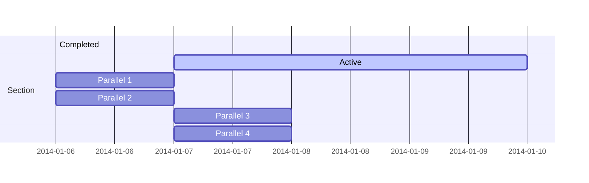

```mermaid
graph LR
    WEBDN["🖥️ WEBDN: Web Design and Production"] e1@==technical core==> PYTHN["🐍 PYTHN: Python Language"] e2@==technical core==> MLAPI["🤖 MLAPI: API, Machine Learning, and Artificial Intelligence"]

  

    %% [Pink] UI/Design Core (Next for Top Placement)

    INFOV eUI1@==UI==> FRONT["⚙️ FRONT: Front-End Frameworks"]

    FRONT eUI2@==UI==> UIVIS["🎨 UIVIS: User and Visual Interface Design"]

  

    %% [Green] PM/Socio-Technical Core (Middle Spread)

    PRODM["📌 PRODM: Product Manager"] ePM1@==PM==>  OPERS

    OPERS ePM2@==PM==> PLNFM["💡 PLNFM: Platform Economy and Innovations"]

  

    %% BEGIN Phase

    INTRO["📡 INTRO: Introduction to New Media"] --> PRODM

    INTRO --> WEBDN

    COPYE["✍️ COPYE: Copy-editing and Creative Writing"] --> INFOV["📊 INFOV: Information Visualization"]

    COPYE -.->  WEBDN

    TECHC["🌐 TECHC: Internet & New Media Technologies and Collaboration"] ==> ONSUR["🧮 ONSUR: Online Surveys and Statistics"]

    TECHC --> WEBDN & PRODM

  

    %% Pink Design Others

    INFOV -.-> PYTHN

    WEBDN -.-> FRONT

    FRONT -.App design.-> APPUI

    PYTHN -.App design.-> APPUI["📱 APPUI: APP Design and Prototyping"]

  

    %% [Blue] Social Science Core (Declared Later for Bottom Placement)

    USRES eUX2@==UX==> UXANA["🧠 UXANA: New Media Analysis and User Experience"]

    ONSUR eUX1@==UX==> USRES

  

    %% Green -- Blue: Management informed by Research

    PRODM -.-> USRES["🔍 USRES: User Research"]    

  

    %% Blue Social Science Others: BIGDA

    WEBDN -.socio-technical.-> OPERS["🔧 OPERS: Website Operations and Management"]

    BIGDA["🗄️ BIGDA: Big Data"] -.-> PYTHN

    BIGDA-.->USRES

    TECHC-.->BIGDA

    INTRO-.->BIGDA

  

    %% transitions

    OPERS -.socio-technical.-> MLAPI

    OPERS -.socio-technical.-> APPUI

    USRES -.service design.-> APPUI

    USRES -.service design.-> MLAPI

    USRES -.service design.-> PLNFM

  
  

    %% Final Phase

    COMMU["🧑‍🤝‍🧑🧬 COMMU: Community of Practice and Self-Curation"]  ~~~ MLAPI

    MLAPI ~~~ LITRV["📚🦠 LITRV: Literature Review and Writing"]

  

    %% Final Phase: Pink

    UIVIS -.-> LITRV

    UIVIS ==> COMMU

    APPUI -.-> LITRV

    APPUI ==> COMMU

  

    %% Final Phase Core

    MLAPI e3@==job==> COMMU

    MLAPI ==> LITRV

  

    %% Final Phase: Green

    PLNFM -.-> COMMU

    PLNFM ==> LITRV

  

    %% Final Phase: Blue

    UXANA -.-> COMMU

    UXANA ==> LITRV

  

    %% Balancing

    COPYE -.-> PRODM

    INTRO -.-> INFOV

    INTRO -.-> ONSUR

  

    %% Hidden Links PYTHN ~~~ APPUI

  

click TECHC callback "Github"

  
  

%% Edge Tooltips

linkStyle 0,1 stroke:brown, stroke-width:5px

linkStyle 2,3 stroke:red, stroke-width:3px

linkStyle 4,5 stroke:blue, stroke-width:5px

  

e1@{ animate: true }

e2@{ animate: true }

e3@{ animate: true }

eUI1@{ animate: true }

eUI2@{ animate: true }

eUX1@{ animate: true }

eUX2@{ animate: true }

ePM1@{ animate: true }

ePM2@{ animate: true }

  
  

%% Node Shapes

WEBDN@{ shape: hex}

PYTHN@{ shape: hex}

MLAPI@{ shape: hex}

COMMU@{ shape: trap-t}

LITRV@{ shape: trap-t}

TECHC@{ shape: trap-b}

INTRO@{ shape: trap-b}

COPYE@{ shape: trap-b}

  

%% Node Styles

%% Foundational Nodes

style TECHC fill:#C3F1E7,stroke:#333,stroke-width:1px,stroke-dasharray:4

style INTRO fill:#FDE2B9,stroke:#333,stroke-width:1px,stroke-dasharray:4

style COPYE fill:#fbcfe8,stroke:#333,stroke-width:1px,stroke-dasharray:4

  

%% Final Nodes

style COMMU fill:#FDE2B9,stroke:#333,stroke-width:1px

style LITRV fill:#FDE2B9,stroke:#333,stroke-width:1px

  

%% Green Socio-Technical/Business/Management

style BIGDA fill:#bbf7d0,stroke:#333,stroke-width:1px

style PRODM fill:#bbf7d0,stroke:#333,stroke-width:1px

style OPERS fill:#bbf7d0,stroke:#333,stroke-width:1px

style PLNFM fill:#bbf7d0,stroke:#333,stroke-width:1px

  

%% Blue Social Science/UX

style ONSUR fill:#cbeafe,stroke:#333,stroke-width:1px

style USRES fill:#cbeafe,stroke:#333,stroke-width:1px

style UXANA fill:#cbeafe,stroke:#333,stroke-width:1px

  

%% Pink Design Core

style INFOV fill:#fbcfe8,stroke:#333,stroke-width:1px

style FRONT fill:#fbcfe8,stroke:#333,stroke-width:1px

style UIVIS fill:#fbcfe8,stroke:#333,stroke-width:1px

style APPUI fill:#fbcfe8,stroke:#333,stroke-width:1px

  

%% Yellow Technical Core

style PYTHN fill:#fff589,stroke:#333,stroke-width:2px

style WEBDN fill:#fff589,stroke:#333,stroke-width:2px

style MLAPI fill:#fff589,stroke:#333,stroke-width:2px
```

The document summarized a full 19-course `New Media & Internet` undergraduate curriculum (focusing on cultivating Internet **Product Managers**, **UI/UX designers**, and **front-end developers** who can ***integrate API cloud resources***) that I have personally developed and implemented in China.  

<!--more-->

Four versions are also available for learners without any software development knowledge:
* 🪴`Agentic Web Development` 
  * 🗓️(Bare) 5+2 course 
	  * the most condensed and updated curriculum that deliver integrated Web and AI Agent development learning
	  * suitable for hackathons, summer schools, or continuous education 
* 🌲`AI agent & Internet`
  * 🗓️ (Core) 10+2 course
    * the condensed and updated curriculum
    * deliver integrated Web and AI Agent development learning
    * suitable for any undergraduate program
* 🎄`Agentic New Media & Internet`
  * 🗓️ (Full) the revised full 18-course 
	* updated with the latest Web and AI Agent development learning
	* suitable for cultivating Internet **Product Managers**, **UI/UX designers**, and **front-end developers** who can ***integrate AI agentic and other API resources*** to apply AI agents to solve problems.
* 🌲`New Media & Internet`
  * 🗓️ (Base) the original full 19-course version
    * implemented and executed in a university in China.
    * focused on cultivating Internet **Product Managers**, **UI/UX designers**, and **front-end developers** who can ***integrate API cloud resources***

The `New Media & Internet` curriculum

Implementing the notion of Education as a Minimum Viable Product (MVP), the `New Media & Internet` curriculum was developed to implement education reform in an university in Guangzhou China. 

## 🧭 Curriculum Overview

## Learning Outcomes: A personal portfolio 
The core of the undergraduate curriculum is learners' personal portfolio as both an MVP of individual learning outcomes, and an learning outcomes of the PBL process. 

* Learners deliver their final portfolio as the a curated collection of MVPs
* Learners demonstrate clear understanding of the industrial roles of Project Management (PM), Frontend and User Interface (UI) development, and User Experience (UX) design and/or research positions, through the corresponding examples and expressions of MVPs.
* Learners collaborate across roles and MVPs, with specific examples such as required documents (MRD, BRD, and PRD), interactive data dashboards, prototypes, Apps, UI libraries, user research reports, market research papers, technical documentations, and thesis papers, etc. 
* 
## 📐 Curriculum Structure

As demonstrated in the graph below, the final learning outcomes (see the final phase of the two courses) will be ultimately presented as a portfolio.  

### Four  interconnected threads

The `New Media & Internet` curriculum unfolds through **four interconnected threads**, each emphasizing distinct yet complementary skill sets. (See the graph above for their color-coded placement.)

1. 🧱 Core technical pillars (yellow hexagon nodes): Web development and API integration **focus** on building functional systems through scripting, data logic, and automated services.
2. 🎨 UI (pink): Frontend and User Interface development emphasizes visual composition, layout strategies, prototyping, and responsiveness.
3. 🎁 PM (green): Project Management: Socio-technical expertise highlights team coordination, production workflow skills, covering agile development, strategic planning, cross-functional collaboration, and applied design workshops.
4. 💓 UX (blue): User Experience: Human-centered observational and analytical skills focus on research-driven usability, platform economics, and evidence-based insights.

### Capstone projects: From Hero to Actions
 The curriculum converges into two capstone projects at the end (see the graph's right end) and begins with three foundational courses (see the left end).

- A. 🚀 **Capstone Projects** –  The product and writing portfolio culminate the program by guiding learners to synthesize full-stack solutions that integrate ***design, data, and decision-making***. 🧪 🤖 
- B. 🌐 **Foundational Internet Literacy** – Personal digital notebooks anchor the learning journey with fluency in online documentations, social media, technical vocabulary, and creative communication.

---

## 1. 🧱Core Technical Pillars (Yellow Hexagon )

The backbone of the Internet-empowered curriculum features three technical courses that equip students with full-stack integration capabilities, from front-end to machine-driven intelligence, connected via brown graph links.

### 🧩 Core Modules
These core technical pillars, shown in the graph as yellow‐filled hexagons, highlight the centrality of the learning-by-doing in the overall curriculum.  

- 🖥️ `WEBDN`: **Web Design and Production** • Establishes core skills in implementing responsive interfaces and structured multi-media multi-modal content using reusable modular components, following usability and sustainability guidelines. • Delivers an individual portfolio with a professional sense of product ownership.
- 🐍 `PYTHN`: **Python Language** • Develops and practices fundamental skills in building interactive data-processing applications. • Delivers troubleshooting documentations, with further product required documents (PRDs) for future task-automation projects.  
-  🤖 `MLAPI`:  **API, Machine Learning, and Artificial Intelligence**  • Identifies and curates core AI capabilities through the use and experiments of APIs for interactive applications.  • Delivers self- and peer-reviewed PRDs and prototypes that specify the value position and relevant cost-benefit analysis for the use of a set of APIs in an identified use context. 

### 💛Why This Cluster Matters 🧱
These hexagon nodes represent a **sequential skill arc** in app development towards full-stack capabilities 🧱:
- 🧰 **Core Workflow**: Learners start by crafting engaging web front ends (`🖥️ WEBDN`), then gain fluency in Python scripting and data-driven interaction (`🐍 PYTHN`), and finally learn to prototype intelligent applications that embed AI capabilities into services (`🤖 MLAPI`). This path aligns with best practices in Continuous Integration and Continuous Delivery/Deployment (CI/CD).
- 🧪 **Learning Process**: Through hands-on labs, peer-review loops, code debugging, and CI/CD workflows, learners build competency to **design, build, and deploy** intelligent web applications that reflect both human values and organizational goals.
- 📱 **Integrated Capability Pillars**: The cluster combines **visual**, **informational** (data manipulation), and **interactive** (prototyping & web logic) dimensions — all foundational to adjacent curriculum threads and real-world digital ecosystems.

---

## 2. 🎨UI (Pink)

The UI thread (pink nodes) features the integrated design thinking across **visual** and **interactive** dimensions.  Positioned at the top of the graph, these nodes often correspond to industry roles such as frontend developers and UI designers.

### 🧩 Core Modules
This thread comprises interactive visualization courses that lead into app prototyping and development.

- 📊 `INFOV`: **Information Visualization** 
- ⚙️ `FRONT`: **Front-End Frameworks** 
- 🎨 `UIVIS`: **User and Visual Interface Design** 
- 📱 `APPUI`: **App Design and Prototyping** 

### 💛 Why This UI Thread Matters 😍🎨
Core teaching strengths and learning objectives:
- 🎨 Foster design thinking through rapid prototyping.
- ⚙️ Leverage modular components for scalable UI (c.f. consistent and positive UX).  
- 📱 Apply web frameworks—including components, libraries, and design patterns—within Continuous Integration and Continuous Delivery/Deployment (CI/CD) pipelines.

## 3. 🎁PM (Green )
The Project Management (PM) thread, represented by **green nodes**, anchors the curriculum’s **socio-technical fluency**—combining planning, coordination, and strategic execution. These nodes reflect real-world roles such as product managers, creative producers, and innovation leads.

### 🧩 Core Modules
This thread equips learners to lead projects from ideation to deployment, enabling them to act as thoughtful stewards of collaborative production, align technology capabilities with value-driven innovations.

- 📌 `PRODM`: **Product Manager** Trains learners in feature planning, team coordination and professional writing. Emphasizes agile principles and roadmapping strategies across real-world use cases. • Integrates **market research** practices to align technical decisions with user expectations and business models — fostering critical thinking around reliability, cost-efficiency, and stakeholder value.
- 🗄️ `BIGDA`: **Big Data** • Explains the processes and features of the data revolution and examines its implications for platform strategies and AI-driven innovations.
- 🔧 `OPERS`: **Website Operations and Management** • Equips learners to optimize digital infrastructure through modern cloud platforms, web hosting, and deployment pipelines. • Applies **cost-benefit frameworks**, **conversion funnel analysis**, and **web analytics tools**  to evaluate projects, prioritize requirements, and  fine-tune user journeys and retention strategies. 
- 💡 `PLNFM`: **Platform Economy and Innovations** • Prepares learners to examines how digital infrastructures orchestrate interaction between producers and consumers via a modular API ecosystem, fostering rapid system innovations. • Encourage learners to investigate regulator and market dynamics alongside growth and scale models driven by positive feedback loops, requiring a system-thinking approach to balance expansion with resilience.  • Engage learners to formulate evidence-based business models and strategies that sustain scalable growth.
    

### 💚 Why This PM Thread Matters 🎁💵

Key strengths and competencies developed through this cluster:
- 🎯 **Full-Lifecycle Mastery**: Guides learners to plan, execute, and deploy projects end-to-end—from initial concept through live delivery.
- 🤝 **Collaborative Stewardship**: Cultivates cross-functional teamwork and community-of-practice engagement to solve complex challenges together.
- 🔍 **Strategic Alignment**: Maps technology choices to stakeholder needs and business outcomes, ensuring every feature delivers clear value.
- 🚀 **Innovation Leadership**: Empowers data-driven experimentation and continuous improvement, embedding positive feedback loops into the project funnel.

## 4. 💓UX (Blue )

The UX thread, represented by **blue nodes**, anchors the curriculum’s **human-centered design capabilities**—integrating rigorous research methods, statistical analysis, and experiential insights. These nodes reflect real-world roles such as UX researchers, content and experience strategists who bridge the gap between user needs and product solutions.

### 🧩 Core Modules
This thread equips learners to empathize with users through surveys and qualitative studies, translate data into actionable UX insights, and iterate designs that enhance usability, satisfaction, and long-term engagement.

- 🧮 **ONSUR: Online Surveys and Statistics** • Guides hands-on survey design, sampling methods, and statistical inference.    
- 🔍 **USRES: User Research** • Conducts ethnographic interviews, contextual inquiries, and usability tests to uncover user behaviors and needs.
- 🧠 **UXANA: New Media Analysis and User Experience** • Transitions from data collection to UX insights using RAG methods, sentiment analysis, and human-centered design.
    
### 😽 Why This UX Thread Matters 🎁💓
- 🔎 **Empathy-first Research**: Builds deep understanding of user motivations and challenges through qualitative and quantitative methods.    
- 🛠️ **Iterative Optimization**: Leverages insights from surveys and usability tests to continuously refine interfaces and interactions.    
- 📊 **Data-informed Decisions**: Integrates statistical analysis and user feedback to drive evidence-based design improvements.    
- 🤝 **User Advocacy**: Empowers learners to champion user perspectives, ensuring products resonate with real-world contexts.    
- 🔄 **Sustainable Feedback Loops**: Embeds ongoing evaluation cycles that adapt to evolving user needs and technology shifts.

## A. 🚀 Capstone Projects (Final Year)

The final phase features the curriculum’s **Outcomes-Based Assessment** by the **Community of Practice** (`CoP`), guiding learners to face real-world scrutiny through structured self- and peer-reviews, professional presentations, and expert feedback loops. It challenges participants to reflect on their entire learning journey, defend their technical and design choices, and communicate their project’s value proposition to industry stakeholders.

### 🧩 Core Modules
This phase requires learners to synthesize cumulative experiences, apply rigorous evaluation frameworks, exercise healthy judgment, and chart personalized career pathways based on evidence and feedback.

- 🧑‍🤝‍🧑 `COMMU`: **Community of Practice and Self-Curation** • Facilitates learner contributions back to role- or discipline-specific networks, orchestrates peer-feedback cycles, and models strategies for collaborative knowledge curation and impact measurement.
- 📚 `LITRV`: **Literature Review and Writing** Equips learners with advanced review skills and scientometric methodologies (including patent and academic databases) to ground capstone work in evidence; broadens cross-disciplinary and cross-regional perspectives for deeper insights and innovative applications.

### 💡 Why This Final Phase Matters 🎁🌏

- 🌟 **Community Contribution** – Empowers graduates to contribute by sharing digital resources (datasets, data dashboards, etc.), participating in online forums, authoring best-practice guides, identifying mentors, and mentoring new cohorts.
- 🔑 **Confidence Validation** – Builds professional assurance through real-world critiques from industry practitioners and peer experts.
- 🗂️ **Portfolio Showcase** – Curates and presents a polished body of work to potential employers, investors, and collaborators.
- 🤝 **Strategic Networking** – Forges lasting relationships with mentors, alumni, and domain specialists to fuel career growth.
- 🏅 **Merit-Based Recognition** – Rewards demonstrable expertise via community endorsements, digital badges, and publication opportunities.
- 💡 **Value Proposition Refinement** – Hones learners’ ability to articulate the impact and future potential of their products and personal contributions.

---

## B. 🌐 Foundational Internet Literacy (First Year)

The first phase of the curriculum establishes fluency in foundational digital literacies through a combination of personal webpages, online documentation, Jupyter notebooks, and creative media practices. Learners build technical vocabulary, explore sociotechnical histories, and begin reflecting critically on how information flows across digital platforms. In particular, they are introduced to open innovation platforms and collaborative ecosystems that distribute **open-source code**, **open content**, and **open data** as global public goods.

### 🧩 Core Modules

This phase initiates learners into active inquiry. Through guided exploration and scaffolded projects, they develop the ability to ask meaningful questions, iterate on ideas, and engage critically with digital resources and tools. By the end of this phase, learners will have launched their personal digital notebooks and begun identifying communities of interest within the open-source and open-data landscape.

- 🪧 `INTRO`: **Introduction to New Media** • Establishes core concepts in digital communication, sociotechnical systems, and internet platforms.
- 🕸️ `TECHC`: **Internet & New Media Technologies and Collaboration** • Introduces GitHub-based collaboration tools for discovering and improving digital resources. • Explores internet ecosystems, open-source frameworks, and cross-cultural case studies in technological innovation.
- ✒️ `COPYE`: **Copy-editing and Creative Writing** • Familiarizes students with modern writing techniques, version-control practices, and visual mind-mapping tools. • Trains learners in clarity, tone, and storytelling—essential for prompting large language models, generating ideas, organizing thoughts, and crafting modular content.

### 💡 Why This First Phase Matters 🎁🌏

- 🪜 **Scaffolded Growth** – Provides a reproducible notebook-based framework that encourages cumulative individual and peer learning, supporting iterative development across future modules.
- ✏️ **Authorial Confidence** – Cultivates self-expression through writing, media annotation, and collaborative documentation.
- 🧠 **Critical Fluency** – Equips learners with the vocabulary and analytical lens to interpret sociotechnical systems and digital narratives.
- 🧰 **Leveraging Open Knowledge Tools** – Familiarizes students with core platforms for reproducible research, remixable media, and community-aligned data infrastructures.
- 🌍 **Open Innovation Readiness** – Connects students to open-source and open-data communities for lifelong contribution, remix culture, and global engagement.

---

<!-- %%{ init: { 'theme': 'forest', 'flowchart': { 'curve': 'monotoneX' }, 'themeCSS': 'handDrawn' } }%% -->

{}
For deeper understanding of the notion of "Education as MVP" and related terms such as OBL, PBL, and CI/CD, please refer to this essay [🤔Education as MVP Philosophy]({})

* 📐Formula
`Education as MVP = OBL + PBL + CI/CD`
 {}

### C. 🎯 最小可行教育产品（Education as a Minimum Viable Product, MVP）

本课程体系贯彻**“教育即最小可行产品（MVP）”**的理念，聚焦于必要且实用的核心知识结构，帮助学生在真实职业场景中实现自信履职与有责任感的表达。 课程不强调碎片化的**“知道是啥”（know-whats）**，而是鼓励学生深入掌握**“知道为啥”（know-whys）**，最终落实为**“知道怎做”（know-hows）**的职业实践能力。

{}
For deeper understanding of the notion of "Education as MVP" and related terms such as OBL, PBL, and CI/CD, please refer to this essay [🤔Education as MVP Philosophy]({})

* 📐Formula
`Education as MVP = OBL + PBL + CI/CD`
 {}

---

#### 🧭 “知道为啥”的学习机制（Know-Whys）

通过迭代练习与自我觉察，引导学生扎实理解：

- 🎯 **总整／毕业项目（Capstone Projects）** — 学生最终提交的个人作品集，作为项目式学习的结晶，融合技术与社会技术层面的知识体系。
    
- 👥 **职业角色导向协作（Role-Based Collaboration）** — 四条职业路径交叉融合，反映数字产品全生命周期中的职责分工与团队协作。
    
- 🧠 **渐进式学习周期（Progressive Learning Cycles）** — 编写真实项目文档（MRD、PRD、UX 地图）作为认知工具，帮助学生应对不确定性、明确设计意图，并将愿景转化为可执行的成果，并借助 API 智能雲端資源实现创意落地。

---

#### 🛠️ “知道怎做”的技能实践机制（Know-Hows）

学生通过专业分工，主动承担就业专业岗位的任务与决策过程：

- 🧱 开发人员采用敏捷开发流程，实现技术架构与模块化设计。
    
- 🎁 产品经理撰写战略简报与产品开发路线图，统筹项目进程与资源配置。
    
- 🎨 UI 设计师搭建用户界面原型，明确视觉风格与交互逻辑。
    
- 💓 UX 研究员绘制用户旅程图，分析系统性结构与行为模式。

所有学习活动均以协作式产出和阶段性反思为基础展开。学生**轮换体验**各类岗位角色，深入**理解不同职责的价值**，增强**跨职能协作意识与团队理解力**。

---

#### 📦 学习成果：以 MVP 为核心的个人作品集

作品集是学生成长的核心载体——既是实战成果的呈现，也是专业素养的体现：

- 💼 学生提交最终作品集，由多个最小可行项目（MVP）构成，每项成果均体现其对实际问题的理解与专业应用。
    
- 🧑‍💻 学生展现出对业界主流岗位的熟练掌握（前端开发、产品管理、UI 设计、UX 研究），并能使用标准化文档格式展示基于 API 集成开发的流程成果。
    
- 🔗 学生跨职业路径协作，产出多样化成果文件，包括 MRD、BRD、PRD，数据仪表盘、应用原型、UI 工具包，用户研究报告、市场分析简报、技术规范说明和反思性论文等。

---

{} 📣 **行动呼吁** 如果您正在探索如何落地此课程体系，或希望获取相关评估量规、毕业项目模板、教学实施工具，请联系作者。 欢迎共创以智能应用开发为核心，兼具实践性、价值性与影响力的教育体系。 {}

{}

- **为何学习**：赋能学生掌握核心知识，不止于“知道是啥”，更注重“知道为啥”与“知道怎么做”
    
- **如何学习**：通过角色模拟、迭代文档与作品集打造，引导学生在 API 智能应用开发中形成实战决策力
    
- **学习成果**：学生毕业时将拥有个性化 MVP 作品集——以具体成果展示其跨职能能力，并准备好在专业生态中做出有价值的贡献
    

{}

