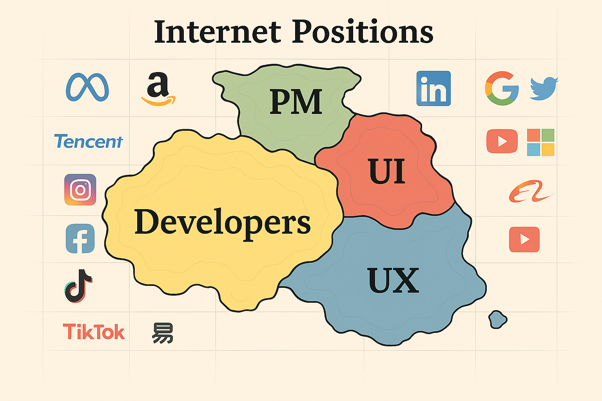

### ⚡ TLDR：MVP 教育理念實踐

以數位產業的敏捷思維重塑學習模式，將 MVP 與 CI/CD 方法融入課程設計，啟動真實項目驅動的技能養成歷程：

- 🎓 畢業即具備可上線成果，對應網頁開發、UX/UI 設計、產品企劃及雲端 API 整合等職涯職能
- 🧠 學習從被動轉為創作者思維，透過成果導向與跨職能協作提升解決能力
- 🧑‍🔬 從第一堂課開始「做中學」，課程設計模擬業界數位產品開發流程
- 🚧 從零開始原型製作，強調驗證式學習與職涯連結
- 🔁 應用 CI/CD 工程邏輯，不斷迭代成果，並在 GitHub 上版本管理與公開發佈
- 📚 建構真實作品集，透過同行評鑑與社群回饋進行持續精進

---

```markmap
# ⤷🤔 MVP 教育理念實踐 — 
## 🟰 新框重塑🖼, 整合💞, 啟動🚀

## 🚀 MVP 思維：以最小可行產品為教學起點
- 🕒 強調價值到達速度（Time-to-Value）
- 🔍 驗證式學習（Validated Learning）
- 🧪 快速原型製作與持續迭代

## 🔁 CI/CD 工程思維導入學習模型
- 🧰 學習成果版本管理
- 🌐 使用 GitHub 進行公開發佈與更新
- 🎯 推動專案反覆修正與模組化發展

## 📈 OBL 架構：成果導向學習
- 👥 同儕評量與自我反思
- 📊 產出對齊職場能力模型
- 📁 建構跨領域、可視化作品集

## 🧪 PBL 模式：真實專案為學習核心
- 🛠️ 起步即創作，第一堂課即進入創作
- 🎓 模擬業界開發流程與職能角色
- 💡 培養應用導向與職涯準備能力

## 🧠 學習體驗轉型：
- 🦋 學習即創作，創作即發佈
- 🧑‍💻 學生轉型為創作者
- 🧭 教師導入產業工作流進教學
- 📦 可公開檢視的實務成果＝學生的能力證明

```

## 🤔MVP 教育理念概述

本課程以軟體產業中核心概念——**最小可行產品（Minimum Viable Product, MVP）**——為基礎，回應數位產業日益加快的成果導向需求，重新定義大學學習的策略與方式。

教學設計融合數位產業的關鍵實務：**MVP 與 CI/CD 工程思維**，並與現代教育的兩大方法論——**專案導向學習（Project-Based Learning, PBL）** 及 **成果導向學習（Outcomes-Based Learning, OBL）** 結合，打造符合數位時代創作者的敏捷教學系統。

---

### 🧩 核心術語

- 🚀 **MVP（最小可行產品）**：來自軟體開發領域，強調「時間價值（time-to-value）」與 [驗證式學習](https://en.wikipedia.org/wiki/Validated_learning)。學生需盡早製作原型，快速迭代，並透過真實使用者回饋進行優化。
- 🔁 **CI/CD 思維**：直接取自軟體工程流程，培養學生持續整合與部署的能力，包括版本管理、模組化內容策劃，以及將成果發佈至 GitHub 等開源平台。
- 📈 **OBL（成果導向學習）**：學生透過自我與同儕評估紀錄學習歷程，確保成果符合職能標準與社群需求。
- 🧪 **PBL（專案導向學習）**：每個課程模組聚焦於真實原型實作，期末專案為可部署、可分享且具備技能指標的成果物。

---

### 📐 教育公式

`教育即 MVP = 成果導向學習（OBL） + 專案導向學習（PBL） + CI/CD 工程思維`

---

### 🔍 教學思維重塑

MVP 教育讓教學更具目標與實效：教師不再只是傳遞固定內容，而是引導學生進入「原型—回饋—部署」的循環。

教師角色轉為引導者，模擬產業流程，協助學生透過原型開發與作品集累積跨領域實作能力。

---

### 🦋 學習歷程轉型

以專案為主軸，學生從起點即開始創造：設計、修正、部署可用系統。

每項成果——從產品簡報到互動介面——都是學習的具體呈現。學生畢業時不僅擁有理論知識，更具備可上線展示的作品，直接銜接網頁開發、UI/UX 設計、產品企劃及 API 整合等數位產業職能。

---

### 🧠 總結

將教育設計與 MVP 及 CI/CD 實務接軌，課程回應了數位產業對「速度、實用性、適應力」的核心期待。

此一教學架構具有高度敏捷性與目標導向性，能讓學生在動態數位環境中發揮創造力，透過真實項目與跨領域實作培養「自主、迭代與合作」的核心能力，作品集公開呈現所學成果與職涯潛能。

---

### 📚 延伸資源

- [GitHub 教育資源](https://github.com/education)
- [Hugging Face 教育部落格 🤗](https://huggingface.co/blog/education)
- [FreeCodeCamp 免費程式教學平台](https://www.freecodecamp.org/learn)
- [Google 數位職涯成長課程](https://grow.google/certificates/)
- [IBM Technology 教育頻道](https://www.youtube.com/@IBMTechnology)

---
