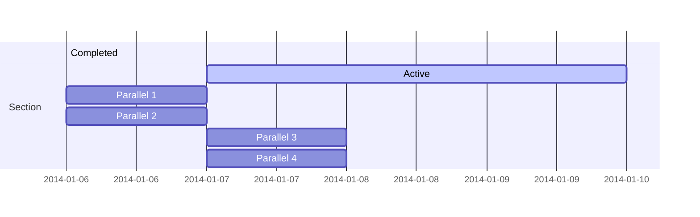

## 🎯 交付并完善可扩展 AI 产品的设计价值

```markmap
- 🔄 流程编排（Pipeline orchestration）
  - ⚡ **触发** API 行为 🚀📲  
  - 🔗 **绑定**事件/触点与触发器 🚨🔄    
  - 👐 **赋能**用户主导权 🧑‍💻🤝🗝    
  - 🪄 **映射** CI/CD 流程与服务路径 🗂️🚦📦
```

本路线图旨在指导战略层面的 AI 创新构思与价值主张设计。

- 🧭 `语境为王` 👑
- 🔁 `流程为后` ♛
- 🧑‍🎨 `设计为骑士` ♞

{}  
本文档尚在持续完善中。  
{}

---

## 🔄 流程编排：通过“交互链”交付价值

要实现产品交付的成功，复杂的交互流程需以 API 调用为核心，通过事件驱动进行衔接，并将决策权交还给指定用户或协作型 AI 代理。

将 AI 产品置于“交互链”视角下设计，其核心任务是通过可执行的触发器、灵活的事件绑定机制、用户授权与无缝的 CI/CD 流程来构建服务交付结构。

---

### ⚡ **触发** API 行为 🚀📲

- **面向角色交换设计可执行提示词与输出内容：**
    
    - 用户提示词如何清晰传达其启动涉及另一角色行为的意图？（如平台上买家向卖家发出请求）
    - AI 的语言输出如何映射并触发 API 调用或系统行为，使角色之间的交互明确并避免歧义？
    - 如何通过 Context Engineering 构造“大模型内部提示词”，确保输出稳定地转化为可执行 API 行为，实现跨角色的“从语言生成到行动生成”？
    - 📎参考 AI PRD 模板章节：用户体验（UX）、功能、技术设计
- **多角色系统中行为启动的用户体验：**
    
    - 当一个角色启动行为影响另一个角色时，系统如何通过视觉/听觉反馈确认行为的启动及其感知？
    - 在什么情境下需设定行为确认流程，以便角色在行为执行前明确责任与期望？（如服务预订需双方确认）
    - 如何通过 AI 的对话风格辅助多方参与者的互动，实现清晰协同的“语言游戏”？
    - 📎参考 AI PRD 模板章节：用户体验（UX）、负责任的 AI（Responsible AI）

---

### 🔗 **绑定**事件与触点 🚨🔄

- **设计响应性强的角色交互流程：**
    
    - 某角色生成的事件或触点哪些是关键，必须被另一角色感知并响应？系统如何“倾听”这些信号并准确解释？
    - 如何将事件绑定为触发器，使 AI 能顺畅推进下一轮交互？需描述角色绑定的逻辑与数据流。
    - 如何动态更新上下文窗口（Context Window），使 AI 能整合双方互动信息，实现全景感知与后续协调？
    - 📎参考 AI PRD 模板章节：用户体验（UX）、技术设计、数据处理
- **设计具语境感知的 AI 响应行为：**
    
    - 如何设计 AI 响应以集成前一轮互动双方的内容，实现连续性“理解”？
    - AI 应遵循哪些设计原则以实现平衡、公正、正向互动？（如平台内自动调解纠纷）
    - 在角色回应延迟或异步的场景中，系统如何优雅介入？如推送状态更新或温和提醒等机制
    - 📎参考 AI PRD 模板章节：用户体验（UX）、机器学习模型（ML Models）

---

### 👐 **赋能**用户主导权 🧑‍💻🤝🗝

- **实现用户控制与赋权的设计机制：**
    
    - AI 的界面与交互逻辑如何使所有参与者（如买家、卖家、创作者、消费者）都能成为交互链的“玩家”？
    - 如何设计显式的“控制节点”或“选择机制”，让各方能纠错、反馈或引导 AI 行为？
    - AI 如何传递互动状态透明信息，使各方了解彼此进度并建立信任？（如订单追踪、已读标记）
    - 📎参考 AI PRD 模板章节：用户体验（UX）、负责任的 AI（Responsible AI）
- **促进正向反馈的语言游戏与增值机制：**
    
    - 如何通过设计促使 AI 成为“语言游戏”的协作者，令交互形成正反馈并累积双方价值？
    - 描述 AI 如何引导互评、共享经验、推荐下一步合作，从而放大既有互动带来的增值空间
    - 哪些可视化元素与对话策略可以让参与者感知交互的积累价值与长期收益？
    - 📎参考 AI PRD 模板章节：用户体验（UX）、目标设定、开放问题

---

### 🪄 **映射**交互流程与服务历程 🗂️🚦📦

- **设计完整的多角色旅程：**
    
    - 通过用户旅程映射，明确平台中各关键角色路径（如买家/卖家历程）。系统设计如何实现从“意图生成”到“价值交付”的流程闭环？
    - 角色之间关键衔接点如何设计，AI 如何助力流程流转，保证各方体验流畅与支持感？
    - 如何实现平台中 AI 交互、人际沟通、系统功能之间的顺畅切换，形成一致性体验？
    - 📎参考 AI PRD 模板章节：用户体验（UX）、技术设计、功能定义
- **优化流程与交互链以实现复利增长：**
    
    - 整体交互链设计如何基于用户反馈、平台指标与“生活形式（form of life）”语境持续迭代？
    - 使用哪些设计指标评估流程是否带来了正向价值复利？（如角色重叠参与率、满意度评分、知识/资源增长量）
    - 系统如何利用用户互评与“AI回应机制”共同推进交互玩法升级，从而带动平台增长？
    - 📎参考 AI PRD 模板章节：目标设定、未来发展、开放问题、用户体验（UX）

---

## ✅ 简要总结

本路线图聚焦于 AI 产品价值交付的操作层面，通过设计精密的 CI/CD 流程与多角色服务旅程，引导产品实现真正可扩展的交互体系。  
`语境为王` 👑 `流程为后` ♛ `设计为骑士` ♞

如你需要将此内容整合为 PRD 教学范本、课程教学设计或可视化演示材料，也可以继续交给我来协助 ✨ 是否希望我帮你构建一个完整的课程手册或设计画布？🧭


Easily manage your projects - create ideation mind maps, Gantt charts, todo lists, and more!

## Ideation

Hugo Blox supports a Markdown extension for mindmaps.

Simply insert a Markdown code block labelled as `markmap` and optionally set the height of the mindmap as shown in the example below.

Mindmaps can be created by simply writing the items as a Markdown list within the `markmap` code block, indenting each item to create as many sub-levels as you need:

<div class="highlight">
<pre class="chroma">
<code>
```markmap {height="200px"}
- Hugo Modules
  - Hugo Blox
  - blox-plugins-netlify
  - blox-plugins-netlify-cms
  - blox-plugins-reveal
```
</code>
</pre>
</div>

renders as

```markmap {height="200px"}
- Hugo Modules
  - Hugo Blox
  - blox-plugins-netlify
  - blox-plugins-netlify-cms
  - blox-plugins-reveal
```

## Diagrams

Hugo Blox supports the _Mermaid_ Markdown extension for diagrams.

An example **Gantt diagram**:

    ```mermaid
    gantt
    section Section
    Completed :done,    des1, 2014-01-06,2014-01-08
    Active        :active,  des2, 2014-01-07, 3d
    Parallel 1   :         des3, after des1, 1d
    Parallel 2   :         des4, after des1, 1d
    Parallel 3   :         des5, after des3, 1d
    Parallel 4   :         des6, after des4, 1d
    ```

renders as



