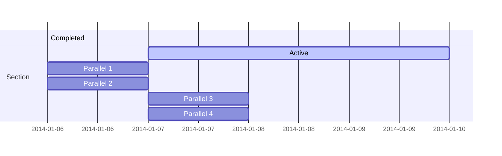
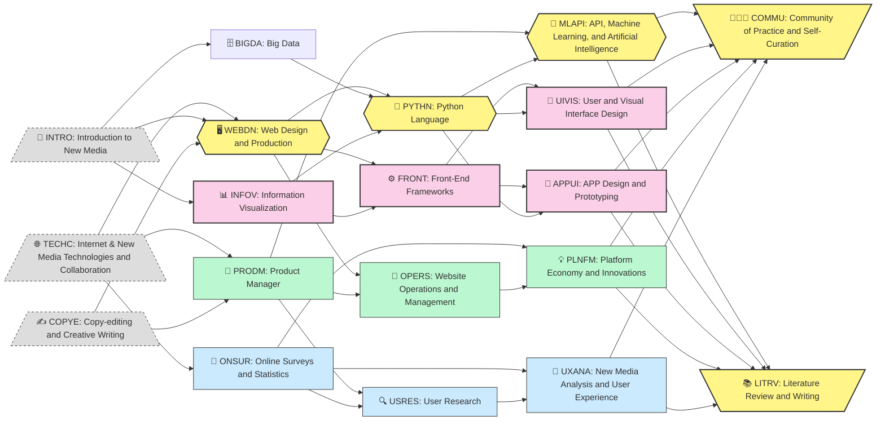

The document proposed a comprehensive yet essential `AI & Internet` curriculum for undergraduate students, based on a revision of a `New Media & Internet` curriculum that I have personally developed and implemented in China.  

<!--more-->

test mermaid here

#### 1. Core Technical Pillars (Yellow Cluster): 
Hexagon Nodes
These three courses—each rendered as a yellow‐filled hexagon—form the backbone of the AI-empowered curriculum. They equip students with full-stack capabilities, from front-end mastery to machine-driven intelligence.

### 🖥️ WEBDN: Web Design and Production

- ✨ **Design responsive interfaces** using TailwindCSS and Hugo templates, ensuring accessibility and cross-device consistency.
    
- 🔄 **Modularize components** through reusable partials and render hooks for scalable content pipelines.
    
- 🤝 **Integrate interactivity** with JavaScript libraries (e.g., Medium-Zoom), teaching students how to blend static site performance with dynamic UX.
    

### 🐍 PYTHN: Python Language

- 🔍 **Develop data pipelines** in Jupyter, leveraging pandas, NumPy, and asynchronous patterns to clean, transform, and analyze large datasets.
    
- 🤹 **Prototype AI workflows** using libraries such as scikit-learn, XGBoost, and PyTorch—guiding learners from exploratory modeling to production-grade scripts.
    
- 🛠️ **Automate tasks** with asyncio, Flask, and Panel, showing how Python underpins webhooks, REST endpoints, and lightweight microservices.
    

### 🤖 MLAPI: API, Machine Learning, and Artificial Intelligence

- 🚀 **Architect intelligent agents** by designing RESTful APIs, chaining prompts with LangChain, and deploying models via Docker or Kubernetes.
    
- 📚 **Implement RAG pipelines** that combine vector embeddings and external knowledge bases for retrieval-augmented generation.
    
- ⚙️ **Orchestrate end-to-end ML systems**, from data ingestion through model monitoring—preparing students to manage real-world AI projects in cloud environments.
    

**Why This Cluster Matters**

- These hexagon nodes represent the **sequential skill arc**: students start by crafting engaging web front ends (WEBDN), then gain fluency in Python scripting and data manipulation (PYTHN), and finally learn to embed AI into services (MLAPI).
    
- By layering hands-on labs, code reviews, and CI/CD best practices, Han-Teng Liao ensures graduates can **design, build, and deploy** intelligent web applications that align with human values and organizational goals.
    

This yellow-highlighted hexagon trio showcases Liao’s unique ability to fuse design thinking, software craftsmanship, and AI orchestration into a cohesive learning journey—ideal for universities looking to lead in AI education.

## In short
    

This yellow-highlighted hexagon trio showcases Liao’s unique ability to fuse design thinking, software craftsmanship, and AI orchestration into a cohesive learning journey—ideal for universities looking to lead in AI education.

---

## Why and how: Education as a Minimum Viable Product (MVP)

* Project-based Learning
* Outcomes-based Assessment
 
### `New Media & Internet` curriculum

#### 1. Core Technical Pillars (Yellow Cluster, Hexagon Nodes): 

The backbone of the AI-empowered curriculum features three technical courses that equip students with full-stack integration capabilities, from front-end to machine-driven intelligence.

These core technical pillars, shown in the graph as yellow‐filled hexagons, reveal the centrality of the learning-by-doing in the overall curriculum.  

- 🖥️ `WEBDN`: **Web Design and Production** • Establishes core skills in implementing responsive interfaces and structured multi-modal content using reusable modular components, usability and sustainability guidelines. • Delivers individual portfolio with a professional sense of product ownership.
- 🐍 `PYTHN`: **Python Language** • Develops and experiments fundamental skills in building interactive data-processing applications. • Delivers trouble-shooting documentations, with further product required documents (PRDs) for future task-automation projects.  
-  🤖 `MLAPI`:  **API, Machine Learning, and Artificial Intelligence**  • Identifies and curates core AI capabilities through the use and experiments of APIs for interactive applications.  • Delivers self- and peer-reviewed PRDs and prototypes that specifies the value position and relevant cost-benefit analysis for the use of a set of APIs in an identified use context. 

**Why This Cluster Matters**
- These hexagon nodes represent the **sequential skill arc**: students start by crafting engaging web front ends (`WEBDN`), then gain fluency in Python scripting and data manipulation and interaction (`PYTHN`), and finally learn to prototype, from clearly identified use scenarios, applications that embed AI capabilities into services (`MLAPI`).
- By layering hands-on labs, code trouble-shooting, peer-reviews, and CI/CD best practices, the module ensures learners can **design, build, and deploy** intelligent web applications that align with human values and organizational goals.

#### 1. Foundational Internet Literacy (Gray Cluster)
Together, these courses build the core capabilities of writing questions for problem-solving iterations, based on a shared vocabulary and critical lens for all subsequent modules.

- 🔰 **INTRO: Introduction to New Media** • Establishes core concepts in digital communication, sociotechnical systems, and internet platforms.    
- 🌐 **TECHC: Internet & New Media Technologies and Collaboration** • Explores Internet and Web ecosystems, open-source code platforms, and international case studies in Chinese and global contexts.    
- ✍️ **COPYE: Copy-editing and Creative Writing** • Trains students to craft clear, impactful narratives—essential for AI-driven content automation.

- 🐍 **PYTHN: Python Language** • Delivers rigorous Python instruction for data manipulation, visualization, and scripting in Jupyter environments.
- 🤖 **MLAPI: API, Machine Learning, and Artificial Intelligence** • Covers RESTful API integration, model training, and deployment of intelligent agents.

## 2. Data Analytics & AI Integration (Blue Cluster)

- 🧮 **ONSUR: Online Surveys and Statistics** • Guides hands-on survey design, sampling methods, and statistical inference.
- 🗄️ **BIGDA: Big Data** • Teaches scalable data pipelines, data cleaning, and exploratory analysis.
- 🔍 **USRES: User Research** → 🧠 **UXANA: New Media Analysis and User Experience** • Transitions from data collection to UX insights using RAG methods, sentiment analysis, and human-centered design.
    

Key action verbs:

- 🔍 Analyze large datasets to inform design decisions.
    
- 🤝 Integrate AI agents with open-source APIs.
    
- 📈 Synthesize quantitative and qualitative insights for strategic foresight.
    

## 3. Interaction & Prototyping (Pink Cluster)

- 🖥️ **WEBDN: Web Design and Production** • Demonstrates responsive layouts with TailwindCSS, Hugo templates, and interactive scripts.
- 📊 **INFOV: Information Visualization** • Introduces D3.js, Vega-Lite, and narrative infographics for data storytelling.
- ⚙️ **FRONT: Front-End Frameworks** → 🎨 **UIVIS: User and Visual Interface Design** → 📱 **APPUI: App Design and Prototyping** • Guides students through iterative wireframing, interactive prototypes, and Medium-Zoom enhancements in static sites.
    

Core teaching strengths:

- 🎨 Foster design thinking through rapid prototyping.
    
- ⚙️ Leverage modular components for scalable UX.
    
- 📱 Bridge web frameworks with mobile app concepts.
    

## 4. Strategic Management & Operations
(Green Cluster)
- 📌 **PRODM: Product Manager** • Instructs Agile methodologies, PRD development, and cross-functional leadership.
- 💡 **PLNFM: Platform Economy and Innovations** • Examines business models, platform governance, and ecosystem mapping.
- 🔧 **OPERS: Website Operations and Management** • Focuses on CI/CD pipelines, containerization (Docker, Kubernetes), and performance audits.
- 🧑‍🤝‍🧑 **COMMU: Community of Practice and Self-Curation** • Cultivates learner networks, peer feedback loops, and knowledge sharing strategies.
- 📚 **LITRV: Literature Review and Writing** • Develops systematic review skills to ground innovation in evidence-based research.
    

Highlights:

- 🎯 Orchestrate AI projects from ideation to deployment.
    
- 🔄 Embed continuous improvement cycles in curriculum design.
    
- 🌱 Align platform strategies with sustainable, open-knowledge principles.
    

## 5. Technical Toolbox & Open Knowledge

(White Cluster)

- 🤖 **Building AI Agents**
    
- 📦 **Managing Software Development**
    
- 📖 **Amplifying Open Knowledge**
    
- 🛠️ **Leveraging Open Knowledge Tools**
    
- 🖌️ **Organizing Design Workshops**
    
- 📊 **Delivering Data Science**
    
- 🎓 **Synthesizing Social Science**
    

Liao’s skill set spans CI/CD, RAG pipelines, API orchestration, containerized AI deployments, and scientometric analysis—equipping students with both breadth and depth in modern AI workflows.

**Why This Matters**

- Engages emerging leaders in hands-on AI prototyping, ethical foresight, and cross-disciplinary collaboration.
    
- Balances technical rigor (Python, ML, DevOps) with human-centered design and strategic management.
    
- Demonstrates Liao’s unique ability to integrate global best practices, open-source approaches, and geopolitical awareness into higher education curricula.
    

This cohesive program impresses educators and deans by showcasing a replicable, scalable, and forward-looking roadmap for teaching AI capabilities in diverse academic environments.

Experience | Visualization by Oxford Roadmapping. Han-Teng Liao’s profile highlights cross-sector teaching and skill sets in AI, open collaboration, and scientometrics.

summary: Key to scaling success, a seemingly _muddy_ context anchors meaning in use, forges links with situations, builds trust through friction, and returns language to the rough ground. This roadmap tackles the strategic layer of AI innovation for ideating and crafting value propositions. `Context is King.` `Value is God.`

Comprehensive AI & New Media Curriculum Overview

